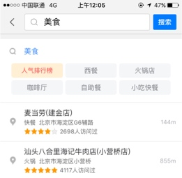

# 2017年SUG技术规划

##需求&想法形成？

惜春令战役拆解&和大陆郑欲的沟通

检索部分：根据最终评估的结论，最终确认检索的目标。
重点工作项：
1.      重复率。
2.      唯一结果展现。
3.      国内外分流。
4.      无召回。
5.      NLP库引入。
6.      Sug数据统一。

Sug：todo？

了解一下国内sug做了哪些更新？梳理下哪些我们可以做。

      1、sug数据一致性的问题：大陆sug数据编译，快速上线机制？ 应该有线上环境，自动部署实施。
      
      sug数据编译目前还没有快速上线机制，目前正在做实时库的项目，可以做到半小时上线，现在线上是一天建一次索引。
      现在线上一天建一次索引流程实现： 首先是检索每天会有一次建库，通过md5判断更新，自动拿检索产出数据；进行sug数据的编译，产出数据后，通过op的配置，直接push到sug线上机器上。基本上也是1天一次的频率更新。     
      
      2、2016年做了什么事情？
      
      解决的问题？导致产品的差异？
      
      展示的云端控制：详见问题3.      
      需求的分类rank（扩展连锁、泛需求，品牌和tag建库）： 详见问题3.
      
      引入文本相关性： 多了一个feature，主要是在rank时使用。就这一个解决rank相关的项目。产品上差异？
      
      sug连检索扩展召回：也就是说，susvr召不回或不足的数据，通过检索再进行一次召回。实现层面在，相当于在susvr层调次as检索。
      
      sug分库重构1拆4 ： 背景是编译产出数据巨大，加载内存受限。将susvr拆分成sug-as、sug-bs，实现分布式的部署，同时也依赖数据编译分库。也具备参考性，解决我们按照区域分流到不同sug服务，召回数据也受限的问题。
      
      3、梳理的产品差异？肯定有对应的工作来实现的
         精确需求：poi名称   +  行业tag + 行政区名.地址 + 评分 + 多少人访问过
         展示的云端控制项目： 可以显示不同的配置字段。与NA端联动，做好模板。后端返回相 应的数据字段，填空来实现。
                  
         泛需求： 美食-》召回，潇湘府         
         品牌： 右上角log
         
         这两个差异的产生,是 需求分类与品牌和tag建库 项目导致的产出。首先sug能识别出精确和泛需求，也就是对需求进行分类。 通过，tag和品牌建库，进行搜美食时，能根据"美食"tag来进行召回。
        
         

      4、sug带uid，检索时直接在uii层走di？原因？实现思路？
         sug带uid目前是走检索as的，后面会改成在uii直接走di，提升直跳比率；近期会做。
                     
      5、我们的代码是2014年10月份版本？2014年的排序模型优化，是否包含在这个版本中？
         
         这个不了解，之前我不带sug，是从15年下半年才开始带的。
         
         看一下排序的rank流程图？
         
      
      6、大陆最新代码拿过来？diff ？
      
      大陆代码copy估计不能直接用，现在对英文还有bug，连基本的召回都有问题。
      
      

      
*     

快速上下线；数据？

点击和热度：  sug。 先验。

Lighttpd 分流的问题？整个代理？ 分区域来存储的各个大洲的检索数据，分布式？

-------

2017年基础服务研发规划

检索和sug数据编译自动化项目：

1、更新poi数据后，自动编译，部署上线；检索和sug；[简单]
2、产出数据编译流程和基础数据字段；[重要]"

国际化检索和sug排序优化项目：

产出：
1、基于数据编译流程和基础数据格式，数据挖掘热点poi（如，景点，购物点），整合到现有数据中。
2、检索可以根据挖掘到的数据(点击次数,热点poi）提升检索排序。
3、sug可以根据挖掘的数据(景点，购物点)提升排序。
4、深入排序策略后，利用现有数据的特征字段，推动数据的优化和检索策略的优化，提升召回和准确率。

------

检索后续想法：

2、sug： 商业化数据排名
   
   问题：现在能正常的提示query和所在的行政区划；没对一些query做商业化的特殊标签、排名提升、商业推广（比如，在北京，搜“汉”，点击“汉光百货”）   
   想法：通过调研相关的技术实现，国际化sug可以对一些query做商业化的特殊标签、排名提升、商业推广。
   收益：实现技术中等；用户其实对国际化的sug依赖程度相比较国内更高，更具商业收益可能性。
   
   
   
主打出境游：
  
  uii
    sug？
        排序策略优化。出境游。突出景点，购物点 排序级别。
        准招  

升级：多语言检索。
     分词
     rank
      
  
数据编译：更新的快速上线。

--------

大陆的《SUG2016下半年技术规划.ppt》，对我们的产品和技术规划指导？

1. 比较大陆和国际化的sug，差异点：（NA）

    * 精确需求：
        * 国际化：poi名称 行政区划名
        * 大陆： poi名称   +  行业tag + 行政区名.地址 + 评分 + 多少人访问过
      
    * 泛需求： 
        * 比如输入"美食"大陆： 美食 作为父，下面又多个细分类，比如西餐，火锅店，这个国际化也有。但子分类中的"人气排行榜"，直接到落地页面。国际化没有。
        * 美食下面推荐的点，国际化是以：美食开头或相关的点  大陆：是比如麦当劳，潇湘府，这种真正的店。

* 连锁店，认证的商家：
    * 大陆：对于是连锁店的检索，比如"居然之家" ，右上角，打上"连锁" 的红色log；点击后，进入到"居然之家" 检索列表；
    * 大陆：对于是认证品牌的检索，比如"肯德基"，打上"百度认证品牌"的红色log；点击后，出列表，底图上用"定制小图标"标出位置。
    * 国际化：暂无

2. 以上差异，根本原因，数据层面的支持。验证国际化和大陆，sug请求返回的数据？
  
请求:

    curl "https://client.map.baidu.com/su?st=0&highlight_flag=2&rp_format=pb&qt=sug&l=17&cid=131&loc=(12953158.137179,4832419.844293)&type=0&b=(12975859,4900323;12977526,4903206)&wd=居然之家&mb=iPhone9,2&os=iphone10.200000&sv=9.7.3&net=1&resid=01&cuid=bf4e4d0b9e9c1fc1ae7bf79205d6d7dc&bduid=Fe+Jpm6MwJackZIf8&channel=1008648b&oem=&screen=(1242,2208)&dpi=(489,489)&ver=1&sinan=qhWrsCkitilLt39tJBFvoy4eE&co=460:02&ctm=1488733188.639000&sign=9bc1372d011ea648e14d4207041d6ffe"  ##大陆请求
    curl "https://client.map.baidu.com/su?st=0&highlight_flag=2&rp_format=pb&qt=sug&l=17&cid=2912&loc=(12715751.420244,2534543.642575)&type=0&b=(12714996,2533201;12716506,2535886)&wd=香港大&mb=iPhone7,1&os=iphone10.200000&sv=9.7.3&net=1&resid=01&cuid=586f86408ad115faac6742a9369293ee&bduid=&channel=1008648b&oem=&screen=(1125,2001)&dpi=(489,489)&ver=1&sinan=7zp=4We=QbyhsVals5Zpvh2Ow&co=460:01&ctm=1488040623.521000&sign=007443f81d7a8e41e877512af8ad0d50" ##国际化请求
  
  结果分析:
I  
    *     发现大陆和国际化的返回数据差异大，主要包括，字段 + 展现格式数据差异；所以造成以上产品体验上很大的差异；
    *     升级？ 数据，服务

    
    

      

----------------------------------------------------------------------------------------------------------------

2017-03-01 18:29:32

开始入手学习，准备 ，深入  sug

1、检索中qt=s，通过sug进入检索的占比？

   通过sug进入的检索的请求req有什么特点？
   
   pc：
   
     lighttpd：
     
       正常检索uri: 
       /?newmap=1&reqflag=pcmap&biz=1&from=webmap&da_par=direct&pcevaname=pc4.1&qt=s&da_src=searchBox.button&wd=东京迪士尼乐园&c=26041&src=0&wd2=&sug=0&l=19&b=(15571378.5,4224925.25;15571789.5,4225276.75)&from=webmap&biz_forward={"scaler":2,"styles":"pl"}&sug_forward=&tn=B_NORMAL_MAP&nn=0&ie=utf-8&t=1488364532452
      
       通过sug检索的uri：
       
       /?newmap=1&reqflag=pcmap&biz=1&from=webmap&da_par=direct&pcevaname=pc4.1&qt=s&da_src=searchBox.button&wd=东京迪士尼乐园&c=26041&src=0&wd2=东京&sug=1&l=19&b=(15571378.5,4224925.25;15571789.5,4225276.75)&from=webmap&biz_forward={"scaler":2,"styles":"pl"}&sug_forward=4b36e6178d65c36b82a00cd3 
       
       这层的结论：通过sug检索，参数：sug=1，wd2会有值
           
     uii-se：
     
        正常检索：
        
        [  logid:2137967519  ][  proctime:total:60(ms) rev:0+proc:60+write:0  ][  reqip:10.120.28.46  ][  reqsvr:uii-proxy  ][  cmdno:s  ][  svrname:uii_se  ][  errno:0  ][    ][  uii: logid=2137967519 wd=%B6%AB%BE%A9%B5%CF%CA%BF%C4%E1%C0%D6%D4%B0 qt=s wd_h= b=%2815571378.5%2C4224925.25%3B15571789.5%2C4225276.75%29 l=19 pn=0 rn=10 sug=0 buid= geocty=0 geoty=0 st=0 dt=map strategy=0 db=0 nc=26041 cn= src=0 sn= en= type=104 err_no=0 res_no=0 sugq=0 specr=0 psrs=0  rp_strategy=0  uniqid=910449811 optime=1488364775.484 cost=60 uip=172.22.178.121 client_ip=10.120.28.46 local_ip=10.120.28.46 product=map subsys=webmap module=uii_se modid=139671038380384    ][    ]
        [  logid:2137967519  ][  proctime:total:200(ms) rev:0+proc:200+write:0  ][  reqip:10.120.28.46  ][  reqsvr:uii-proxy  ][  cmdno:poi  ][  svrname:uii_se  ][  errno:0  ][    ][  uii: logid=2137967519 wd=%B6%AB%BE%A9%B5%CF%CA%BF%C4%E1%C0%D6%D4%B0 qt=poi wd_h= b=%2815571378.5%2C4224925.25%3B15571789.5%2C4225276.75%29 l=19 pn=0 rn=10 sug=0 buid= geocty=0 geoty=0 st=0 dt=map strategy=0 db=0 nc=26041 cn= src=0 sn= en= type=11 err_no=0 res_no=1 sugq=0 specr=0 psrs=0 qid=13487969172969711717 uids=184161726,185243705,184488098,179413621,180626159,185125061,185124897,185124797,185124404,185124281 accflags=1,0,0,0,0,0,0,0,0,0 rp_strategy=1 rp_des_type=0,0,0,0,0,0,0,0,0,0 uniqid=1567478634 optime=1488364775.689 cost=200 uip=172.22.178.121 client_ip=10.120.28.46 local_ip=10.120.28.46 product=map subsys=webmap module=uii_se modid=139671961487712 children=    ][    ]
        
        
        通过sug检索：
        
        
        [  logid:279783116  ][  proctime:total:26(ms) rev:0+proc:26+write:0  ][  reqip:10.120.28.46  ][  reqsvr:uii-proxy  ][  cmdno:s  ][  svrname:uii_se  ][  errno:0  ][    ][  uii: logid=279783116 wd=%B6%AB%BE%A9%B5%CF%CA%BF%C4%E1%C0%D6%D4%B0 qt=s wd_h= b=%2815547129.52%2C4199972.56%3B15599737.52%2C4244964.56%29 l=12 pn=0 rn=10 sug=1 buid= geocty=0 geoty=0 st=0 dt=map strategy=0 db=0 nc=26041 cn= src=0 sn= en= type=104 err_no=0 res_no=0 sugq=0 specr=0 psrs=0  rp_strategy=0  uniqid=1984145746 optime=1488365298.606 cost=26 uip=172.22.178.121 client_ip=10.120.28.46 local_ip=10.120.28.46 product=map subsys=webmap module=uii_se modid=139671909038432    ][    ]
        [  logid:279783116  ][  proctime:total:189(ms) rev:0+proc:189+write:0  ][  reqip:10.120.28.46  ][  reqsvr:uii-proxy  ][  cmdno:poi  ][  svrname:uii_se  ][  errno:0  ][    ][  uii: logid=279783116 wd=%B6%AB%BE%A9%B5%CF%CA%BF%C4%E1%C0%D6%D4%B0 qt=poi wd_h=%B6%AB%BE%A9 b=%2815547129.52%2C4199972.56%3B15599737.52%2C4244964.56%29 l=12 pn=0 rn=10 sug=1 buid= geocty=0 geoty=0 st=0 dt=map strategy=0 db=0 nc=26041 cn= src=0 sn= en= type=11 err_no=0 res_no=1 sugq=0 specr=0 psrs=0 qid=13061973172215586726 uids=184161726,185243705,184488098,179413621,180626159,185125061,185124897,185124797,185124404,185124281 accflags=1,0,0,0,0,0,0,0,0,0 rp_strategy=1 rp_des_type=0,0,0,0,0,0,0,0,0,0 uniqid=1656792005 optime=1488365298.800 cost=189 uip=172.22.178.121 client_ip=10.120.28.46 local_ip=10.120.28.46 product=map subsys=webmap module=uii_se modid=139671898548576 children=    ][    ]
        

        这层的结论： phpui层的qt=s，会转成2个qt（s，poi）到uii； 日志中，sug=1，wd_h会有值，一般是行政区划名称
        
        
    NA:
    
      lighttpd:
      
        正常uri:
         
        /phpui2/?      ldata={"src_from":"mainpg_search","se_id":"2b7979a11b0c290a861c5931af90c246"}&lrn=20&da_src=poiSearchPG.searchBt&rp_format=pb&qt=s&rp_filter=simplified&l=17&ads_version=1.7.4&route_traffic=1&req=1&loc=(11194857,1535168)&extinfo=32&ie=utf-8&rn=10&b=(15570837,4223954;15572507,4226820)&c=0&wd=东京迪士尼乐园&pn=0&sug=0&version=5&sub_version=960&mb=ONEPLUS A3000&os=Android23&sv=9.7.1&net=1&resid=01&cuid=2B1C43E9F716033D1953D86C7BBE5A27|0&bduid=&channel=baidu&oem=baidu&screen=(1080,1920)&dpi=(401,401)&ver=1&sinan=TbdMwaWZKdlcS817faJTfciXn&co=&phonebrand=OnePlus&patchver=&isart=1&ctm=1488371029.355000&sign=1127ffd79bb30d1938f528da2205d490 
        
        通过sug的uri：
        
        /phpui2/?spos=1&ldata={"src_from":"mainpg_search","se_id":"a259b593b670e79eae68d94648cdb4c5"}&lrn=20&da_src=poiSearchPG.sersug&rp_format=pb&qt=s&rp_filter=simplified&sug_input=东京迪士尼乐园 东京&l=19&ads_version=1.7.4&route_traffic=1&req=1&sl=5&loc=(11194857,1535168)&extinfo=32&sut=0&ie=utf-8&rn=10&b=(15571375,4224561;15571793,4225278)&c=0&wd=东京迪士尼乐园 东京&pn=0&sug=1&version=5&sub_version=960&mb=ONEPLUS A3000&os=Android23&sv=9.7.1&net=1&resid=01&cuid=2B1C43E9F716033D1953D86C7BBE5A27|0&bduid=&channel=baidu&oem=baidu&screen=(1080,1920)&dpi=(401,401)&ver=1&sinan=FJ+vn4mf6fOjx4IL94/cV/eR9&co=&phonebrand=OnePlus&patchver=&isart=1&ctm=1488371199.515000&sign=ade15fc38ec545b5214b47e4ca0b7efd
      
      
      uii-se:
      
        正常检索：              
        
        [  logid:953228984  ][  proctime:total:66(ms) rev:0+proc:66+write:0  ][  reqip:10.120.28.46  ][  reqsvr:uii-proxy  ][  cmdno:s  ][  svrname:uii_se  ][  errno:0  ][    ][  uii: logid=953228984 wd=%B6%AB%BE%A9%B5%CF%CA%BF%C4%E1%C0%D6%D4%B0 qt=s wd_h= b=%2815570837%2C4223954%3B15572507%2C4226820%29 l=17 pn=0 rn=10 sug=0 buid= geocty=0 geoty=1 st=0 dt=map strategy=0 db=0 nc=26041 cn= src=0 sn= en= type=104 err_no=0 res_no=0 sugq=0 specr=0 psrs=0  rp_strategy=0  uniqid=0 optime=1488371029.20 cost=67 uip=172.22.108.19 client_ip=10.120.28.46 local_ip=10.120.28.46 product=map subsys=apimap module=uii_se modid=139671510423904    ][    ]
        [  logid:953228984  ][  proctime:total:287(ms) rev:0+proc:287+write:0  ][  reqip:10.120.28.46  ][  reqsvr:RAL  ][  cmdno:poi  ][  svrname:uii_se  ][  errno:0  ][    ][  uii: logid=953228984 wd=%B6%AB%BE%A9%B5%CF%CA%BF%C4%E1%C0%D6%D4%B0 qt=poi wd_h= b=%2815570837%2C4223954%3B15572507%2C4226820%29 l=17 pn=0 rn=10 sug=0 buid= geocty=0 geoty=1 st=0 dt=map strategy=0 db=0 nc=26041 cn= src=0 sn= en= type=11 err_no=0 res_no=1 sugq=0 specr=0 psrs=0 qid=13182183414122236607 uids=184161726,185243705,184488098,179413621,180626159,185125061,185124897,185124797,185124404,185124281 accflags=1,0,0,0,0,0,0,0,0,0 rp_strategy=1 rp_des_type=0,0,0,0,0,0,0,0,0,0 uniqid=0 optime=1488371029.311 cost=288 uip=172.22.108.19 client_ip=10.120.28.46 local_ip=10.120.28.46 product=map subsys=apimap module=uii_se modid=139671499934048 children=    ][    ]
        
                
        通过sug的检索：
                
        [  logid:3716678564  ][  proctime:total:62(ms) rev:0+proc:62+write:0  ][  reqip:10.120.28.46  ][  reqsvr:uii-proxy  ][  cmdno:s  ][  svrname:uii_se  ][  errno:0  ][    ][  uii: logid=3716678564 wd=%B6%AB%BE%A9%B5%CF%CA%BF%C4%E1%C0%D6%D4%B0+%B6%AB%BE%A9 qt=s wd_h= b=%2815570603%2C4223227%3B15572273%2C4226094%29 l=17 pn=0 rn=10 sug=1 buid= geocty=0 geoty=1 st=0 dt=map strategy=0 db=0 nc=26041 cn= src=0 sn= en= type=104 err_no=0 res_no=0 sugq=0 specr=0 psrs=0  rp_strategy=0  uniqid=0 optime=1488371305.153 cost=62 uip=172.22.108.19 client_ip=10.120.28.46 local_ip=10.120.28.46 product=map subsys=apimap module=uii_se modid=139671447484768    ][    ]
        [  logid:3716678564  ][  proctime:total:265(ms) rev:0+proc:265+write:0  ][  reqip:10.120.28.46  ][  reqsvr:RAL  ][  cmdno:poi  ][  svrname:uii_se  ][  errno:0  ][    ][  uii: logid=3716678564 wd=%B6%AB%BE%A9%B5%CF%CA%BF%C4%E1%C0%D6%D4%B0+%B6%AB%BE%A9 qt=poi wd_h= b=%2815570603%2C4223227%3B15572273%2C4226094%29 l=17 pn=0 rn=10 sug=1 buid= geocty=0 geoty=1 st=0 dt=map strategy=0 db=0 nc=26041 cn= src=0 sn= en= type=11 err_no=0 res_no=1 sugq=0 specr=0 psrs=0 qid=13226184074189127054 uids=185243705,184161726,184488098,179413621,180626159,185125061,185124897,185124797,185124404,185124281 accflags=1,1,1,1,0,0,0,0,0,0 rp_strategy=1 rp_des_type=0,0,0,0,0,0,0,0,0,0 uniqid=0 optime=1488371305.422 cost=266 uip=172.22.108.19 client_ip=10.120.28.46 local_ip=10.120.28.46 product=map subsys=apimap module=uii_se modid=139671436994912 children=    ][    ]
      
        
        
        

   拿到日志：
   
        uii-se层统计：  gzhxy-ns-c22-xi2-map360z20151202233448558129.gzhxy.baidu.com：/home/map/wangwei/data/uii-se-log         
          
          grep -oP "sug=[0-9]" ./all.res |sort |uniq -c

            qt=poi：
            
             6580946 all.res            
             6448206 sug.0.res 
             
               69071 sug.1.res
               63640 sug.2.res
                  24 sug.3.res
            qt=s：
            
               3969397 11.res
               3886219 sug.0.res
               75665 sug.1.res
        
       
           uii-se层统计的问题： 2%，sug只占；问题是，sug检索量/检索总量  ，这个检索总量包含了webmap，apimap，aladin的所有泛和精确检索； 实际想要是，sug检索量/精确检索的量
        
       
       phpui层统计：
       
       
       #!/bin/bash
           
        echo "begin to process!"
        
        rm -fr sug.1.res
        
        
        for((i=0;i<9;i++)){
           echo "times:"$i;
           
           grep  -E 'qt=s c=(29[0-9]{2}|90[0-9]{2}|[2-7]{1}[0-9]{4})' ./$i/home/map/phpui/webmap/log/webmap.log.* |grep 'op_gel=0' >$i.res 
           
           grep -i 'sug%3d1%26' ./$i.res >> sug.1.res
        
        }
        
        
        res=`wc -l *.res`
        
        echo $res
        
        
        grep  -E 'qt=s c=(29[0-9]{2}|90[0-9]{2}|[2-7]{1}[0-9]{4})' ./webmap.log |grep 'op_gel=0' >1.res 
        
        grep -i 'sug%3d1%26' ./1.res 
       
        
           
                  
------------------------------------------------------------------------------------------------------------------------------------------------------------------------------------------------------------------------------------------        

2、通过日志，分析重要字段含义：

   sug=0，1，2，3：
   
          日志中：sug=0 未用sug检索  sug=1 正常webmap  sug=2 sug=3 apimap的请求，可能3是历史纪录的？
   
   subsys：     
          subsys=apimap
          subsys=wapaladdin
          subsys=webmap      
          
 

------------------------------------------------------------------------------------------------------------------------------------------------------------------------------------------------------------------------------------------        

3、通过udw表，评估检索效果：
  
  
  use namespace udw_ns;
  select 0,event_day,
         1,lbs_query_word，
         2,lbs_sugs,
         3,lbs_suge,
         4,lbs_detail_action,
         5,event_location_city,  --根据移动设备的定位信息得到的城市信息
         6,lbs_city, --城市名字
         7,lbs_cityid, --城市信息
         8,lbs_city_name, --根据city_id计算出来的被检索城市的名称
         9,lbs_postopgel --返回泛需求结果标识   
  
  from udw.udw_event
  where event_action = 'lbsquery' 
    and lbs_query_type = 's'
    and lbs_postopgel = '0'
    and ((lbs_cityid >= '2912' and lbs_cityid <= '2934')
        or (lbs_cityid  >= '9000'))
    
    and event_day <= '20170302' 
    and event_day >= '20170301'  
     
  limit 100;
  
  
  

  

 
 
          
          
                      
               
 
 
               
               
               
               
                         
              
   
   
   
   
   
   
              
        
   

   

