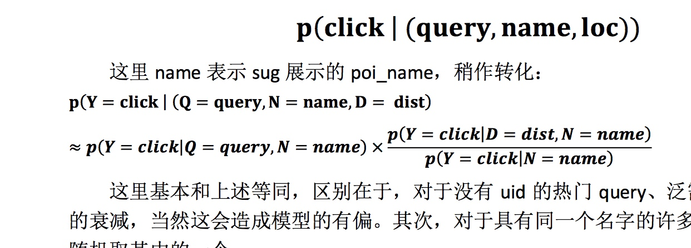

# TEST

*倾斜字体`<em>`*
**加粗字体**

* 无序列表 `* + 空格`
1. 有序列表 `数字 + . +空格`
- [x] 任务列表 `- + 空格 +[]`




自动生成连接 <https://www.baidu.com>
[不显示连接url](https://www.baidu.com)

`行内代码`
```
多行代码
多行代码
```

顺序图,可以参考：<https://bramp.github.io/js-sequence-diagrams/>

```sequence
张三->李四: 嘿，小四儿, 写博客了没?
Note right of 李四: 李四愣了一下，说：
李四-->张三: 忙得吐血，哪有时间写。
```

流程图，可以参考：<http://flowchart.js.org/>

``` flow
st=>start: 开始
e=>end: 结束
op=>operation: 我的操作
cond=>condition: 确认？

st->op->cond
cond(yes)->e
cond(no)->op
```


| test | test | test3 |
| --- | --- | --- |
| tes | s | dsf |
| tesasd | ads | ddsf |


  

