# 检索&SUG类 CASE 分析

<!--王伟记录-->


##case 1

```
香港尖沙咀皇悦酒店(empire hotel kowloon-tsim sha tsui) 香港特别行政区油尖旺区
去除sug后缀后有检索结果，否则没有

```

**问题原因**

---
对于查询词的最大长度做了限制

``` c++

/da/app/search/lbs-maps/mapinclude/map_define.h

const int MAP_QUERYWORD_LEN   = 76;                    // 查询词的最大长度
const int MAP_SUGGESTWORD_LEN = MAP_QUERYWORD_LEN * 2; // suggest最大长度

```


##case 2

```
瑞芳车站 新北市瑞芳区 ：台北 新北区 检索结果：首位无关后且无主需求
奈良公园 奈良 ： 日本 奈良

```

**问题分析**
    
---

1. 瑞芳车站： 主需求第1个，剩余部分折叠
    bs：
    qw=[瑞芳车站] where[] what[瑞芳车站]
    
    通过qw 和 what 召回主需求，且相关性高，进行了折叠


2. 瑞芳车站 选sug：主需求第1个，剩余部分没有折叠，杂质

    bs：
    qw=[瑞芳车站] where[瑞芳新北市瑞芳区] what[车站]
    
    通过qw召回准确的主需求
    通过what召回杂质
    

3. 瑞芳车站 新北市瑞芳区：直接输入整体，没有召回主需求，且召回数据是杂质
    
    bs:
    qw=[瑞芳车站 新北市瑞芳区] where[瑞芳新北市瑞芳区] what[车站]

    通过what召回杂质数据
     
4. 瑞芳车站 新北市: 直接输入整体，召回主需求，且折叠
    bs：
    qw=[瑞芳车站 新北市] where[新北市] what[瑞芳车站]
    
    通过what召回的数据。

---
    
1. 奈良公园奈良：
    qw=[奈良公园奈良] where[奈良] what[奈良公园]

2. 奈良公园 奈良：

    qw=[奈良公园 奈良] where[奈良奈良] what[公园]


    
    
    **总结**
        
    >Where what解析不对  
    >主要case类型：【机构中有行政区划】 【城市】 
    >DA本应解析为【机构】【城市】
    >Tips:有无sug会对切词结果顺序造成影响  


**解决方案**

这类case：【机构中有行政区划】【城市】
DA调用NLP解析，进行成分分析，解析的结果有2条，默认选了第1条结果，导致解析不符合实际。解决：根据解析出的成分，提取出机构和行政区划，对行政区划成份，去掉(市，区，县)，设为new_city。重新判断new_city是否在机构的成分中出现，如果出现了，就选择此条结果。
比如：
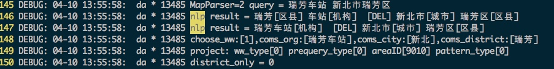

``` c++

//解决：机构名称中含有行政区 解析错误的情况
//比如：[瑞芳车站 新北市瑞芳区] where[瑞芳新北市瑞芳区] what[车站]
for(size_t i = 0; i < forms.size() && forms.size() > 1; ++i)
{
	string coms_org = "";
	string coms_city = "";
	string coms_district = "";

	for (size_t j = 0; j < forms[i].coms.size(); ++j) {
		string coms_tag = forms[i].coms[j].tag;
		if (strcmp(coms_tag.c_str(), "机构") == 0) {
			coms_org = forms[i].coms[j].content;
			continue;
		}
		if (strcmp(coms_tag.c_str(), "城市") == 0) {
			coms_city = forms[i].coms[j].content;
			continue;
		}
		if (strcmp(coms_tag.c_str(), "区县") == 0) {
			coms_district = forms[i].coms[j].content;
			continue;
		}
	}    //end for j

	//去掉 "市"后缀，比如：新北市区 处理成 新北
	string::size_type pos = coms_city.find("市");
	if (pos != string::npos){
		coms_city = coms_city.substr(0,pos);
	}
	//去掉"区县"后缀，比如:瑞芳区 处理成 瑞芳
	pos = coms_district.find("区");
	if (pos != string::npos){
		coms_district = coms_district.substr(0,pos);
	}else{
		pos = coms_district.find("县");
		if (pos != string::npos){
			coms_district = coms_district.substr(0,pos);
		}
	}
	//机构中是否含有行政区划
	if ((coms_city != "" && coms_org.find(coms_city) != string::npos) ||
			(coms_district != "" && coms_org.find(coms_district) != string::npos)) {
		choose_ww = i;
	    ul_writelog(UL_LOG_DEBUG, "choose_ww:[%d],coms_org:[%s],coms_city:[%s],coms_district:[%s]",
	    		choose_ww,coms_org.c_str(),coms_city.c_str(),coms_district.c_str());
		break;
	}
}//end for i

```


---

**问题跟进**
澳门威尼斯人酒店 澳门特别行政区

DA: 可能没有 "澳门威尼斯人酒店"，这个poi, NLP训练的词典，会把澳门拆出来。。
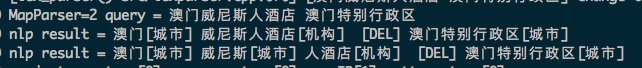
BS：
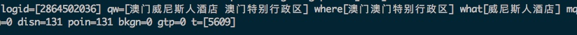
问题：数据没有"澳门威尼斯人酒店"，导致不会把其识别为机构，会把里面的澳门拆出来，识别为where。


澳门银河酒店 澳门特别行政区路氹城
DA解析没有问题，没有此poi数据
bs：没有此poi点"澳门银河酒店"，拼接wherewhat ,重查.?
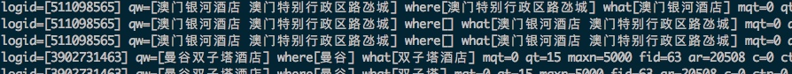


氹仔岛 澳门特别行政区氹仔岛

氹仔岛 是行政区划，单搜的话，DA只解析where，返回给AS，AS查行政区划表，命中。返回uii-se空uid和一个标识，不去bs查了。uii-se再去查gc，拿轮廓数据（暂时只有港澳台）。

如果输：氹仔岛 澳门特别行政区氹仔岛
bs：没有poi数据，叫氹仔岛，通过what匹配不到，结果都是通过where召回。
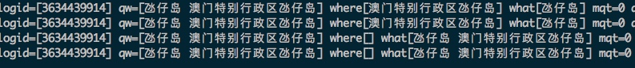
原始的poi点中有：凼仔岛  搜"凼仔岛 澳门特别行政区氹仔岛" 我们可以召回的啊。
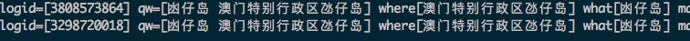


希尔顿东京台场酒店 东京

BS：没有poi。
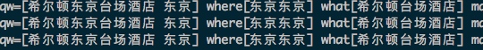


这几种case，没有解决，继续解决


##case 3

```

问题： 东京检索寿司，显示760条结果，但翻第二页后，弹出未搜出结果？

```
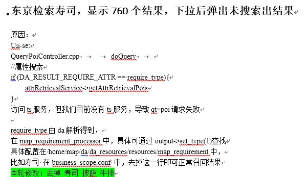


属性检索在检索中架构：


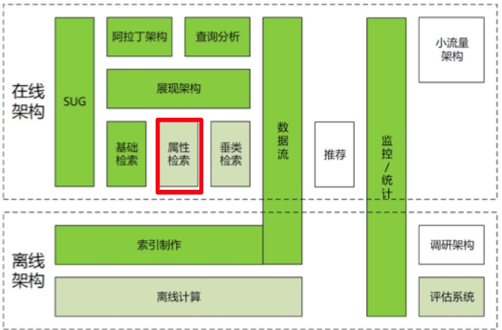


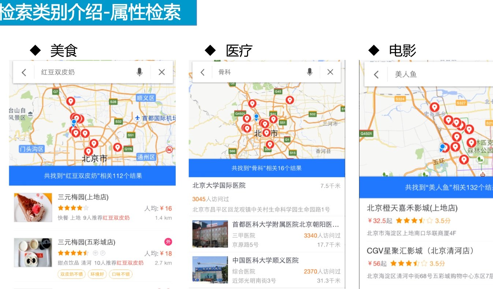


##case 4

```
intlmap-1819:
Na端东京， 检索 "靖国神社 青空古市"， 点击返回的第一条结果，详情的页的名字为空。

```

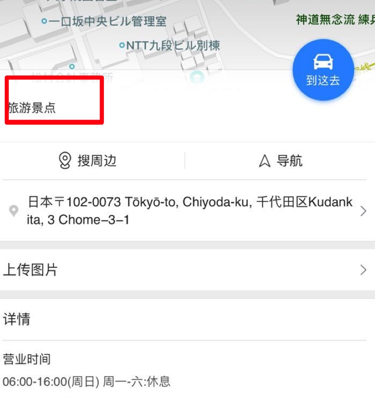

**问题分析**

NA的名字字段是哪个字段控制？
content.ext.detail_info.name

发现vui老版本能显示，新版本现实不了？

uii-se这层，字符串反序列化后，确实将ext.detail_info.name字段给丢失了？

di 返回的ext字段数据，是utf8的，同时数据里面的中文编码是unicode。
使用下面反序列化代码，将里面中文unicode编码转成gbk的中文。这个case，将name字段给转没有了。但暂未发现其它case有类似情况。
怀疑：1、原始数据，此name字段值，编码有问题。
     2、 此接口有bug，部分字符转换不成功。     

修复思路：

1、临时行：ext并列的有name字段，若ext.detail_info.name给转没了，使用name字段重新赋值。
2、根本： 为什么转没有了把name字段？

extChar中原始数据：

"name":"\ufa1c\u56fd\ufa19\ufa4c \u9752\u7a7a\u53e4\u5e02"

"name":"靖国神社 青空古市",

注意：第一个字符：fa1c开头，不在unicode转GBK的范围之内（http://www.cnblogs.com/feichengwulai/articles/3653368.html）；这个unicode是：cjk的"靖",通中文"靖"(https://codepoints.net/U+FA1C)
    
靖：fa1c  靖：9756  gbk：BEB8  
神：fa19  神：795E  gbk：C9F1
社：fa4c  社：793E  gbk：C9E7

F900-FAFF：CJK 兼容象形文字 (CJK Compatibility Ideographs)

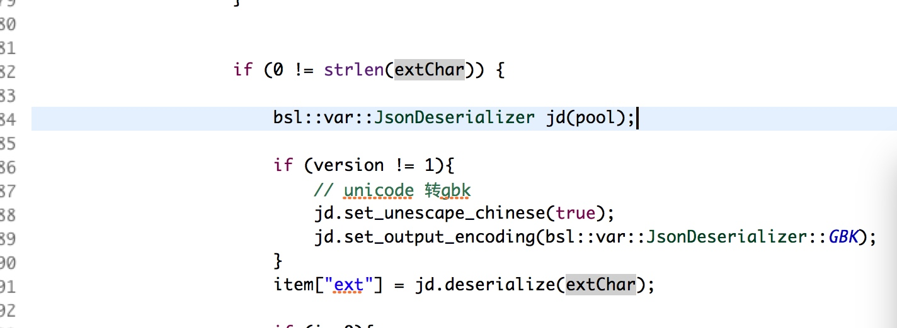


接口：deserialize不支持，CJK兼容象形文字的码段转gbk。
extChar有CJK类似的扩展unicode编码，比如：\ufa1c，接口set_output_encoding处理不了。码表中没有啊；依赖的码表：uii-se/public/uconv/un2gbkmap.h

处理思路：
先将unicode字段转为utf8，再整体将extChar转为gb18030，之后进行反序列化


lighttp请求uri：

/phpui2/?ldata={
  "src_from" : "mainpg_search",
  "se_id" : "c15b8e6551a88d65a9d030c59b495089"
}&lrn=20&da_src=poiSearchPG.searchBt&rp_format=pb&**qt=s**&rp_filter=simplified&l=19&route_traffic=1&req=1&sl=9&rp_version=1&loc=(12948087,4845120)&extinfo=32&b=(15555909,4233023;15556326,4233764)&rn=10&ie=utf-8&rp_oue=1&c=0&**wd=靖国神社 青空古市**&pn=0&sub_version=2&version=5&**sug=0**&mb=iPhone7,1&os=iphone10.100000&sv=9.8.0&net=1&resid=01&**cuid=1361817410762bcbb6b93b609b944ca1**&bduid=cRnT1zWt LgDJ&channel=1008648b&oem=&screen=(1242,2208)&dpi=(489,489)&ver=1&sinan=4ZlRaanmQzuNIOn_ kaT1dWYJ&co=454:07&ctm=1493877910.245000&sign=f741bb2881951208c76ab65a368e5b09&tk=d7b53dfce2a34099c43c68179df504a7


东京搜『靖国神社 青空古市』phpui这层拿到的uii返回的数据：

``` json
    {
        "data":{
            "backend_data":{
                "city_change":0,
                "cur_area_id":26041,
                "if_current":1,
                "parsed_cur_area_id":26041,
                "set_def":1
            },
            "children":null,
            "content":[
                {
                    "acc_flag":1,
                    "addr":"日本〒102-0073 Tōkyō-to, Chiyoda-ku, 千代田区Kudankita, 3 Chome−3−1",
                    "alias":[
                        "靖国神社 青空古市"
                    ],
                    "area":26041,
                    "biz_type":0,
                    "catalogID":0,
                    "cla":[
                    ],
                    "detail":1,
                    "dis":2105991,
                    "ext":{
                        "detail_info":{
                            "areaid":26041,
                            "brief_ticket":[
                            ],
                            "di_review_keyword":[
                            ],
                            "free":2,
                            "from_pds":"2",
                            "guide":0,
                            "link":[
                            ],
                            "list_min_price_save":0,
                            "name":"",  //确认NA，详情页头上面名称显示使用此字段。
                            "normal_features":[
                            ],
                            "overall_rating":"0",
                            "phone":"",
                            "poi_address":"日本〒102-0073 Tōkyō-to, Chiyoda-ku, 千代田区Kudankita, 3 Chome",
                            "point":{
                                "x":15556118.34,
                                "y":4233434
                            },
                            "rec_reason":"",
                            "refer_price":"",
                            "service_rating":"0",
                            "shop_hours":"06:00-16:00(周日) 周一-六:休息",
                            "shop_hours_flag":1,
                            "short_desc":"",
                            "std_tag":"旅游景点",
                            "tag":"旅游景点",
                            "ticket_book_flag":0,
                            "weighted_tag":"旅游景点:10"
                        },
                        "src_name":"scope"
                    },
                    "ext_type":4,
                    "f_flag":1,
                    "father_son":0,
                    "geo":".=6CMucBoU7OZA;",
                    "geo_type":2,
                    "name":"靖国神社 青空古市",
                    "new_catalog_id":"0c0000",
                    "poiType":0,
                    "poi_profile":0,
                    "primary_uid":"427472323",
                    "profile_geo":"",
                    "region_type":"international",
                    "route_flag":0,
                    "show_tag":[
                    ],
                    "status":1,
                    "std_tag":"旅游景点",
                    "storage_src":"api",
                    "tag":"",
                    "ty":2,
                    "uid":"8b496c8d04d8b0f08c1a8982",
                    "view_type":0,
                    "x":1555611834,
                    "y":423343400
                },
                ...
            ],
            "current_city":{
                "code":26041,
                "geo":".=417vcBInvKZA;",
                "level":0,
                "name":"东京",
                "sup":0,
                "sup_bus":1,
                "sup_business_area":0,
                "sup_lukuang":0,
                "sup_subway":0,
                "type":2,
                "up_province_name":"日本"
            },
            "error":0,
            "hot_city":[
                "北京市|131",
            ],
            "is_utf8":1,
            "lbs_forward":{
                "param":
            },
            "place_info":{
            },
            "previous_city":{
                "code":26041,
                "name":"东京"
            },
            "result":{
                "aladdin_res_num":2,
                "aladin_query_type":0,
                "area_profile":0,
                "catalogID":0,
                "cmd_no":45,
                "count":2,
                "current_null":0,
                "db":0,
                "debug":0,
                "disp_attr":1,
                "jump_back":0,
                "loc_attr":1,
                "op_gel":0,
                "page_num":0,
                "pattern_sign":0,
                "poi_region_type":"international",
                "profile_uid":"2bfcb14cf5cb2cfcc23644f2",
                "qid":"16961886214943137723",
                "region_type":"international",
                "requery":"",
                "res_bound":"(15556091,4233431;15556409,4233456)",
                "res_bound_acc":"(15556018,4233334;15556218,4233534)",
                "res_l":-1,
                "res_x":"0.000000",
                "res_y":"0.000000",
                "result_show":0,
                "return_query":"靖国神社 青空古市",
                "rp_strategy":1,
                "spec_dispnum":0,
                "spothot":false,
                "sug_index":-1,
                "time":0,
                "total":2,
                "total_busline_num":0,
                "tp":0,
                "type":11,
                "wd":"靖国神社 青空古市",
                "wd2":"",
                "what":"靖国神社 青空古市",
                "where":""
            }
        },
        "phpui":{
            "errNo":0,
            "errMsg":"OK"
        }
    }
    
```    

>> 总结：
>> 1、unicode中有CJK编码段
>> 2、unicode 和 utf8编码
>> 3、wchar_t 数据类型，针对unicode
>> 4、ucode库接口使用：uln_unicode_char_to_utf8: 把宽字符类型0x12af转为utf8汉字
>> 5、如何解析文本："name":"\ufa1c\u56fd\ufa19\ufa4c \u9752\u7a7a\u53e4\u5e02" -》"name":"靖国神社 青空古市"
>> 参考：
>> http://blog.csdn.net/caigen1988/article/details/19075073
>> 《unicode调研_陈天宇.docx》

    
---
## case 5

```
通过点击sug进入检索：uii-se-》as  后端拿到的query词PC和NA端是不一样的。
比如：点击sug词 "迪士尼乐园"  
PC: query: "迪士尼乐园" wd2: 东京
NA: query: "迪士尼乐园 东京"

``` 
**问题分析**

1.端上请求uri不同导致

* pc:
newmap=1&reqflag=pcmap&biz=1&from=webmap&da_par=direct&pcevaname=pc4.1&qt=s&da_src=searchBox.button&**wd=东京迪士尼乐园**&c=26041&src=0&**wd2=东京**&**sug=1**&l=19&b=(15571378.5,4224925.25;15571789.5,4225276.75)&from=webmap&biz_forward={"scaler":2,"styles":"pl"}&sug_forward=4b36e6178d65c36b82a00cd3
 
* NA:
    /phpui2/?spos=1&ldata={"src_from":"mainpg_search","se_id":"a259b593b670e79eae68d94648cdb4c5"}&lrn=20&da_src=poiSearchPG.sersug&rp_format=pb&qt=s&rp_filter=simplified&**sug_input=东京迪士尼乐园 东京**&l=19&ads_version=1.7.4&route_traffic=1&req=1&sl=5&loc=(11194857,1535168)&extinfo=32&sut=0&ie=utf-8&rn=10&b=(15571375,4224561;15571793,4225278)&c=0&**wd=东京迪士尼乐园 东京**&pn=0&**sug=1**&version=5&sub_version=960&mb=ONEPLUS A3000&os=Android23&sv=9.7.1&net=1&resid=01&cuid=2B1C43E9F716033D1953D86C7BBE5A27|0&bduid=&channel=baidu&oem=baidu&screen=(1080,1920)&dpi=(401,401)&ver=1&sinan=FJ+vn4mf6fOjx4IL94/cV/eR9&co=&phonebrand=OnePlus&patchver=&isart=1&ctm=1488371199.515000&sign=ade15fc38ec545b5214b47e4ca0b7efd

2.确认几个问题：

* 对于没有城市信息的，类泛需求的sug提示词，传入的请求，是什么情况？
  
  pc：sug=0 无sug_input字段 wd=美食 wd2没有值 （lightty，uii-se两层日志都一样）
  
  NA: sug=1 sug_input=美 wd=美食 无wd2字段
  
* 对于有城市信息的，sug提示词，传入请求的情况？

  pc： sug=1 wd=美邦快递 wd2=纽约，也就是wd_h字段
  NA:  sug=1 wd=美邦快递 纽约  没有wd2字段
  
**问题解决**
1.将pc端的sug请求，将wd+wd2 拼成一个新的query词，送到后端处理；同时记下原始的u_wd和u_wd2;
2.在回吐检索数据给phpui的时候，使用原始的u_wd和u_wd2，恢复response["result"]["wd"]和response["result"]["wd2"]两个字段。
否则，在pc端历史检索记录，会显示：『**东京迪士尼乐园 东京** 东京』有重复行政区划的bug。
  
  
  
  


