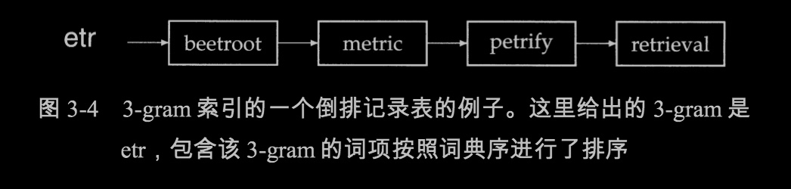
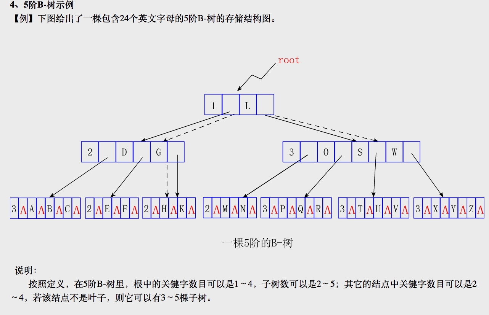

#第三章 词典及容错式检索
>《信息检索导论》
>美德两国作者 王斌翻译
>本文是本人的读书笔记
>本书参考：
>http://home.ustc.edu.cn/~zhufengx/ir/index.html [中科大的教学网站，非常具有参考价值] 

##3.2 通配符查询
###3.2.2 支持通配符查询的k-gram索引

k-gram： 举个例子
    castle的3-gram形式：` $cas,cas,ast,stl,tle,le$ `
    
k-gram 索引结构：[实质也是：倒排索引]



词典: 由所有词项的k-gram形式组成
倒排记录表: 包含该k-gram的所有词项组成

**k-gram 索引结构如何支持通配符的检索？**

```
re*ve： 查询步骤
    1. 构造布尔查询：$re AND ve$
    2. 去k-gram索引中，查找词典：$re 和 ve$，对应的词项list。假设：response，relieve，retrieve，move/relieve,retrieve,remove...
    3. 进行与操作，得到词项：relieve，retrieve
    4. 在普通的倒排索引中查找这些词项，并返回这些词项对应的docid。

    
red* ：导致查询不准确的例子及解决方案 
    1. $re AND red
    2. 词项list可能会有召回，但不准确的case：retired[不准确]、reddit[准确]
    3. 增加后过滤：postfiltering：利用red*，对上述结果进行字符匹配过滤。
    4. 再根据结果，比如reddit，到普通倒排索引中查找词项，返回docid。

```
    

##3.3 拼写校正

###3.3.1 拼写校正的实现？

grnt： 修正为 grant 或 grunt ？
flew form Heathrow:  修正为 flew from Heathrow?

###3.3.2 拼写校正的方法？

词项独立校正： isolated-term : 编辑距离方法、k-gram重复度法
上下文敏感的校正：context-sensitive :

###3.3.3 编辑距离
**编辑距离：** 将字符串s1变成s2，最小编辑操作（插入，删除，替换动作）数。比如：cat ->dog : 编辑距离是：3

**计算两个string的编辑距离：**
算法：？动态规划  时空复杂度：o(M*N)


实现：第3章：
https://github.com/ww5365/info_retrive/tree/master/src/guide_book

###3.3.4 拼写校正中的k-gram索引

要将上面问题：grnt 纠正为grant或grunt？通过计算query与"张的"相似集合S的编辑距离，找到距离最小的。但这个相似集合S如何产出？ k-gram索引

1. 找相似集合S
    
    bord 2-gram： bo or rd
    
    假设有下面的2-gram倒排索引表：
    
    
    通过bord的2-gram找到了，与其相似的词集合。假设我们只要拉链合并中出现过>=2次的词：aboard boardroom,border
    
    进一步筛选出更合理的S集合？ 提出该问题的出发点：boardroom 这种其实和bord差距还是有点大的。
    
    **雅可比系数**：|A交B|/|A并B|  A：query的k-gram B：待选某个词项k-gram集合
    
    举个例子：query=bord   2-gram：[bo or rd]    
    待选词项：boardroom [bo oa ar rd dr ro oo om]
    j_coefficient = 2/9   [值越大，其实越相似]
    
    计算过程发现，我不可能计算每个待选词项的k-gram，计算量大了；
    假设我们倒排记录表中预先保存了boardroom的k-gram的个数8，query=bord的2-gram好计算：3； 通过遍历我们知道2-gram重合部分，也就是交集2；雅可比系统，可以这样计算： 2/[8+3-2] = 2/9

2. 计算query与集合S的编辑距离，找最小的。作为纠错词项。


 


##补充：B-树


B-树的定义

1、B-树的定义
    　一棵m(m≥3)阶的B-树是满足如下性质的m叉树：
(1)每个结点至少包含下列数据域：
    (j，P0，Kl，P1，K2，…，Ki，Pi)
　　其中：
    j为关键字总数
    Ki(1≤i≤j)是关键字，关键字序列递增有序：K1 <K2<…<Ki。
    Pi(0≤i≤j)是孩子指针。对于叶结点，每个Pi为空指针。
  注意：
    　①实用中为节省空间，叶结点中可省去指针域Pi，但必须在每个结点中增加一个标志域leaf，其值为真时表示叶结点，否则为内部结点。
　②在每个内部结点中，假设用keys(Pi)来表示子树Pi中的所有关键字，则有：
　　　　　　　keys(P0)<K1<keys(P1)<K2<…<Ki<keys(Pi)
即关键字是分界点，任一关键字Ki左边子树中的所有关键字均小于Ki，右边子树中的所有关键字均大于Ki。
(2)所有叶子是在同一层上，叶子的层数为树的高度h。
(3)每个非根结点中所包含的关键字个数j满足：
                [m/2]-1 <= j <= m-1

即每个非根结点至少应有[m/2]-1个关键字，至多有m-1个关键字。
因为每个内部结点的度数正好是关键字总数加1，故每个非根的内部结点至少有[m/2]子树，至多有m棵子树。
(4)若树非空，则根至少有1个关键字，故若根不是叶子，则它至少有2棵子树。根至多有m-1个关键字，故至多有m棵子树。

2、B-树的存储结构

```
 #define Max l000 //结点中关键字的最大数目：Max=m-1，m是B-树的阶
 #define Min 500 //非根结点中关键字的最小数目：Min=┌m/2┐-1
typedef int KeyType； //KeyType应由用户定义
typedef struct node{ //结点定义中省略了指向关键字代表的记录的指针
  　int keynum； //结点中当前拥有的关键字的个数，keynum《Max
  　KeyType key[Max+1]； //关键字向量为key[1..keynum]，key[0]不用。
  　struct node *parent； //指向双亲结点
  　struct node *son[Max+1]；//孩子指针向量为son[0..keynum]
 }BTreeNode；
typedef BTreeNode *BTree；
```

3、B-树例子




