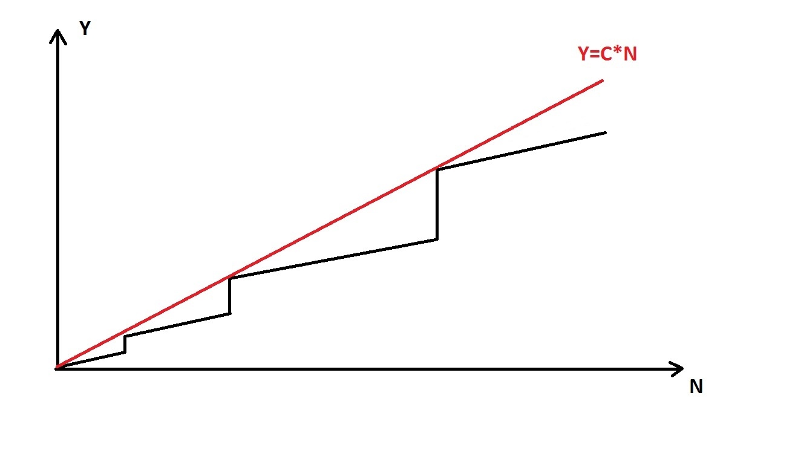
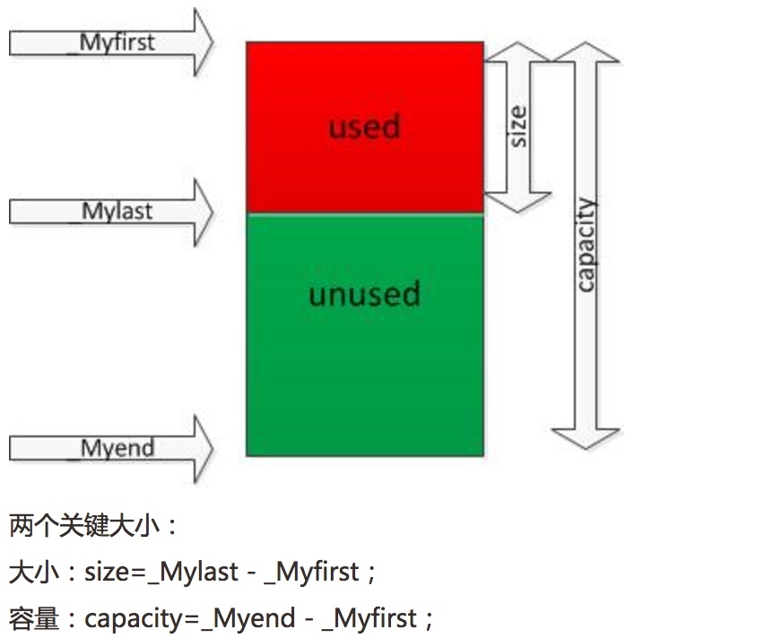

# c++ STL - vector 
>mainly introduce vector's : instructions、implement、thread-safety 
>vector容器使用较多，记录积累它

---


## 一 basic introduction

amortized constant time complexity：分期常量时间复杂度 push_back


To develop an intuitive way of thinking about it, consider insertion of elements in dynamic array (for example std::vector in C++). Let's plot a graph, that shows dependency of number of operations (Y) needed to insert N elements in array:




Vertical parts of black graph corresponds to reallocations of memory in order to expand an array. Here we can see that this dependency can be roughly represented as a line. And this line equation is Y=CN + b (C is constant, b = 0 in our case). Therefore we can say that we need to spend CN operations on average to add N elements to array, or C*1 operations to add one element (amortized constant time).

与其它的动态顺序容器(lists,forward_lists,deques)相比，访问数据元素更加高效，尾部插入删除也较高效；但插入和删除效率要低，同时，iterator和reference比list，forward_list稳定性要差些。

连续，动态数组，内存分配器


---

## 二 instructions

* 基本介绍

``` c++
#include <vector>  //头文件
using namespace std; //名空间
```
vector 存储空间连续；list不连续；

* 初始化

```c++
std::vector<std::string> vec_str1; //空的vec，存储string类型
vector<string> vec(vec_str1); //使用另一个vec，来初始化新的vec
vector<string> vec(10); //创建具有10个空间的vec，但此时没有元素
vector<int> vec(3,100); //创建3个空间，都放置100
vector<int> vec(arr,arr+6);//使用数组，前6个值，初始化vec
//定义并初始化二维数组
vector<vector<int> > vec(ROW,vector(COL,0));


```

* 元素存储及访问

``` c++
vec_str1.push_back(str1);//尾部存放一个string元素
vec_str1.at(INDX); //访问位置INDX处的元素，越界抛异常out of range
vec_str[INDX];//无异常检查

//最长用迭代器来访问
for (vector<string>::iterator it = vec_str1.begin();it != vec_str1.end(); ++it){
     cout << "it->内容:" << *it <<endl;
}

```

* 元素插入：


push_back():
    
insert()函数原型：

``` c++

1. iterator insert (const_iterator position, const value_type& val);

2. iterator insert (const_iterator position, size_type n, const value_type& val);
	
3. template <class InputIterator>
iterator insert (const_iterator position, InputIterator first, InputIterator last);

4. iterator insert (const_iterator position, value_type&& val);	
5. iterator insert (const_iterator position, initializer_list<value_type> il);

//将多个vector中的值合并到一个vector中，使用原型3
vec.insert(vec.end(),other.begin(),other.end());
//将数组arr中3个元素插入到vector中,注意最后参数标识截至位置点
vec.insert(vec.begin(),arr,arr+3)

```

emplace_back();
emplace();

//emplace是c++11新加入的成员；和insert的区别是？这种插入操作会执行两次初始化构造，一次对象的初始化构造，一次插入时的拷贝构造；使用emplate再插入时，直接构造；效率提升；建议使用；

vector<string> book;
book.push_back("book name");//构造book name临时变量；之后执行拷贝构造函数，将临时对象拷贝到容器
book.emplace_back("book name");//在容器管理的内存空间，直接构造一个新元素


* 其它函数介绍


| 函数 | 描述 |
| --- | --- |
| c.empty() | 判断容器是否为空 |
| c.size() | 容器实际装的元素个数； |
| c.capcity() | 容器能装元素的个数； |
| c.reserve() | 保留适当的容器大小 |
| void erase(iterator pos)  void erase(iterator first,iterator last) | 删除pos位置/值为val/起始位置元素；返回下一个数据位置； |
| c.clear() | 清空容器中的所有元素； |
| c1.swap(c2) swap(c1,c2) | 将容器c1和c2中的元素互换；  |
| reference front(); const_reference front() const; reference back(); const_reference back() const; | 返回容器中第一个或最后一个元素的引用（容器必须非空）
|


``` c++
//有意思的应用：当大量删除了vec中元素时，此容器的capcity比较大，但size很小了。造成空间浪费；
//如何消除臃肿，释放空间？创建自身拷贝，再和其互换；

vector<string> v1;//capcity是100 ，size是2 

vector<string> (v1).swap(v1); //v1调整为capcity为2；相当于下面过程：

vector<string> v2(v1);// v2 capcity 和 size 都为2
v2.swap(v1); //v1的capcity是2 ，V2的capcity是1000；

```

## implement


``` c++

template<class _Ty,
    class _Ax>
    class vector
        : public _Vector_val<_Ty, _Ax>
    {   // varying size array of values
public:
    /********/
protected:
    pointer _Myfirst;   // pointer to beginning of array
    pointer _Mylast;    // pointer to current end of sequence
    pointer _Myend; // pointer to end of array
    };

```


分别对应于resize()、reserve()两个函数。 
size表示vector中已有元素的个数，容量表示vector最多可存储的元素的个数；为了降低二次分配时的成本，vector实际配置的大小可能比客户需求的更大一些，以备将来扩充，这就是容量的概念。即capacity>=size，当等于时，容器此时已满，若再要加入新的元素时，就要重新进行内存分配，整个vector的数据都要移动到新内存。二次分配成本较高，在实际操作时，应尽量预留一定空间，避免二次分配


## thread-safety
* 结论
STL 线程不安全，每次插入，删除，读取元素，保证原子性

来自<< Effective STL >> 条款十二

> 1、在每次调用容器的成员函数期间都要锁定该容器。
> 2、在每个容器返回的迭代器（例如通过调用begin或end）的生存期之内都要锁定该容器。
> 3、在每个在容器上调用的算法执行期间锁定该容器。（这事实上没有意义，因为，正如条款32所解释的，算法没有办法识别出它们正在操作着的容器。不过，我们将在这里检验这个选项，因为它的意义在于看看为什么即使是可能的它也不能工作。）

* 实现线程安全？ 
  参考：http://blog.csdn.net/xsckernel/article/details/52093902
  
  
  
  
## reference


