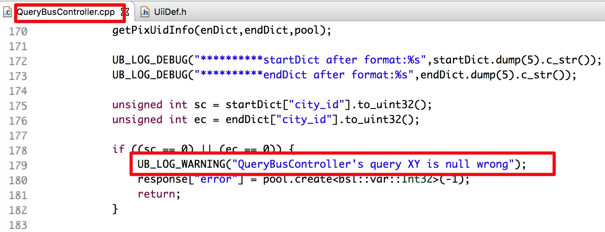
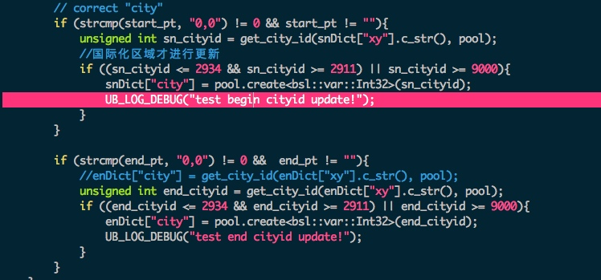

# UII 路线规划 CASE

##case 1
1. 问题描述：
http://newicafe.baidu.com:80/issue/map-bugs-37836/show?from=page

2. 问题定位：



终点坐标为null了

起点坐标：13527642.000000,2863753.000000

终点坐标：gdb时发现city id在en after format 之后，就为0了？

（13517179.000000,2880152.000000）roam更新之后，坐标为0...

3. 问题解决思路：

1）roam：海岸线位置，是没有划分区域；导致xy取不到cityid。
2）当向uii-route发起qt=bus的请求时。再次用xy坐标更新cityid时，如果不是国际化区域，继续沿用传入进来的cityid。不进行更新。
这依赖于传进来的值有，且正确。这个值，对于两个起始点是key值的情况，是检索返回的cityid；




4. 问题延伸：

对于两个起始点是关键词的情况：先发起qt=traffic_poi的请求，之后再封装参数进行qt=bus的请求；


* 台北松山机场 -》 台北大学： qt=traffic_poi 检索返回的结果，如下：

``` json

{
    "backend_data":{
        "city_change":0,
        "cur_area_id":9002,
        "if_current":1,
        "parsed_cur_area_id":9002,
        "set_def":1
    },
    "current_city":{
        "code":9002,
        "geo":"1|13533673.75,2862507.48;13533673.75,2862507.48|13533673.75,2862507.48;",
        "level":0,
        "name":"台北市",
        "sgeo":[
            13533673,
            2862507
        ],
        "sup":0,
        "sup_bus":1,
        "sup_business_area":0,
        "sup_lukuang":0,
        "sup_subway":1,
        "type":2,
        "up_province_name":"台湾省"
    },
    "hot_city":[

    ],
    "is_utf8":1,
    "lbs_forward":{
        "param":[
            {
                "forward_query":null,
                "jump_uid":"693145007",
                "module":"as"
            },
            {
                "forward_query":null,
                "jump_uid":"140536881",
                "module":"as"
            }
        ]
    },
    "nc_city_id":9002,
    "result":{
        "qid":"",
        "uii_type":"global",
        "region":"9000",
        "uii_qt":"traffic_poi"
    },
    "result_array":[
        {
            "bid":"693145007",
            "city_id":9002,
            "icbt_area":0,
            "icbt_res":0,
            "new_cname":"台北市",
            "new_cur_area_id":9002,
            "new_wd":"台北松山机场 (TSA)",
            "nt_uid":"afa47bd50e4b738514b54ba5",
            "p_stop":"1$$13532344.000000,2865699.000000",
            "prio_flag":1,  
            "pt":"13532344.000000,2865699.000000",
            "result":{
                "count":24
            },
            "tf_res":0
        },
        {
            "bid":"140536881",
            "city_id":9002,
            "icbt_area":0,
            "icbt_res":0,
            "new_cname":"台北市",
            "new_cur_area_id":9002,
            "new_wd":"台北市立大学",
            "nt_uid":"95b66bb149e09ae012293567",
            "p_stop":"1$$13528142.000000,2862216.000000",
            "prio_flag":1, //强展示，不出城市列表；为0的话出城市列表
            "pt":"13528142.000000,2862216.000000",
            "result":{
                "count":50
            },
            "tf_res":0
        }
    ]
}

```

* 之后封装参数，如过是start_city_id 等于end cityid 发起同城，否则发起跨城公交；如果prio_flag为0 还要出城市列表，之后进行qt=bus的请求：
    
    参数sn和en中的type 字段如下：
    
     ``` c++
    #define TYPE_UID 0 //起终点都有uid
    #define TYPE_XY 1  //无uid，起终点是xy坐标
    #define TYPE_KEYWORD 2 //起终点就是输入的key关键词
     
     ```
     
     
     


-------


