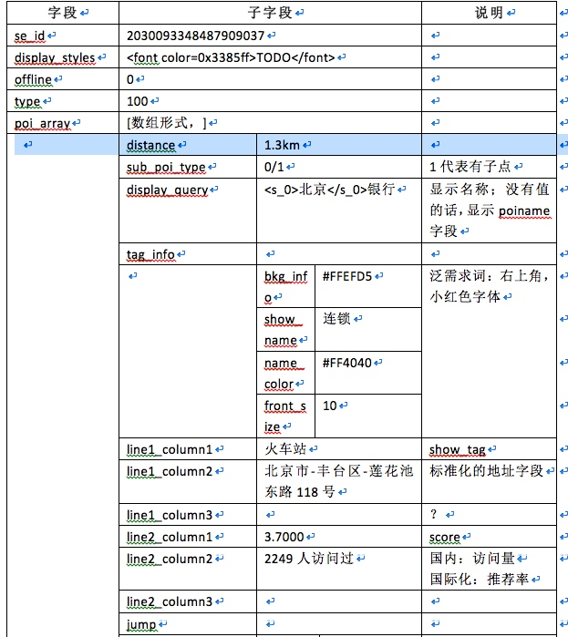
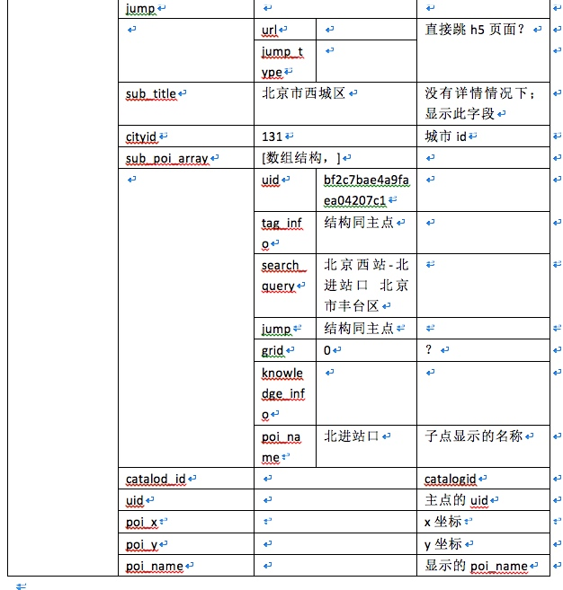

# SUG国际化现状和协议分析 -- 之一


------

>2017-03-01 18:29:32
>别人笑我太疯癫，我笑别人看不穿；不见五陵豪杰墓，无花无酒锄作田；

-----
##一、了解现状

> 检索中qt=s，通过sug进入检索的占比？ 
> 意义在于，占比越高，说明sug服务给用户提示帮助越大；sug服务的意义也就越大；

* 1.1 通过uii-se 、phpui的日志，手工统计：
   
    uii-se层统计：  gzhxy-ns-c22-xi2-map360z20151202233448558129.gzhxy.baidu.com：/home/map/wangwei/data/uii-se-log         

    日志格式：sug=1 
     统计点：grep -oP "sug=[0-9]" ./all.res |sort |uniq -c
    
    | qt | sug=0 | sug=1 | sug=2 | sug=3 |
    | --- | --- | --- | --- | --- |
    | poi | 6580946 | 6448206 | 69071 | 24 |

    **统计结论**：

    uii-se层统计占比： 2%；
    问题: 
    1：sug检索量/检索总量,这个检索总量包含了webmap，apimap，aladin的所有泛和精确检索；导致占比低；实际想要是，sug检索量/PC检索的量.
    2：区分不了泛需，还是精确需求？


* 1.2 udw表统计：  
      
    来源：是webmap和NA的；国际化的； 
    纬度： 精确和泛需求 (op_gel=1: 泛需求，op_gel=0:精确需求)
      
    sug=0 未用sug检索 其它都是用sug的
    sug=1 正常webmap  
    sug=2 历史记录sug提示
    sug=3 ？
    
    
    | 类型 | sug=0/N | sug=1 | sug=2 | sug=3 | 占比 |
    | --- | --- | --- | --- | --- | --- |
    | 精确需求 | 55266 + 1599448 = 1654714 | 455354 | 572181 | 231 | 1027766/2682480 ~ 38% |
    | 泛需求 | 388813 + 133508 = 522321 | 44088 | 55111 | 15 | 99214/621535 ~ 16% |
   
    

 
 产品升级之后的统计：
 

      
      
      
 ---
   
##二、sug初始请求uri和返回数据协议分析


* 2.1 NA端sug请求url参数分
    `/su?st=0&highlight_flag=2&rp_format=pb&qt=sug&l=16&cid=131&loc=(12948087.641205,4845126.899421)&type=0&b=(12947164,4843105;12948971,4846318)&wd=mei shi&mb=iPhone7,1&os=iphone10.300000&sv=9.8.5&net=1&resid=01&cuid=0cc8cf9f3879290e591d2850c48b8930&bduid=4DVu/NU3Sk6lS&channel=1008648b&oem=&screen=(1242,2208)&dpi=(489,489)&ver=1&`
    
        
    | 参数名 | 说明 | 默认值 |
    | --- | --- | --- |
    | su | 国际化会被重写为:mapssu |  |
    |st|两框检索所处的具体位置|0:大框；1:周边；2,公交；3，驾车；4,步行骑行；5，出租、专车；| 
    |highlight_flag|标识是否高亮显示数据|na传值：2|
    |rp_format|返回数据的格式；pb||
    |qt|queyr类型：sug||
    |l|图区级别||
    | cid | 城市citycode |cid支持中文或cityid  |
    | loc | 定位点坐标 |  |
    | type |Type对应0，1，2，3| lighttp.conf中根据不同type进行不同的访问。type=0，是大框sug服务器；type=2，是公交两框的sug服务器； |
    | b | 图区视野 | 这个参数重要，分流插件根据这个参数进行分流处理 |
    | wd | 输入的query |  |
    | mb | 手机型号 |  |
    | os | 手机操作系统版本号 |  |   
    | sv | 地图的版本号 |  |
    | net |网络类型|-1:无网络或断网；0:未知网络类型;1:wifi|
    | resid | ？ |  |
    | cuid | 用户的cuid |  |   
    | ct_l | 限定城市召回，暂时只有api使用； |1标识可召回其它城市的结果，默认|


        
* 2.2 NA端返回的数据协议分析：
 
 
 
    
        
    
* 2.3 PC请求uri分析：
      `/su?wd=%E6%B7%B1%E6%B0%B4%E5%9F%97&cid=1&if_poi_xy=1&type=0&newmap=1&b=(12705277.135367414%2C2532054.0358466455%3B12708351.80535144%2C2538038.5141533543)&t=1504234964454&pc_ver=2`
        
    | 参数名 | 说明 | 默认值 |
    | --- | --- | --- |
    | su | 国际化会被重写为:mapssu |  |
    | wd | 用户输入的qury |  |
    | cid | 开放平台需要支持 | cityid或者城市名字？cid支持中文或cityid，如果是城市名称，通过raw.area建的trie树，返回cityid |
    | if_poi_xy | 开放平台 | 是否返回xy坐标 |
    | type |Type对应0，1，2，3| lighttp.conf中根据不同type进行不同的访问。type=0，是大框sug服务器；type=2，是公交两框的sug服务器； |
    | pc_ver |主要是控制返回pc端的数据协议|pc端是否返回uid和xy坐标；2，增加透传字段；目前只有uid，xy|
    | t | 时间戳 |  |

    


* 2.4 PC端返回数据协议分析： 
            
    ``` json
    [{"q":"北京大学", //query
     "p":false, //query是否是完全的字母或空格
     "t":0,  //参数type数据
     "s":[
     "北京市$海淀区$$北京大学$131$ddfd7c2d8db36cf39ee3219e$"<12111230816633752856>,
     "北京市$西城区$$北京大学第一医院$        131$34f68ab0bedfdd138e55ec9d$"<1259843375410970623>,
     "北京市$海淀区$$北京大学第三医院$131$550fd5f96e079260921fc9f3$"<1266055680532414463>,
     "北京市$西城区$$北京大学人民医院$131$5211d2191fb8b6257dc8763a$"<17669963967956516863>,..]
     }]
                    
    ```
         
         
         

---

##三、 sug和检索
  

> 1、点击sug进入检索的请求url和普通的url有什么不同？
> 2、sug能否为检索提供些直接可用的信息？
       
 
* 3.1 pc端检索请求

    * 正常检索uri: 
    `/?newmap=1&reqflag=pcmap&biz=1&from=webmap&da_par=direct&pcevaname=pc4.1&qt=s&da_src=searchBox.button&wd=东京迪士尼乐园&c=26041&src=0&wd2=&sug=0&l=19&b=(15571378.5,4224925.25;15571789.5,4225276.75)&from=webmap&biz_forward={"scaler":2,"styles":"pl"}&**sug_forward**=&tn=B_NORMAL_MAP&nn=0&ie=utf-8&t=1488364532452`

    * 通过sug检索的uri：      
    `/?newmap=1&reqflag=pcmap&biz=1&from=webmap&da_par=direct&pcevaname=pc4.1&qt=s&da_src=searchBox.button&wd=东京迪士尼乐园&c=26041&src=0&wd2=东京&sug=1&l=19&b=(15571378.5,4224925.25;15571789.5,4225276.75)&from=webmap&biz_forward={"scaler":2,"styles":"pl"}&sug_forward=4b36e6178d65c36b82a00cd3` 
      
        这层的结论：
            (1)通过sug进入检索：sug=1，且wd2会有值；
            (2)sug返回的uid值，赋到sug_forward; 
            (3)当前图区cityid：参数c
            (4)wd是输入的query，wd2是行政区划   
       
   
* 3.2 NA端检索请求
  
    * 正常uri:
    `/phpui2/?      ldata={"src_from":"mainpg_search","se_id":"2b7979a11b0c290a861c5931af90c246"}&lrn=20&da_src=poiSearchPG.searchBt&rp_format=pb&qt=s&rp_filter=simplified&l=17&ads_version=1.7.4&route_traffic=1&req=1&loc=(11194857,1535168)&extinfo=32&ie=utf-8&rn=10&b=(15570837,4223954;15572507,4226820)&c=0&wd=东京迪士尼乐园&pn=0&sug=0&version=5&sub_version=960&mb=ONEPLUS A3000&os=Android23&sv=9.7.1&net=1&resid=01&cuid=2B1C43E9F716033D1953D86C7BBE5A27|0&bduid=&channel=baidu&oem=baidu&screen=(1080,1920)&dpi=(401,401)&ver=1&sinan=TbdMwaWZKdlcS817faJTfciXn&co=&phonebrand=OnePlus&patchver=&isart=1&ctm=1488371029.355000&sign=1127ffd79bb30d1938f528da2205d490` 

    * 通过sug的uri：
    `/phpui2/?**spos=1**&ldata={"src_from":"mainpg_search","se_id":"a259b593b670e79eae68d94648cdb4c5"}&lrn=20&da_src=poiSearchPG.sersug&rp_format=pb&qt=s&rp_filter=simplified&**sug_input=东京迪士尼**&l=19&ads_version=1.7.4&route_traffic=1&req=1&sl=5&loc=(11194857,1535168)&extinfo=32&sut=0&ie=utf-8&rn=10&b=(15571375,4224561;15571793,4225278)&c=0&**wd=东京迪士尼乐园 东京**&pn=0&**sug=1**&version=5&sub_version=960&mb=ONEPLUS A3000&os=Android23&sv=9.7.1&net=1&resid=01&**cuid=2B1C43E9F716033D1953D86C7BBE5A27|**0&bduid=&channel=baidu&oem=baidu&screen=(1080,1920)&dpi=(401,401)&ver=1&sinan=FJ+vn4mf6fOjx4IL94/cV/eR9&co=&phonebrand=OnePlus&patchver=&isart=1&ctm=1488371199.515000&sign=ade15fc38ec545b5214b47e4ca0b7efd`
    
       这层的结论：
    
           (1)spos：代表用户点击了第几行的sug
           (2)cuid：通过此参数将sug返回的uid信息透传给检索；同时也赋给了bid,fbid
           (3)c：都是0啊
           (4)sug=1：通过sug检索；sug取值 1，2，3：正常，历史纪录，公交?
           (5)sug_input：用户输入query ；
           (6)wd：点选的sug词，也是检索的query
              比如：sug_input=迪士尼 wd=迪士尼乐园 东京  
 
 
     
     
     
     
                    
         
   
   
   
   
   
   
         
   
   


   


