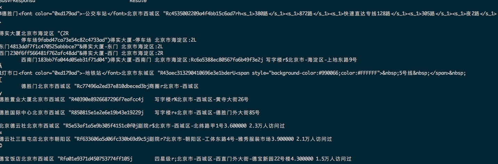

# 一 SUG国际化现状和uri分析


------

>2017-03-01 18:29:32
>开始入手学习，准备 ，深入  sug

##一、了解现状

-----

1. 检索中qt=s，通过sug进入检索的占比？

* 通过uii-se 、phpui的日志，手工统计：
   
uii-se层统计：  gzhxy-ns-c22-xi2-map360z20151202233448558129.gzhxy.baidu.com：/home/map/wangwei/data/uii-se-log         

日志格式：

NOTICE: 02-14 08:04:45:  uii_se * 6170 [  logid:1764041900  ][  proctime:total:101(ms) rev:0+proc:101+write:0  ][  reqip:10.67.19.47  ][  reqsvr:RAL  ][  cmdno:poi  ][  svrname:uii_se  ][  errno:0  ][    ][  uii: logid=1764041900 **wd=%CE%C2%C9%AF%B3%C7%B1%A4+%B2%AE%BF%CB%BF%A4 qt=poi** wd_h= b=%28-188761%2C6615932%3B-105907%2C6740213%29 l=10 pn=0 rn=10 **sug=1** buid= geocty=0 geoty=1 st=0 dt=map strategy=0 db=0 nc=51441 cn= src=0 sn= en= type=11 err_no=0 res_no=1 sugq=0 specr=0 psrs=0 qid=15810406861360777268 uids=248624041,0,0,0,0,0,0,0,0,0 accflags=0,0,0,0,0,0,0,0,0,0 rp_strategy=1 rp_des_type=0 uniqid=0 optime=1487030685.332 cost=101 uip=111.193.229.196 client_ip=10.67.19.47 local_ip=10.67.18.38 **product=map subsys=apimap** module=uii_se modid=140673976625504 children=    ][    ]

     
grep -oP "sug=[0-9]" ./all.res |sort |uniq -c

| qt | sug=0 | sug=1 | sug=2 | sug=3 |
| --- | --- | --- | --- | --- |
| poi | 6580946 | 6448206 | 69071 | 24 |


```

uii-se层统计占比： 2%；
问题: 
1. sug检索量/检索总量,这个检索总量包含了webmap，apimap，aladin的所有泛和精确检索； 实际想要是，sug检索量/PC检索的量.
2. 区分不了泛需，还是精确需求？

```

* udw表统计：  
 
use namespace udw_ns;
select 0,event_day,
1,lbs_query_word，
2,lbs_sugs,
3,lbs_suge,
4,lbs_detail_action,
5,event_location_city,  --根据移动设备的定位信息得到的城市信息
6,lbs_city, --城市名字
7,lbs_cityid, --城市信息
8,lbs_city_name, --根据city_id计算出来的被检索城市的名称
9,lbs_postopgel --返回泛需求结果标识   
  
from udw.udw_event
where event_action = 'lbsquery' 
and lbs_query_type = 's'
and lbs_postopgel = '0'
and ((lbs_cityid >= '2912' and lbs_cityid <= '2934')
or (lbs_cityid  >= '9000'))
    
and event_day <= '20170302' 
and event_day >= '20170301'  
     
limit 100;
  
  
来源：是webmap和NA的；国际化的； 
纬度： 精确和泛需求 (op_gel=1: 泛需求，op_gel=0:精确需求)
  
sug=0 未用sug检索 其它都是用sug的
sug=1 正常webmap  
sug=2 历史记录sug提示
sug=3 ？

| 类型 | sug=0/N | sug=1 | sug=2 | sug=3 | 占比 |
| --- | --- | --- | --- | --- | --- |
| 精确需求 | 55266 + 1599448 = 1654714 | 455354 | 572181 | 231 | 1027766/2682480 ~ 38% |
| 泛需求 | 388813 + 133508 = 522321 | 44088 | 55111 | 15 | 99214/621535 ~ 16% |
|  |  |  |  |  |  |

  
 ---
   
##二、初始请求uri和分析


* sug本身请求url特点
/su?st=0&highlight_flag=2&rp_format=pb&**qt=sug**&l=13&cid=2912&**loc=(12948088.310858,4845123.230306)**&**type=0**&**b=(12700763,2533057;12717519,2562846)**&wd=ms&mb=iPhone7,1&os=iphone10.100000&sv=9.8.0&net=1&resid=01&cuid=1361817410762bcbb6b93b609b944ca1&bduid=lP22Vl4m=u79N&channel=1008648b&oem=&screen=(1242,2208)&dpi=(489,489)&ver=1&...
    
    | 参数名 | 说明 | 默认值 |
    | --- | --- | --- |
    | su | 国际化会被重写为:mapssu |  |
    | wd | 输入的query |  |
    | cid | 城市citycode |  |
    | type |Type对应0，1，2，3| lighttp.conf中根据不同type进行不同的访问。type=0，是大框sug服务器；type=0，是公交两框的sug服务器； |
    | loc | 定位点坐标 |  |
    | b | 图区视野 | 这个参数重要，分流插件根据这个参数进行分流处理 |
    |  |  |  |
        
* 返回的数据：NA
 
 ```
 curl "http://10.150.206.11:8096/su?st=0&highlight_flag=2&rp_format=pb&qt=sug&l=17&cid=131&loc=%2812948084.026936%2C4845122.151636%29&type=0&b=%2812947250%2C4843638%3B12948917%2C4846601%29&wd=de&mb=iPhone8%2C2&os=iphone10.300000&sv=9.8.0&net=1&resid=01&cuid=00e9673df72da21c88cc16584f0a4656&bduid=&channel=1008648b&oem=&screen=%281242%2C2208%29&dpi=%28489%2C489%29&ver=1&sinan=XtRH9pzFDl3sOuBb8Up0WP7pP&co=460%3A02&ctm=1496908462.830000&sign=dff9c2adb049acf2233d45b38fd6a742"
 ```        

    


* 使用sug的检索的请求req及日志的特点？
    
    ```
    >分析lighttpd和phpui结论：
    >sug=1：此参数不为0，是通过sug进入的；sug取值 1，2，3：正常，历史纪录，公交?
    >通过sug检索，参数：sug=1
    >NA端：sug_input 和 wd 参数： 迪士尼乐园 东京  【query 行政区】
    >Pc端： wd是输入的query，wd2是行政区划
    >uii-se层日志日志结论：phpui层的qt=s，会转成2个qt（s，poi）到uii； 日志中，sug=1，wd_h会有值，一般是行政区划名称; 
    
    > sug返回的qt=s信息利用：
    
    广州市$黄埔区$$mps包装有限公司$257$65adb1c4fbce05c9c1f1cf9b$
    香港特别行政区$葵青区$$m&d实业有$2912$5a623343cf598975e8e58297#12706464.15,2538764.03$  
    
    大陆,PC:将uid赋值 sug_forward；NA，将uid赋值qt=s的url中的bid； 
    
    将sug的返回数据，保持和大陆的协议一直。看能否在url中自动加上此两个值参数。  
    
    ```
 
* pc：
   
    lighttpd：
         
    正常检索uri: 
    /?newmap=1&reqflag=pcmap&biz=1&from=webmap&da_par=direct&pcevaname=pc4.1&qt=s&da_src=searchBox.button&wd=东京迪士尼乐园&c=26041&src=0&wd2=&sug=0&l=19&b=(15571378.5,4224925.25;15571789.5,4225276.75)&from=webmap&biz_forward={"scaler":2,"styles":"pl"}&**sug_forward**=&tn=B_NORMAL_MAP&nn=0&ie=utf-8&t=1488364532452
     
    通过sug检索的uri：
      
    /?newmap=1&reqflag=pcmap&biz=1&from=webmap&da_par=direct&pcevaname=pc4.1&qt=s&da_src=searchBox.button&wd=东京迪士尼乐园&c=26041&src=0&wd2=东京&sug=1&l=19&b=(15571378.5,4224925.25;15571789.5,4225276.75)&from=webmap&biz_forward={"scaler":2,"styles":"pl"}&sug_forward=4b36e6178d65c36b82a00cd3 
      
    这层的结论：通过sug检索，参数：sug=1，wd2会有值
     
    uii-se：
         
    正常检索：
       
    [  logid:2137967519  ][  proctime:total:60(ms) rev:0+proc:60+write:0  ][  reqip:10.120.28.46  ][  reqsvr:uii-proxy  ][  cmdno:s  ][  svrname:uii_se  ][  errno:0  ][    ][  uii: logid=2137967519 wd=%B6%AB%BE%A9%B5%CF%CA%BF%C4%E1%C0%D6%D4%B0 qt=s wd_h= b=%2815571378.5%2C4224925.25%3B15571789.5%2C4225276.75%29 l=19 pn=0 rn=10 sug=0 buid= geocty=0 geoty=0 st=0 dt=map strategy=0 db=0 nc=26041 cn= src=0 sn= en= type=104 err_no=0 res_no=0 sugq=0 specr=0 psrs=0  rp_strategy=0  uniqid=910449811 optime=1488364775.484 cost=60 uip=172.22.178.121 client_ip=10.120.28.46 local_ip=10.120.28.46 product=map subsys=webmap module=uii_se modid=139671038380384    ][    ]
    [  logid:2137967519  ][  proctime:total:200(ms) rev:0+proc:200+write:0  ][  reqip:10.120.28.46  ][  reqsvr:uii-proxy  ][  cmdno:poi  ][  svrname:uii_se  ][  errno:0  ][    ][  uii: logid=2137967519 wd=%B6%AB%BE%A9%B5%CF%CA%BF%C4%E1%C0%D6%D4%B0 qt=poi wd_h= b=%2815571378.5%2C4224925.25%3B15571789.5%2C4225276.75%29 l=19 pn=0 rn=10 sug=0 buid= geocty=0 geoty=0 st=0 dt=map strategy=0 db=0 nc=26041 cn= src=0 sn= en= type=11 err_no=0 res_no=1 sugq=0 specr=0 psrs=0 qid=13487969172969711717 uids=184161726,185243705,184488098,179413621,180626159,185125061,185124897,185124797,185124404,185124281 accflags=1,0,0,0,0,0,0,0,0,0 rp_strategy=1 rp_des_type=0,0,0,0,0,0,0,0,0,0 uniqid=1567478634 optime=1488364775.689 cost=200 uip=172.22.178.121 client_ip=10.120.28.46 local_ip=10.120.28.46 product=map subsys=webmap module=uii_se modid=139671961487712 children=    ][    ]
       
       
    通过sug检索：
       
       
    [  logid:279783116  ][  proctime:total:26(ms) rev:0+proc:26+write:0  ][  reqip:10.120.28.46  ][  reqsvr:uii-proxy  ][  cmdno:s  ][  svrname:uii_se  ][  errno:0  ][    ][  uii: logid=279783116 wd=%B6%AB%BE%A9%B5%CF%CA%BF%C4%E1%C0%D6%D4%B0 qt=s wd_h= b=%2815547129.52%2C4199972.56%3B15599737.52%2C4244964.56%29 l=12 pn=0 rn=10 sug=1 buid= geocty=0 geoty=0 st=0 dt=map strategy=0 db=0 nc=26041 cn= src=0 sn= en= type=104 err_no=0 res_no=0 sugq=0 specr=0 psrs=0  rp_strategy=0  uniqid=1984145746 optime=1488365298.606 cost=26 uip=172.22.178.121 client_ip=10.120.28.46 local_ip=10.120.28.46 product=map subsys=webmap module=uii_se modid=139671909038432    ][    ]
    [  logid:279783116  ][  proctime:total:189(ms) rev:0+proc:189+write:0  ][  reqip:10.120.28.46  ][  reqsvr:uii-proxy  ][  cmdno:poi  ][  svrname:uii_se  ][  errno:0  ][    ][  uii: logid=279783116 wd=%B6%AB%BE%A9%B5%CF%CA%BF%C4%E1%C0%D6%D4%B0 qt=poi wd_h=%B6%AB%BE%A9 b=%2815547129.52%2C4199972.56%3B15599737.52%2C4244964.56%29 l=12 pn=0 rn=10 sug=1 buid= geocty=0 geoty=0 st=0 dt=map strategy=0 db=0 nc=26041 cn= src=0 sn= en= type=11 err_no=0 res_no=1 sugq=0 specr=0 psrs=0 qid=13061973172215586726 uids=184161726,185243705,184488098,179413621,180626159,185125061,185124897,185124797,185124404,185124281 accflags=1,0,0,0,0,0,0,0,0,0 rp_strategy=1 rp_des_type=0,0,0,0,0,0,0,0,0,0 uniqid=1656792005 optime=1488365298.800 cost=189 uip=172.22.178.121 client_ip=10.120.28.46 local_ip=10.120.28.46 product=map subsys=webmap module=uii_se modid=139671898548576 children=    ][    ]
       
    
    这层的结论： phpui层的qt=s，会转成2个qt（s，poi）到uii； 日志中，sug=1，wd_h会有值，一般是行政区划名称
       
   
* NA:
        
    lighttpd:
     
    正常uri:
        
    /phpui2/?      ldata={"src_from":"mainpg_search","se_id":"2b7979a11b0c290a861c5931af90c246"}&lrn=20&da_src=poiSearchPG.searchBt&rp_format=pb&qt=s&rp_filter=simplified&l=17&ads_version=1.7.4&route_traffic=1&req=1&loc=(11194857,1535168)&extinfo=32&ie=utf-8&rn=10&b=(15570837,4223954;15572507,4226820)&c=0&wd=东京迪士尼乐园&pn=0&sug=0&version=5&sub_version=960&mb=ONEPLUS A3000&os=Android23&sv=9.7.1&net=1&resid=01&cuid=2B1C43E9F716033D1953D86C7BBE5A27|0&bduid=&channel=baidu&oem=baidu&screen=(1080,1920)&dpi=(401,401)&ver=1&sinan=TbdMwaWZKdlcS817faJTfciXn&co=&phonebrand=OnePlus&patchver=&isart=1&ctm=1488371029.355000&sign=1127ffd79bb30d1938f528da2205d490 
       
    通过sug的uri：
       
    /phpui2/?spos=1&ldata={"src_from":"mainpg_search","se_id":"a259b593b670e79eae68d94648cdb4c5"}&lrn=20&da_src=poiSearchPG.sersug&rp_format=pb&qt=s&rp_filter=simplified&**sug_input=东京迪士尼乐园 东京**&l=19&ads_version=1.7.4&route_traffic=1&req=1&sl=5&loc=(11194857,1535168)&extinfo=32&sut=0&ie=utf-8&rn=10&b=(15571375,4224561;15571793,4225278)&c=0&**wd=东京迪士尼乐园 东京**&pn=0&**sug=1**&version=5&sub_version=960&mb=ONEPLUS A3000&os=Android23&sv=9.7.1&net=1&resid=01&cuid=2B1C43E9F716033D1953D86C7BBE5A27|0&bduid=&channel=baidu&oem=baidu&screen=(1080,1920)&dpi=(401,401)&ver=1&sinan=FJ+vn4mf6fOjx4IL94/cV/eR9&co=&phonebrand=OnePlus&patchver=&isart=1&ctm=1488371199.515000&sign=ade15fc38ec545b5214b47e4ca0b7efd
    
    
/phpui2/?spos=-27&ldata={
  "se_id" : "3770023696290927059",
  "src_from" : "mainpg_search"
}&lrn=20&da_src=poiSerchPG.serhistory&rp_format=pb&qt=s&rp_filter=simplified&sug_input=&l=14&route_traffic=1&req=1&**bid=878776008c80496886330405&**sl=0&rp_version=1&loc=(12948084,4845123)&extinfo=32&sut=0&b=(12942066,4798754;12955401,4822459)&rn=10&ie=utf-8&rp_oue=1&c=0&**wd=MD Dental Center 华盛顿**&pn=0&sub_version=2&version=5&**sug=2**&mb=iPhone7,1&os=iphone10.100000&sv=9.8.0&net=1&resid=01&cuid=1361817410762bcbb6b93b609b944ca1&bduid=FAPMo/Om9PoGA&channel=1008648b&oem=&screen=(1242,2208)&dpi=(489,489)&ver=1&sinan=TbFUUgU46_Lc6Zq-faJJhMiXn&co=454:07&ctm=1496218343.365000&sign=6827b3ac3c442da4902e555bb3dfcd09&tk=5dc9fb6a295c8ca794a4d39a92053ba7
     
     
    uii-se:
     
    正常检索：              
       
    [  logid:953228984  ][  proctime:total:66(ms) rev:0+proc:66+write:0  ][  reqip:10.120.28.46  ][  reqsvr:uii-proxy  ][  cmdno:s  ][  svrname:uii_se  ][  errno:0  ][    ][  uii: logid=953228984 wd=%B6%AB%BE%A9%B5%CF%CA%BF%C4%E1%C0%D6%D4%B0 qt=s wd_h= b=%2815570837%2C4223954%3B15572507%2C4226820%29 l=17 pn=0 rn=10 sug=0 buid= geocty=0 geoty=1 st=0 dt=map strategy=0 db=0 nc=26041 cn= src=0 sn= en= type=104 err_no=0 res_no=0 sugq=0 specr=0 psrs=0  rp_strategy=0  uniqid=0 optime=1488371029.20 cost=67 uip=172.22.108.19 client_ip=10.120.28.46 local_ip=10.120.28.46 product=map subsys=apimap module=uii_se modid=139671510423904    ][    ]
    [  logid:953228984  ][  proctime:total:287(ms) rev:0+proc:287+write:0  ][  reqip:10.120.28.46  ][  reqsvr:RAL  ][  cmdno:poi  ][  svrname:uii_se  ][  errno:0  ][    ][  uii: logid=953228984 wd=%B6%AB%BE%A9%B5%CF%CA%BF%C4%E1%C0%D6%D4%B0 qt=poi wd_h= b=%2815570837%2C4223954%3B15572507%2C4226820%29 l=17 pn=0 rn=10 sug=0 buid= geocty=0 geoty=1 st=0 dt=map strategy=0 db=0 nc=26041 cn= src=0 sn= en= type=11 err_no=0 res_no=1 sugq=0 specr=0 psrs=0 qid=13182183414122236607 uids=184161726,185243705,184488098,179413621,180626159,185125061,185124897,185124797,185124404,185124281 accflags=1,0,0,0,0,0,0,0,0,0 rp_strategy=1 rp_des_type=0,0,0,0,0,0,0,0,0,0 uniqid=0 optime=1488371029.311 cost=288 uip=172.22.108.19 client_ip=10.120.28.46 local_ip=10.120.28.46 product=map subsys=apimap module=uii_se modid=139671499934048 children=    ][    ]
       
          
    通过sug的检索：
          
    [  logid:3716678564  ][  proctime:total:62(ms) rev:0+proc:62+write:0  ][  reqip:10.120.28.46  ][  reqsvr:uii-proxy  ][  cmdno:s  ][  svrname:uii_se  ][  errno:0  ][    ][  uii: logid=3716678564 wd=%B6%AB%BE%A9%B5%CF%CA%BF%C4%E1%C0%D6%D4%B0+%B6%AB%BE%A9 qt=s wd_h= b=%2815570603%2C4223227%3B15572273%2C4226094%29 l=17 pn=0 rn=10 sug=1 buid= geocty=0 geoty=1 st=0 dt=map strategy=0 db=0 nc=26041 cn= src=0 sn= en= type=104 err_no=0 res_no=0 sugq=0 specr=0 psrs=0  rp_strategy=0  uniqid=0 optime=1488371305.153 cost=62 uip=172.22.108.19 client_ip=10.120.28.46 local_ip=10.120.28.46 product=map subsys=apimap module=uii_se modid=139671447484768    ][    ]
    [  logid:3716678564  ][  proctime:total:265(ms) rev:0+proc:265+write:0  ][  reqip:10.120.28.46  ][  reqsvr:RAL  ][  cmdno:poi  ][  svrname:uii_se  ][  errno:0  ][    ][  uii: logid=3716678564 wd=%B6%AB%BE%A9%B5%CF%CA%BF%C4%E1%C0%D6%D4%B0+%B6%AB%BE%A9 qt=poi wd_h= b=%2815570603%2C4223227%3B15572273%2C4226094%29 l=17 pn=0 rn=10 sug=1 buid= geocty=0 geoty=1 st=0 dt=map strategy=0 db=0 nc=26041 cn= src=0 sn= en= type=11 err_no=0 res_no=1 sugq=0 specr=0 psrs=0 qid=13226184074189127054 uids=185243705,184161726,184488098,179413621,180626159,185125061,185124897,185124797,185124404,185124281 accflags=1,1,1,1,0,0,0,0,0,0 rp_strategy=1 rp_des_type=0,0,0,0,0,0,0,0,0,0 uniqid=0 optime=1488371305.422 cost=266 uip=172.22.108.19 client_ip=10.120.28.46 local_ip=10.120.28.46 product=map subsys=apimap module=uii_se modid=139671436994912 children=    ][    ]
 

  
  
  
  
  

  

 
 
     
     
            
     
 
 
     
     
     
     
                    
         
   
   
   
   
   
   
         
   
   


   


