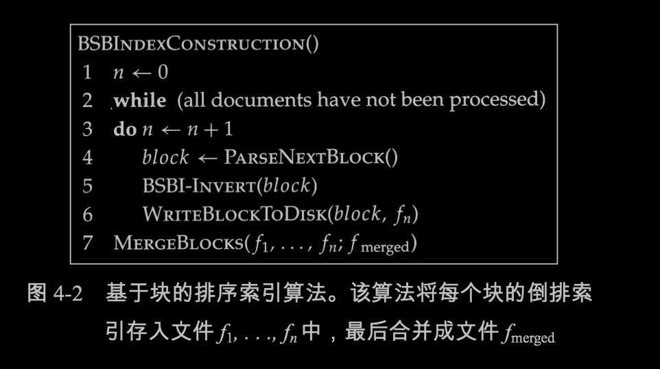
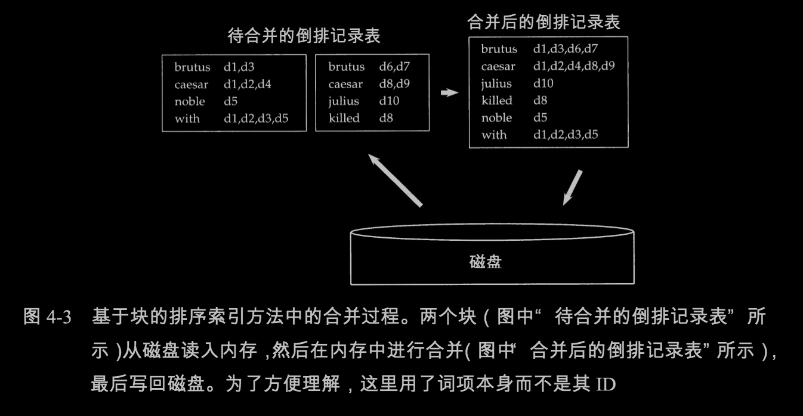

# 第四章 索引构建
>《信息检索导论》
>美德两国作者 王斌翻译
>本文是本人的读书笔记
>本书参考：
>http://home.ustc.edu.cn/~zhufengx/ir/index.html [中科大的教学网站，非常具有参考价值] 


## 4.2 基于块的排序索引方法

> 本节存在疑问：
> 多个块进行合并时，把全部的块读入，并写到一个merge文件中，一样需要大内存吧？这个问题怎么解决的？

* 算法思想


* 实例


 多个有序块，合并成一个文件，怎样解决内存不足的问题？
 
 TIPs：
 合并时，同时打开所有块对应的文件，内存中维护了为N个块准备的读缓冲区和一个为最终合并索引准备的写缓冲区。每次迭代中，利用优先级队列（即堆结构）或者类似的数据结构选择最小的未处理词项 ID 进行处理。读入该词项的倒排记录表并合并，合并结果写回磁盘中。需要时，再次从文件中读入数据到每个读缓冲区。


## 4.3 内存式单遍扫描索引构建方法


```c++
class Test {
public:
    Test(int n):num（n）{}

private:
    int num;
}

Test val = 10;//实际进行隐式类型转换：Test tmp(10) -> val

```


## 4.4 分布式索引构建方法


## 4.5 动态索引构建方法


## 4.6 其它索引类型


