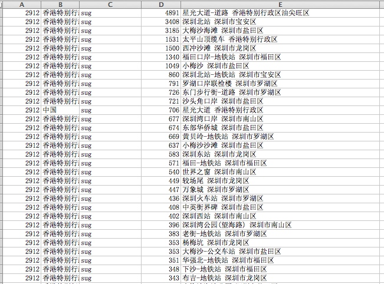
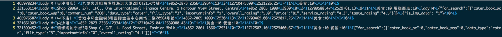

# 检索&SUG类 CASE 分析二


##case 1

```
sug的query，点击后，检索无结果；


```
query：



**问题原因**

* query1 星光大道-道路

输入【星光大道】，sug召回：

星光大道-道路：c8af380b6a2bea753717dc45 ====> 152079704
能在raw中找到数据


直接检索『星光大道』，能召回：

uid:"6a24a641a87161f27e29bd2e"：152711663

在raw中找不到数据。还能召回。。什么原因？


* query2

【lady m】sug召回：

"香港特别行政区$湾仔区$$lady m$2912$1a193cda35fbae831c58002c#12712507.10,2529400.67$"

"香港特别行政区$油尖旺区$$lady m$2912$24d3be02a3f0eefe00294f2d#12710425.04,2530980.43$"

"香港特别行政区$油尖旺区$$lady m(尖沙咀店)$2912$f3fa4b013f2fe5a796ec8412#12710475.00,2531226.25$"
uid：465978234

"香港特别行政区$中西区$$lady m$2912$18b46b11f26a751cbca24044#12709588.47,2529761.13$"

uid：321553114

"香港特别行政区$中西区$$lady m(中环店)$2912$95ca6bf592e17dabc71b750b#12709469.00,2529817.25$"
uid：465976587

【lady m】 检索召回：2条

"321661903"：24d3be02a3f0eefe00294f2d

321399452：1a193cda35fbae831c58002c




* query 3  【中环花园道山顶缆车总站】

sug 召回：

"香港特别行政区$中西区$$中环花园道山顶缆车总站$2912$f4d0226f1c1aa5cb08f5eb9a#12709604.94,2528963.57$"
 
where=【】 what=【中环花园道山顶缆车总站 香港特别行政区中西区】


检索召回：
321377336： f4d0226f1c1aa5cb08f5eb9a

ww解析：where=【】 what=【中环花园道山顶缆车总站】


-----
## case 2

* 问题描述

```
 sug 在数据编译过程中，gen_match_query 实现获取全部query和拼音转换的过程中，挂死。cpu是100%，但mem占用很少。
 
```
 
* 问题分析

1、使用了多线程(6个)来读取pb文件中的数据。运行到join时，停止了。说明，有线程一直没有运行结束。
代码：generator_main.cpp：167
2、gdb：info threads 发现有4个进程,bt时，函数int MatchQueryGenerator::ConvertMatchQueryToPinyin中出现invalid parameter.

3、 在深入分析:GenerateMatchQuerys(*sugg_poi, &match_querys) 函数产出match_querys（map<string,int>）,里面string特别长。

4、上面的match_querys中的string，最终传到int PinyinConvertor::ConvertCnToPinyin(const char* src, char* dst) 函数，导致里面的temppy[kMaxPinyinLen];字符数组溢出。。
比如string:`王子户外休闲生活馆王子登山延平店桃园机场a1站登山配备桃园机场a1站攀岩配备北门露营用品北门相关水上用品台北户外活动用品台北滑雪配备台北冲浪用品推荐台北排汗衣裤推荐台北防水衣裤`

*  问题总结

部分poi数据的match_querys过长，导致字符数组溢出，导致线程挂死，导致整个进程推进。


 
---

## case3

```
问题： http://chanpin.family.baidu.com/article/47673

图区再：深圳 南山 ：荔山工业区-8栋 位置，sug分流到国际化了。排查

```
分析：
http://map.baidu.com/su?wd=南山&cid=131&type=0&newmap=1&&b=(12679495.1725,2554388.055;12679631.5475,2554513.805)&t=1507534373216&pc_ver=2

中心点：坐标点：12679563.33,2554450.91  

使用下面程序排查现在配置(lighttpd/conf/citymdflist)中哪些矩形快包含了南山：
g++ -Wall -g -o2  -I . ./mbrlist.cpp  ./util.cpp -o jugembr

发现：南山被包含在citymdflist的：193_38中；   

解决方案： 去掉citymdflist中香港的配置：193_38 194_38  在mbrlist中添加新的香港的mbr数据


QA排查其它类似的有问题的点：

缅甸的首都内比都 未分流国际化，重新做了缅甸的bound，加入到mbrlist，分流到国家化。

西藏和尼泊尔：亚东县 ：分流到国际化，去掉：151_48 citymdflist


## case4


