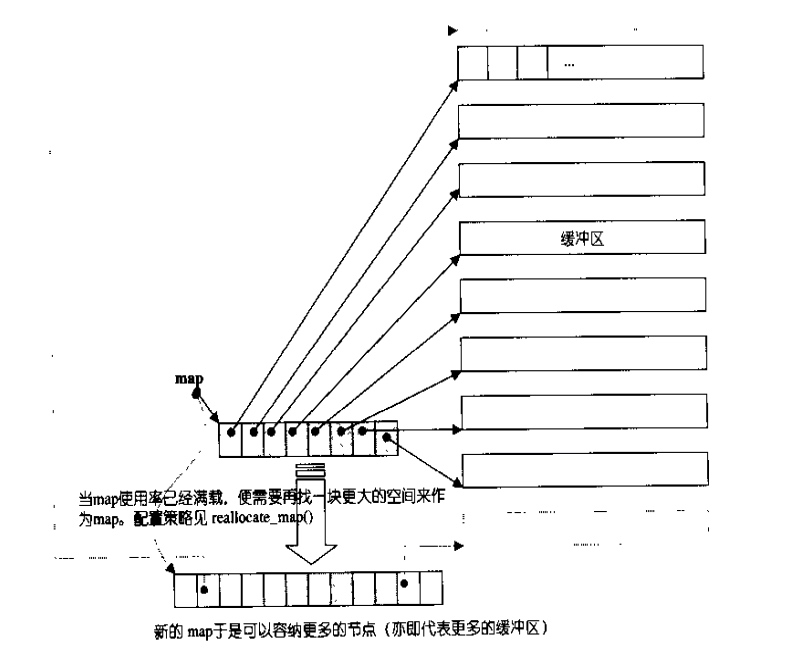

# c++ STL - deque 双端队列

## 一 基本说明 
deque双向队列是一种双向开口的**连续线性**空间，可以高效的在头尾两端插入和删除元素；

## 二 实现原理

deque的实现比较复杂，内部会维护一个map（注意！不是STL中的map容器）即一小块连续的空间，该空间中每个元素都是指针，指向另一段（较大的）区域，这个区域称为缓冲区，缓冲区用来保存deque中的数据。因此**deque在随机访问和遍历数据会比vector慢**。具体的deque实现可以参考《STL源码剖析》，当然此书中使用的SGI STL与VS2008所使用的PJ STL的实现方法还是有区别的。

## 三 类接口说明

## 四 使用范例

## 参考：
http://blog.csdn.net/morewindows/article/details/6946811

