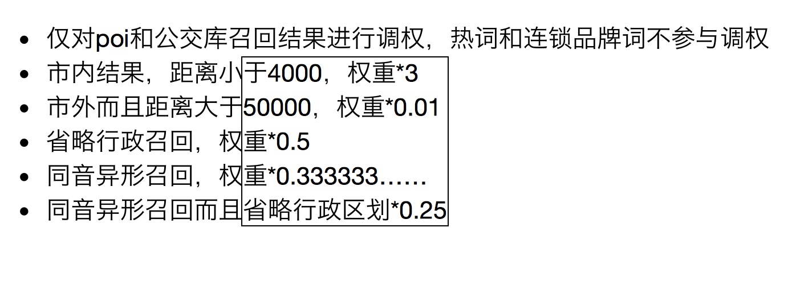
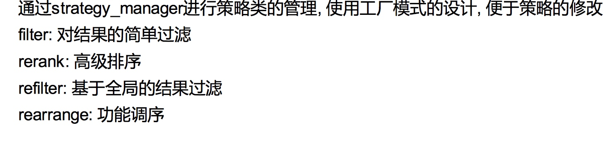
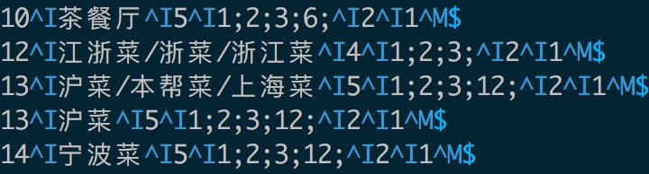
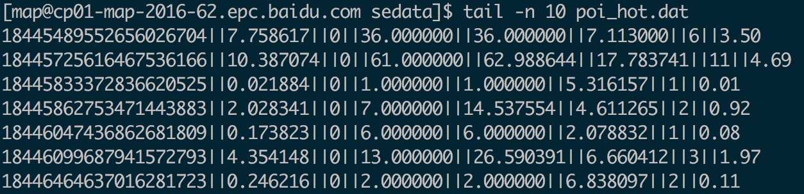
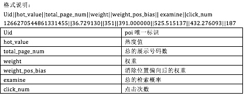
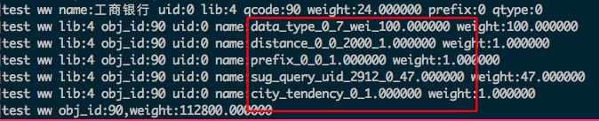

# 四 SUG召回策略 & 排序策略


## 一 索引构建阶段：权重计算

索引构建阶段：basic weight

* 泛需求：gel_sug.conf中设定，直接使用
* 品牌数据：chain.txt中设定x，score = 8.0*x/10000;
* poi和bus数据：通过uid找到下面分数
    hot_data_score ：  hot_data_weight.conf
    basic_smooth_score ： basic_smooth_weight.conf
    
    计算公式：
    score = 1.0 + hot_data_score + 8 * basic_smooth_score / 10000.0;
 


## 二 sug-bs召回阶段： 基础调权



bs的召回策略：

1. 原始query的召回：

2. ww召回
3. drop area召回
4. 同义词召回


   loc召回：
   bound召回： 
   
   
   
sug-bs返回出来的就是按照召回队列优先级排序:(ORI_QUERY>WHERE_WHAT>DROP_AREA_QUERY>PY_ORI_QUERY>PY_DROP_AREA_QUERY)    


## 三 sug-as 排序阶段： 高级调权



### 3.1 精确需求
一、reranker： 包含8个score计算策略

1. 检索点击特征获取：SearchClickFeature 
    * 使用词典配置：pc_click_up_dict na_click_up_dict
    * 词典路径：/home/map/sedata/NaClickUp ClickUp
    * 查找方式：
        key：query，cityid，uid
        value：
        satisfy_factor = node.cuint1 / 10000.0;
        need_factor = node.cuint2 / 10000.0;
        
    * 计算公式：
        factor = 1 + 2 * sqrt(satisfy_factor * need_factor);
        
2. 热度特征获取：PoiHotFeature 
    * 使用词典配置：tag_info_dict  poi_hot_info_dict
    * 词典路径：./data/tag_info.conf     /home/map/sedata/poi_hot
    * 配置数据格式：
    * 
    * 
    * 
      
      
    * 查找方式：
        * 热度敏感值：sensitivity_hot_value 
            * value : hot_value_sensitivity:第5个字段
       * 热度权重值：hot_value
            * key : uid
            * value: hot_value = 1.0 + node.cuint1 / 1000000.0;
            

    * 热度特征计算 [泛需求]
        * sensitivity_hot_value:2
            * hot_value=sqrt(hot_value);
       * 上面的值是：1
           * hot_value=pow(hot_value,0.4);
    
    
3. 城市倾向调权

    * 使用词典配置：distance_factor_dict  poi_hot_info_dict
    * 不分析城市倾向的情况： 
        >1. poi在定位点城市
        >2. poi在cityid城市
        >3. poi距离定位点50km之内
        >4. 泛需求
        >5. 省份、热门query
        
        > 主要考虑：召回外省市的poi且文本相关度高的poi？打压
          
    *  城市倾向距离调权因子：city_tendency_factor 
       
        * 计算条件：poi即is_outside_demand 才计算城市倾向因子。
        * 计算key： uid
             
        * 字典：./index/feature/distance_factor
        * key：uid，distance=512000
        * value：node.cuint1 / 10000.0
          
          反应的是什么？某个poi是热点poi，同时在本城市的距离之内(),能获取到城市倾向距离调权因子；如果是热点，但在市外，此因子统一设置成0.02；

    * adjust_factor: 文本相关性角度对市外结果的展现，进行限制的因子
    
        这里判断文本相关性:使用poiname的拼音是否包含query的拼音来判断strstr(poi_name,query)；
         如果query的name拼音和poi相同了，对于这种外地结果，但相关性比较好的结果，打压程度会小些；但也得保证本地相关性差些的结果排在其前面；
         对于反城市倾向的，继续打压： adjust_factor * 0.1;
         对于具备相同城市倾向的，重新提权，根据热度或基础权重；
         
        
    * 最终权重：weight = city_tendency_factor * adjust_factor; 
        
        ``` c++
       sorted_pois[i]->city_tendency_factor = city_tendency_factor;
       sorted_pois[i]->city_adjust_factor = adjust_factor;
       sorted_pois[i]->city_tendency_weight = weight;//城市倾向权重
       sorted_pois[i]->weight = sorted_pois[i]->weight * weight; //重新调整此poi的权重，考虑城市倾向
        
        ```
                    
4. poi类别调权
    * 各种数据类型调权：
      bus：weight = 0.75； 还是降权了
      kchain：query和poiname文本相关程度决定
      拼音长度相同:weight = 10000.0; 升权程度很高；
      其他情况升：1000、100
      kgeneral： weight = 1000.0;
      kprovince: weight = 1000;
      
      kcity ,kcountry: 
      1、假如query和市级poi名称匹配过半，则赋予1k权重；
      2、而父query为行政区划->子poi为行政区划策略下线
      
    * 最终调权：通过data_type_weight来看数据类别调权结果；

      ```
      sorted_poi->data_type_weight = weight;
      sorted_poi->weight = sorted_poi->weight * weight;
      ``` 
        
5. 距离权重调权

    * 字典配置：distance_factor_dict
    * 字典：index/feature/distance_factor
    * 距离： poi->distance poi的属性中存在distance？
    * key: uid + distance
    * 计算：get_distance_factor
            
    
       ```c++
       //距离表
       m_distance_list.push_back(100.0);
       m_distance_list.push_back(300.0);
       m_distance_list.push_back(500.0);
       m_distance_list.push_back(1000.0);
       m_distance_list.push_back(2000.0);
       m_distance_list.push_back(4000.0);
       m_distance_list.push_back(8000.0);
       m_distance_list.push_back(12000.0);
       m_distance_list.push_back(16000.0);
       m_distance_list.push_back(20000.0);
       m_distance_list.push_back(32000.0);
       m_distance_list.push_back(64000.0);
       m_distance_list.push_back(128000.0);
       m_distance_list.push_back(256000.0);
       m_distance_list.push_back(512000.0);
       m_distance_list.push_back(1024000.0);
        
        //根据uid+距离表[index],拿到该poi特定距离的影响因子
        y1 = FindDistanceFactor(uid, m_distance_list[index-1]);
        y2 = FindDistanceFactor(uid, m_distance_list[index]); 
        //直接查距离表结果
        double x1 = m_distance_list[index - 1];
        double x2 = m_distance_list[index];
        //核心计算公式？
        double ret_distance_factor = (y2 - y1) / (x2 - x1) * (distance - x1) + y1;
        if (distance < 2000.0) {
        ret_distance_factor = ret_distance_factor * 8;
    }else if (distance < 4000.0) {
        ret_distance_factor = ret_distance_factor * 3;
    } 
    //最终结果
        sorted_poi->distance_weight = weight;
        sorted_poi->weight = sorted_poi->weight * weight;
   ```
    
    * 总结：主要考虑距离较短的市内的poi调权。 2000和4000米是调权不同的。uid相关。
    

6. prefixType 调权

    * sug_query_uid_weight
      词典配置：sug_query_uid_count_dict
      词典：index/feature/sug_query_uid_count
      key：query + cityid + uid
      value：这个query召回的uid，对应此uid的访问次数。
           
   * 根据prefix 类型进行调权
       sug_query_uid_weight>=1:
       命中关联或tag：weight=0.2
       命中别名：weight=0.5
       
       sug_query_uid_weight<1:
       命中别名或关联：weight=0.1 
       命中tag：weight=0.02
       命中分词： weight=0.008；
       
    ``` c++
       HIT_NAME = 0,       // 名称/拼音
       HIT_KEYWORD,        // 核心词
       HIT_LINE_KEYWORD,   // 公交核心词
       HIT_BRAND,          // 品牌名称
       HIT_TAG,            // tag
       HIT_MULTI_TITLE,    // 别名
       HIT_MINING_KEYWORD, // 关联query
       HIT_NAME_SEGMENT    // 分词         
   ```
        
   * 最终结果: 命中tag，别名等要降权处理。
        
        
        ```
        sorted_poi->prefix_type_weight = weight;
        sorted_poi->weight = sorted_poi->weight * weight;    
        ```
        
        
7. sug点击调权  
      * 字典： sug_query_uid_count_dict   index/feature/sug_query_uid_count
      * key： query + cityid + uid  、 query + loc_cityid + uid 、query + cityid + wd
      * value： sug点击次数
         
         ```
         //获取sug的poi的点击次数
         count = click_resource->get_click_count(sorted_pois[i], _databuf);
         sorted_pois[i]->click_count = count;
         
         //根据点击次数，计算权重
         if (max_click_count > 1) {
            weight = count / max_click_count;
            if (weight < 0.02) {
                weight = 0.02;
            }
            weight *= 10;//乘10,防止最后的权重太小,无其他意义
         }
         sorted_pois[i]->sug_click_weight = weight;
         sorted_pois[i]->weight = sorted_pois[i]->weight * weight;    
         
         ```
8. 文本相关性调权
    
    * 字典配置： text_feature_dict
    * 字典：data/text_relevance/text_feature_dict
    * key： query + uid

    get_title_in_query_text_relevance：计算title对query的覆盖比例
    
    query的每个字或字符或数字，在poi的name或别名（包括拼音）中出现，记录这个字的长度；出现总长度/query总长度=覆盖比例 
    比如： query=台中市  poiname=台中开门公司  覆盖比例 = 4/6 [台、市]出现，出现长度4； query总长度6


    
    
    
    
二、rearranger： 包含下面7个功能调序策略

1. 行政区划提权
    * 行政区划的数据类型： kCity kProvince
      输入的query匹配上poiname，包括拼音匹配上，权重*100；
      
      GSB效果评估OK。
      
2. 文本全匹配提权
    * query == poiname的情况：本地poi，权重*10;但公交，线路，地铁不提权
    * 不等情况下，如果是本地或有本地倾向的poi， query匹配上别名，权重*4;

3. 行业调权：支持酒店频道页面
    * industry: hotel
    * 同时，poi的tag命中：宾馆，旅游景点，交通设施，教育， 进行调权。

4. 检索点击相关性调序

    * 根据pc_click_factor + na_click_factor 筛选出topclick的poi，最多处理3个；
    * 根据pc_click_factor 和 na_click_factor 两个因子的值，确定插入的位置 和 容忍插入位置（不可在此位置之后）。一般是前5位。
    * 调整至多3个topclick的poi 的位置

    * 总结：根据检索的点击相关性，获取检索高质量结果。然后根据检索的需求和sug插入风险。在sug列表中找到一个合适的位置进行poi插入。一般插入前五位。

    
5. 结果聚类：。。。最重要部分。。   


6. 父子点调序


7. 热词POI分离： 
   
      
      

   
    
    
    
    
---   
         
         
         
         
          
          
          
         
            
          


----


susvr老版本的高级调权阶段：

nocord_lib:2: 20 -> 2000  泛需，在原来配置的基础上，又调高了。

CHAIN_LIB:4: 10.820-》10.820 品牌，没有变动

POI_LIB:1:  1->1  没有变动。

BUS_LIB:  1->0.75  有变动。


但在rank的new_core生成过程中。
首先，通过GetFeatures，获取影响因子。涉及的影响因子：



再次，使用了`m_model.Predict(features, &prob)` 这种预测模型和影响因子，产出新的探测prob，就是new_core

也就是说发现了m_model,他是什么东东?和feature什么关系？

自己推测结论是：

1. prob = basic_weight * (data_type * distance * prefix * sug_query_uid * city_tendency)
2. 吐出的数据，对于chainlib 和 nocordlib，每个库最多吐出2条数据
3. 


### 3.2  泛需求排序

泛需求召回数据分两种情况：无坐标的纯泛需求；通过tag召回的poi；


