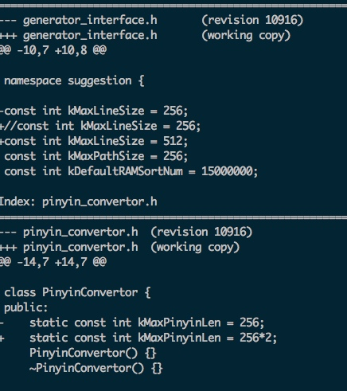
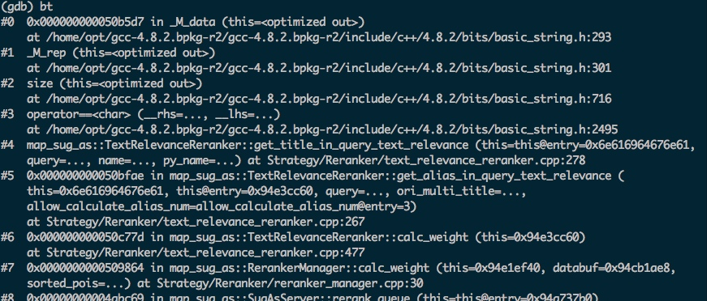

# 十  SUG项目过程中问题及TIPS


## 720 项目

* 支持检索cityid，uid？
    
    加州理工学院 洛杉矶 ：  399966883 这个有数据 但由于洛杉矶重名，DA解析时cityid给不是加州理工学院所在的cityid。  后续优化是否给检索带上cityid？

* 召回别名相关的poi以及别名显示？

    卧佛寺 曼谷：   别名显示，主名称: Temple of the Reclining Buddha (Wat Pho)   180263207 ，但为什么能召回Temple of 。。。 ，别名没有建索引啊？
    
    * 分析：？

* TIPs：发现了pc端和NA端，差异地方？
    1、返回数据的协议不同。

    2、过滤数据配置不同，根据返回数据协议来配；

    3、召回及排序结果有差别；
    
    
* 父子点如何形成？


## 920 项目 - 架构升级


###问题1.  使用大陆的sudata的bin处理国际化数据过程中，出现了core？
  
      uid: 665811683: ศูนย์การเรียนรู้ในเมือง มหาวิทยาลัยราชภัฏหมู่บ้านจอมบึง และโรงเรียนสาธิตแห่งมหาวิทยาลัยราชภัฏหมู่บ้านจอมบึง^I174
      
    poiname是泰文，而且长度很长；获取切词粒度子片段的函数中：使用sugg_segment结果最多存储80个切词片段；但实际对此poi数据切出105个片段。导致int PoiNameKeywordExtractor::get_segment_result 中PraseQuery时，segment变量溢出了。
  
  
  
  core文件打开：bt后函数名都是问号。?
  
      http://www.cnblogs.com/egmkang/archive/2011/03/19/ManualBacktrace.html
      
      http://www.jianshu.com/p/088fb171cd40
      
  
  valgrind : 查程序内存泄露的？
  
 
###问题2.   使用suindex的bin建索引的过程中，gen_match_query 内存到15m，就不在上升了？  还是存在内存泄露的代码。。poiname长或产生的matchquery太长，导致的内存溢出。

 


###问题3.  sugg_build_index_ww.sh 中使用sug名称切词词典，poi_segment_info 什么时候使用？为什么使用？ 国际化能否去掉？


###问题4.  sug-bs 读取国际化的./data/raw.mbr 配置数据，程序出core。。？
    sug-as 读取raw.mbr 启动不了；抱core？

    怀疑是：mbr中负坐标的问题。不是负坐标问题
    
    原因： sug_as_init.cpp: 初始化hash字典时，宏定义：MAX_AREA_MBR_NUM 不够造成；
    国际化需要定义成500000；
    g_data.g_area_mbr_dict = odb_creat(MAX_AREA_MBR_NUM);
    
    `#define MAX_AREA_MBR_NUM 500000`


###问题5. 没有详情：  display_info是否能启动起来？能起来但会core.


core点1：get_final_result -》delete_ambiguous_result ： 对于返回的结果，如果是同一个行政区划内poi只要一个，也就是要去重。去重时使用详情数据display_info：name areaid show_tag addr 国际化咱没有详情数据。只使用name$$area 进行去重；
      
      gdb 报错如下：
      
    ```
    #0  _odb_seek<unsigned int, CustomType<unsigned int, unsigned long long> > (snode=0x7f1d5d9d7c30,
        snode@entry=0x7f1d5d9d7bf0, sdb=0x1) at odict.cpp:1353
    #1  odb_seek (sdb=0x1, snode=snode@entry=0x7f1d5d9d7c30) at odict.cpp:1772
    #2  0x00000000004bea19 in map_sug_as::DisplayInfo::get_display_item (this=0x32d08b40,
        bid=bid@entry=1266783613064577023) at Resources/resource/display_info.cpp:202
    #3  0x00000000004990b3 in map_sug_as::get_display_item (uid=1266783613064577023) at Framework/get_son_result.cpp:40
    #4  0x000000000053dcf6 in map_sug_as::delete_ambiguous_result (condition=..., element=..., result_hash=...)
        at Util/susvr_util.cpp:986
    #5  0x00000000004ac7de in map_sug_as::SugAsServer::get_final_result (this=0x7f1d54033400, result_array=...)
        at Framework/sug_as_server.cpp:367
    #6  0x00000000004b045d in get_response (log_data=0x7f1d54030ff0, databuf=0x37195fb0) at Framework/sug_as_work.cpp:101
    #7  map_sug_as::thread_main (arg=0x37195fb0) at Framework/sug_as_work.cpp:282
    #8  0x00007f22756981c3 in start_thread () from /opt/compiler/gcc-4.8.2/lib/libpthread.so.0
    #9  0x00007f227431e12d in clone () from /opt/compiler/gcc-4.8.2/lib/libc.so.
    
    ``` 
   
   core点2：  透露的问题：如何关闭去AS查询结果的？
   
   oinQueueManager::join -》join_as_result -》get_display_item
   
   当结果不足或为0时，去查as检索返回结果；拿回结果后，因为检索是分钟级别更新，sug展示信息是天级更新；所以需要根据uid到sug展示信息中去拿详情数据；
   解决：关闭去AS查询结果； 
   ../data/service_degrade_dict：as_access_switch：置成0 
   
   core点3：  展示father-son的功能；uid != 0的情况，取父子点的tag，从详情中；
   
   get_son_result.cpp：get_father_son_status -》produce_father_son_display_tag -》get_display_item
   这里使用了_display_metadata_dict，因为没有/index/display_info，所以初始化不成功；但没有为空，直接用了odb_seek(_display_metadata_dict, (sodict_snode_t*)&metadata); 抛出core；
   处理：增加了判断
      
###问题6. NA端和PC端返回的协议不一致，怎么显示来控制的？具体返回了哪些字段？插入人工干预的结果？
      《参考sug-AS源码分析》  


###问题7. sug-as 抛下面的core


两个string 使用 == 比较 ，抛core了。
根本原因是：调用函数get_title_in_query_text_relevance,第三个参数，py_name 越界了。
程序原因：get_pinyin:将别名转化为拼音时候，别名特别长，拼音的buf不足，数组越界。
数据层面：140094884 别名： 【台中市开锁换锁匙店,开配汽机车锁,汽车晶片钥匙遗失复制,锁匠24小时夜间开换锁装新锁,电子门锁,钢印,印章,脐带印章,胎毛笔,公司章,橡皮章连续章,电动铁捲门马达遥控器安装 太子锁匙刻印章店】  这个别名，太长了，感觉应该用$分开。
    


###问题8.问题描述：

```
问题：线上报警：sug-as 只有warning日志，没有正常的.log日志，且服务停止；wf日志中的错误：
   [check_item] : insert_item_sock work_sock [20914] fail
   [insert_item] : insert socket[20914] fail, socket array[max_size:20480] overflow.


```

* 问题分析

通过找资料，如下,参考资料：

   http://wiki.baidu.com/pages/viewpage.action?pageId=179996328#comlogFAQ-comlogsvr日志丢失，并出现大量insert_item_sockwork_sock[1014]fail错误是怎么回事？
   
   http://wiki.baidu.com/pages/viewpage.action?pageId=358086785
   http://wiki.baidu.com/pages/viewpage.action?pageId=290118483
   
   
资料中的解释：
comlogsvr日志丢失，并出现大量insert_item_sock work_sock [1014] fail错误是怎么回事？
     配置中comlogsvr_sock_num是comlogsvr支持的最大连接数。如果该配置小于客户端连接数量，就会拒绝连接，出现warning，并丢失未连接上的日志。
     例如：php的comlog客户端的连接数量和php进程数相当。若fastcgi配置128进程，10台机器，则有1280个连接。如果comlogsvr_sock_num设置成1000则会拒绝连接并丢日志。

ala_root_socket_full	ependingpool队列（socket队列以及就绪socket队列）满了，导致丢请求	分钟	采集 ac.log.wf 日志中，匹配以下字段：
insert socket[%d] fail, socket array[max_size:%d] overflow.
queue overflow socket %d, queue len %d

* 线下复现
  

* 解决方案?
根本原因？
 谁把fd给消耗了（没有display_info，程序每次加载文件？线程卡死？）没有释放fd。
 报错的点：/public/ependingpool/ependingpool.cpp:335
 

线下复现？调整 PP_QUEUE_LEN : 20480  PP_SOCK_NUM : 20480 ；不加载display_info;进行线下复现

如果线上复现了，查看：

ll /proc/ID/fd | grep "sokect:"   ：进程占用socket数
netstat -apn|grep TIME_WAIT |grep "8098"：

top：看看占用fd的情况


解决：？

服务线程数调整？


-------
## 1220 项目  问题宝藏


### python 
发现使用python对数据处理很方便
使用dict数据结构，处理大文件(13G),需要接近70G的内存。非常消耗资源。


###文件读写？ 
1、在代码中，会看到 c/c++ 两种方式的文件读写，应用的场景：网络文件（sug-as），二进制文件(transform_display_info)，普通文件(sudata)。 在不同的场景下，选择合适的文件读写接口？
2、pb是什么？形成的pb文件，使用fwrite，fread的方式，进行二进制文件的读写？pb库的使用？


### odic字典库？索引设计？

1、倒排索引？

2、geohash的空间索引？


### 字典树？
sug-as里面area_trie.cpp有对raw.area数据建trie树，通过此树，查询行qury中是否能前缀匹配到行政区划名，如果有的话，可以把query中行政区划名称去掉，bs扩大召回；


### 大文件如何进行外排序？


###boost库的使用

lexical_cast<数据类型>

切分一行数据：写法。。。
StringUtil::SplitString(line, delimitor, &fields);


### 语言层面


``` c++

#ifdef __x86_64__
#define EPOLL_PACKED __attribute__((packed))
#else
#define EPOLL_PACKED
#endif

typedef union epoll_data
{
  void *ptr;
  int fd;
  uint32_t u32;
  uint64_t u64;
} epoll_data_t;

struct epoll_event
{
  uint32_t events;	// Epoll events 
  epoll_data_t data;	//User data variable 
} EPOLL_PACKED;

```

问题？
__attribute__ ？？

union epoll_data 联合体存储？使用？


### 系统设计：高并发？


BSPendingPool实现原理：
http://wiki.baidu.com/pages/viewpage.action?pageId=114447273


### 网络编程

socket：TIME_WAIT


