# 第六章 文档评分、词项权重计算及向量空间模型

## 6.1 参数化索引及域索引

检索的时候，条件可以设置：标题中含？作者是？摘要中含？  有条件要求情况下，怎么处理索引来支持检索？参数化索引。
一篇文档，可能含有：标题，摘要，作者，正文等各个部分。不同的部分看做不同的：域(任意自由文本) ，对不同的域建立域索引

例子: william作者的作品，建立域索引；
支持查询"标题出现merchant,作者有william,正文中存在短语gentl rain"

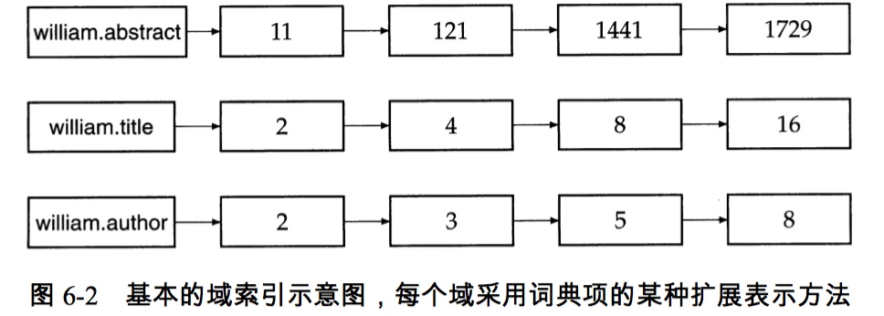


改进型域索引，域信息存放再postlist中： 

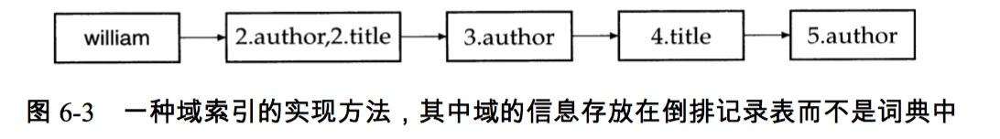

这种索引好处？ 词典变小；支持域加权评分；


### 6.1.1 域加权评分

定义：
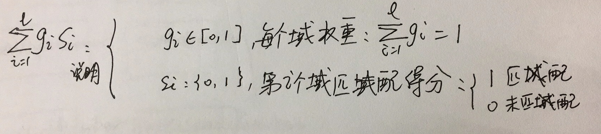

例子：

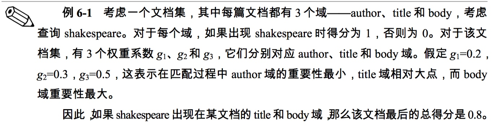


### 6.1.2 权重学习

上面的g的值(同一篇文档中，不同域，所占的权重)，是怎么确定出来？ 通过例子来描述
所有文档仅包含：title 和 body 两个域
查询query、文档：q,d
布尔匹配函数：s（d,q）

样本数据：如下：
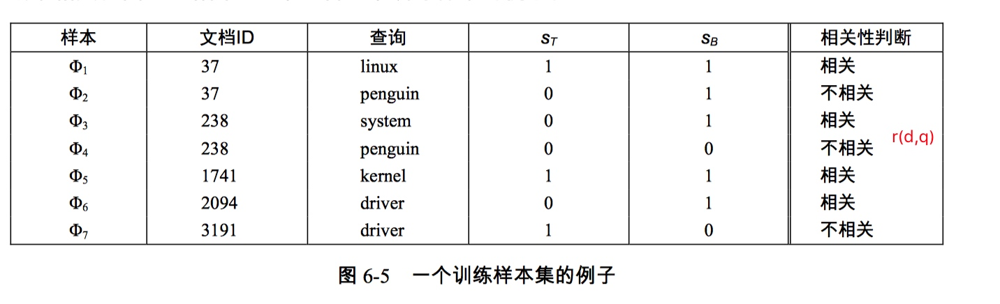
  
使用样本，获取g的值？

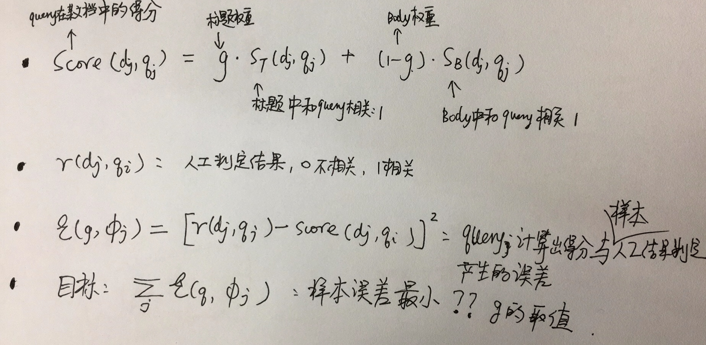


获取最优权重g ？

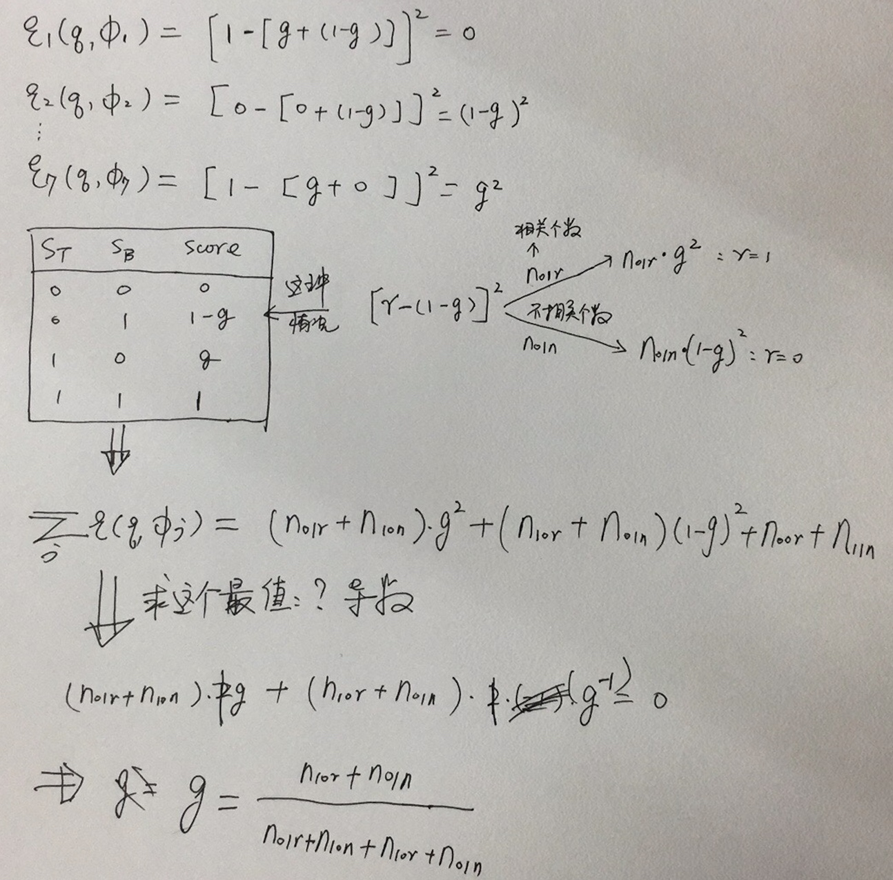


## 6.2 词项频率及权重计算

词项频率：(term frequency) tf ：term在文档d中出现的次数
文档频率：(document frequency) df ： 出现term的所有文档的数目
逆文档频率：(inverse document frequency) idf ： 
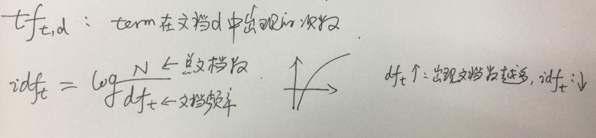


某个term在文档d中最终权重：可以用 tf-idf 指标描述

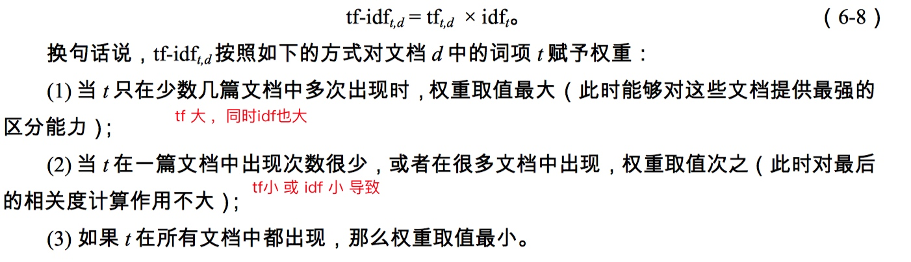


## 6.3 向量空间模型（VSM:vector space model）

###6.3.1 内积
我们可以把一片文章标示成向量：V(d)=<tf-idf1,tf-idf2...> 每个分量是，文章中词项的某个计算指标。

如何计算两篇文档的相似度？similarity

向量内积中的余弦夹角：cosA = ? [空间向量数学，具体应用；非常好的描述了现实世界中的向量标识的东西的重合度]

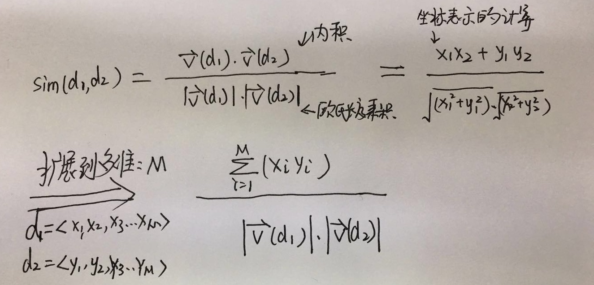

为了便于计算和使用，计算文档的相似度，使用归一化后的单位向量

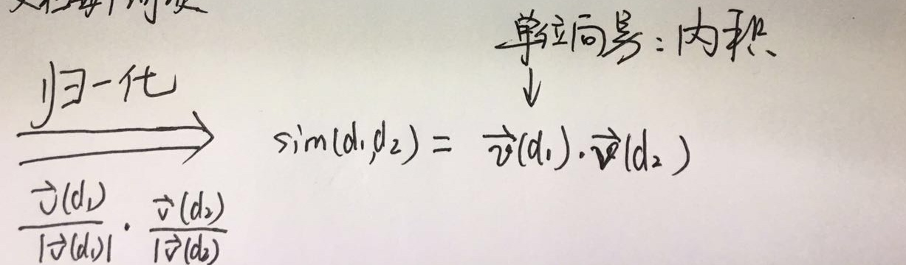

###6.3.2 查询向量
很自然的，有了上面的理论基础，我们可以把查询query看成是向量；计算query向量和每个文档d向量的相似度值，按照值大小，可以进行排序了。

计算query和d相似度，作为score的例子：score = sim(query,doc)

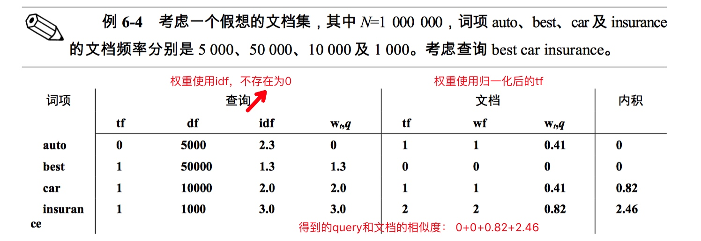
###6.3.3 向量相似度计算

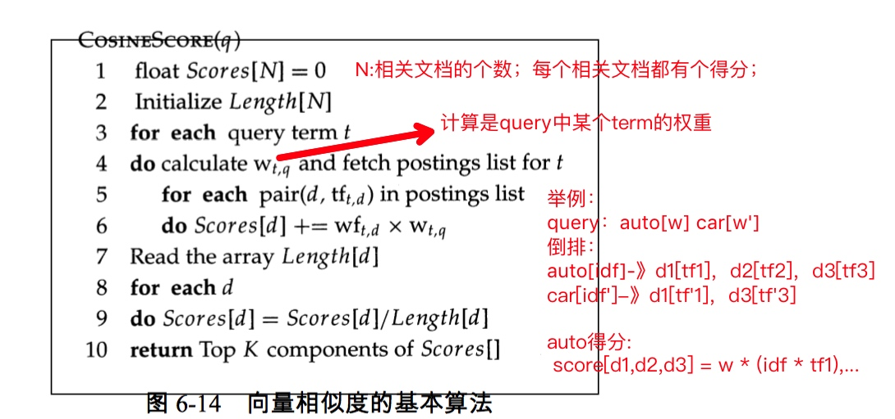

通用算法，说明：

* 继续上面红字部分举例，计算每篇文档的得分：
    query使用权重为<w,w'> ,文档权重：tf-idf

```
 
    auto:
    score[d1,d2,d3] = [w*(idf*tf1),w*(idf*tf2),w*(idf*tf3)]  //小括号中为：tf-idf指标数据
    
    car:
    score[d1,d3] = [w'*(idf'*tf'1),w'*(idf'*tf'2)]
    
    query在各个文档中的，最终得分：
    
    score[d1,d2,d3] = [w*(idf*tf1)+w'*(idf'*tf'1), w'*(idf'*tf'1), w'*(idf'*tf'1)+w'*(idf'*tf'1)]
    
    使用length[d]进行归一化分数。
    
    从中可以看出，倒排中term字典中记录idf，postlist中记录tf； 不用记录每个term在文档中的权重
```

* TOP K 选取？ 堆结构 


## 6.4 其它的tf-idf的权重计算方法


### 6.4.1 tf的亚线性尺度变换方法

###6.4.2 基于最大值的tf归一化

###6.4.3 文档权重和查询权重机制

向量空间的相似度评分方法的不同，在于向量V(q)和V(d)中权重计算机制的不同。
SMART记号来描述，不同的权重计算方法：ddd.qqq

前三位：文档权重计算方法，第一位tf因子，第二位df因子，第三位归一化形式
后三位：查询向量的权重计算方法， 同上


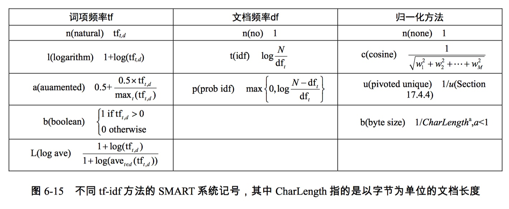

常用权重计算机制：lnc.ltc
文档向量权重:lnc: tf对数计算方法；df不采用idf因子；归一化方法：余弦
查询向量权重:ltc: tf对数计算方法；df采用idf；归一化方法：余弦


###6.4.4 文档长度的回转归一化

这节没有怎么看懂？这要处理长文档时，需要考虑到的；


