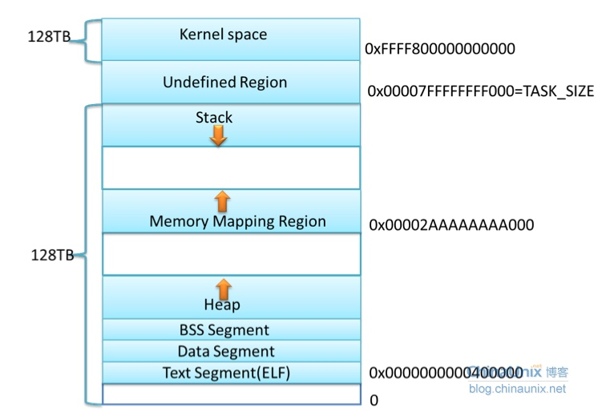
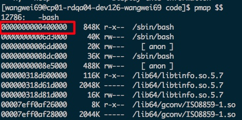
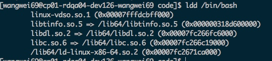
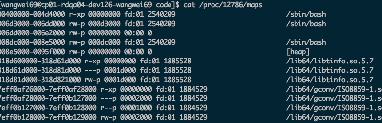
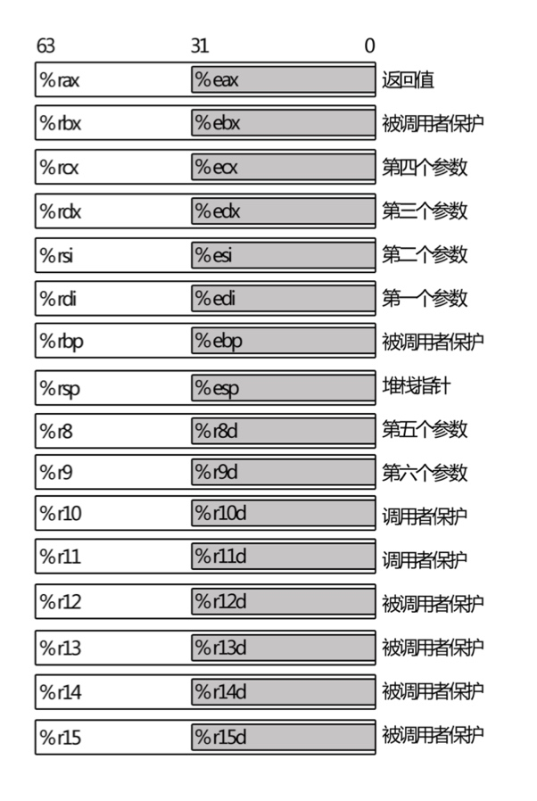
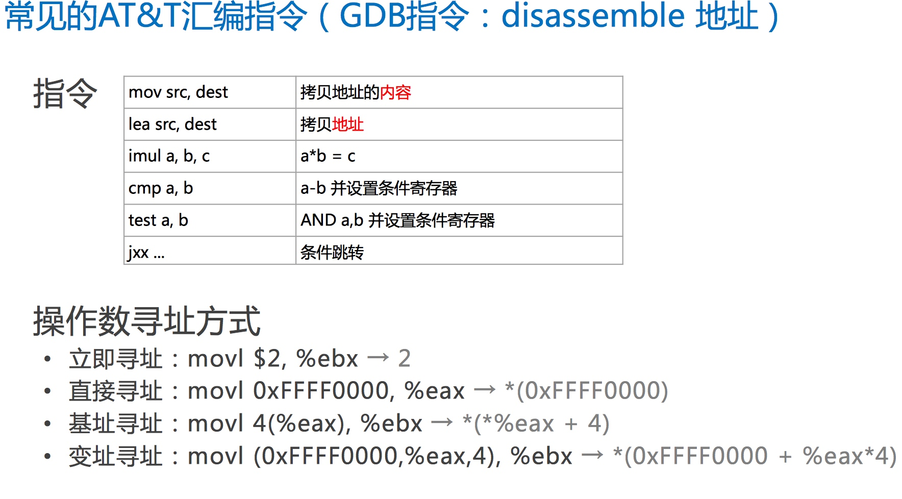
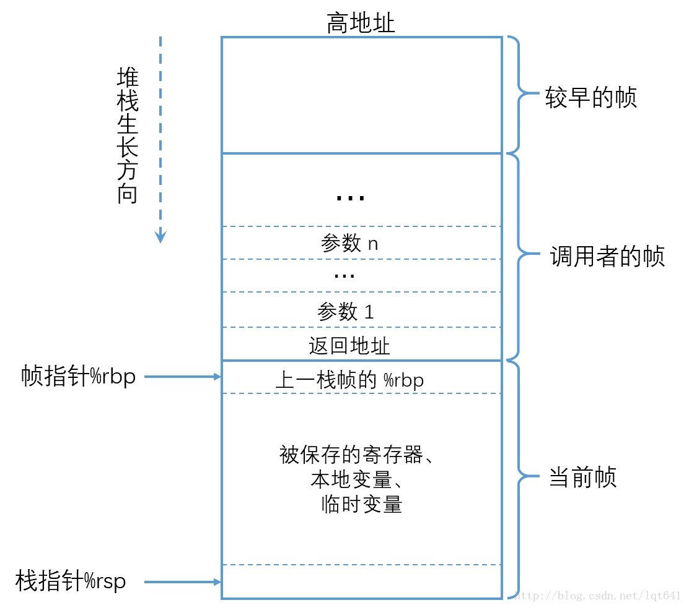
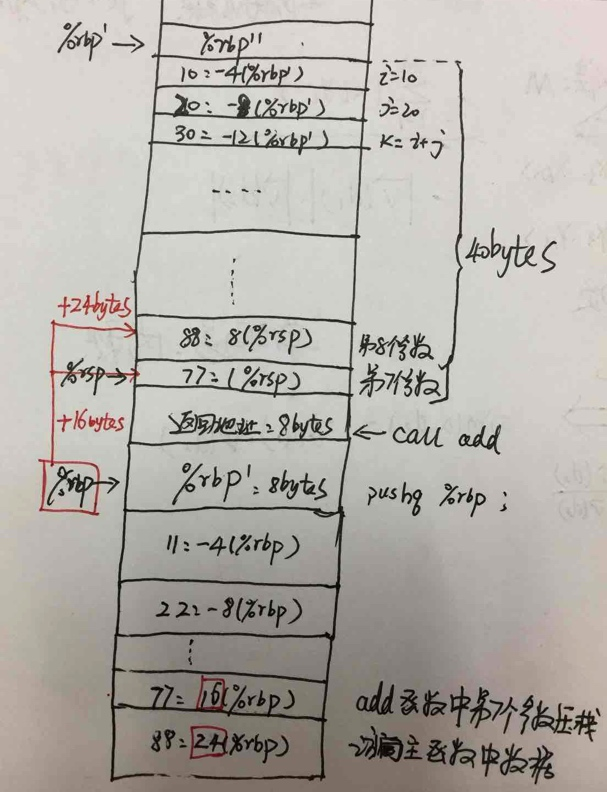

# 调试技术一：x86-64进程运行空间分析

--- 
## 一、linux x86-64 进程运行空间

### 1.1 进程空间说明




* txt代码段

二进制代码；从虚拟内存地址00400000开始，使用pmap可以查看到，这个地址是固定的。


* data 数据段

存放已经初始化的全局变量

* bss段

存放全局但未初始化的变量；

* heap段

用户获取内存空间，malloc new

* memory map

mmap系统调用可将**文件**映射入进程memory map地址空间；
使用ldd命令，我们可以看到进程依赖的库文件，这些库文件编译过程中都要关联到进程的虚拟地址空间；


* stack段

存放局部变量，从高地址向低地址生长。
 
linux提供了/proc/PID/maps接口，我们可以通过该接口查询某进程的虚拟地址段：


```
该文件有6列，分别为：
地址：库在进程里地址范围
权限：虚拟内存的权限，r=读，w=写,x=,s=共享,p=私有；
偏移量：库在进程里地址范围
设备：映像文件的主设备号和次设备号；
节点：映像文件的节点号；
路径: 映像文件的路径
每项都与一个vm_area_struct结构成员对应

```


### 1.2 进程空间程序验证？

 
## 二、linux x86-64  函数栈帧


### 2.1 x86-64体系寄存器及汇编指令



* 调用者保护：主函数作为调用者，调用子函数时，某些寄存器中的数据需要压栈保护，以便于恢复，不被覆盖；这个动作由主函数完成；对应的寄存器叫caller save

* 被调用者保护：callee save 子函数压栈保护寄存器中内容；

* %rax 通常用于存储函数调用的返回结果，同时也用于乘法和除法指令中。在imul 指令中，两个64位的乘法最多会产生128位的结果，需要 %rax 与 %rdx 共同存储乘法结果，在div 指令中被除数是128 位的，同样需要%rax 与 %rdx 共同存储被除数。
* %rsp 是堆栈指针寄存器，通常会指向栈顶位置，堆栈的 pop 和push 操作就是通过改变 %rsp 的值即移动堆栈指针的位置来实现的。
* %rbp 是栈帧指针，用于标识当前栈帧的起始位置
* %rdi, %rsi, %rdx, %rcx,%r8, %r9 六个寄存器用于存储函数调用时的6个参数（如果有6个或6个以上参数的话）。




### 2.2 x86-64函数栈帧


* 函数调用

调用执行过程：父函数将参数从后向前入栈-》返回地址入栈-》跳到子函数起始地址执行-》父函数的栈帧起始地址（%rbp）入栈 【子函数来完成此动作】-》更新%rbp值，指向子函数栈帧起始地址

对应的汇编：

```x86asm
...   # 参数压栈
call FUNC  # 保存返回地址，并跳转到子函数 FUNC 处执行；两个功能
...  # 函数调用的返回位置

FUNC:  # 子函数入口
pushq %rbp  # 保存旧的帧指针，相当于创建新的栈帧
movq  %rsp, %rbp  # 让 %rbp 指向新栈帧的起始位置
subq  $N, %rsp  # 在新栈帧中预留一些空位，供子程序使用，用 (%rsp+K) 或 (%rbp-K) 的形式引用空位

```

* 函数返回

函数返回就是要从子函数返回到主函数调用点，继续执行；同时，主函数的现场(指令，寄存器数据等)都要恢复；

函数返回值保存在：%rax 

leave 指令：恢复主函数的栈帧; 执行完后，%rsp正好指向，主函数返回地址处；%rbp指向主函数栈帧起始位置；

``` 
movq %rbp, %rsp    # 使 %rsp 和 %rbp 指向同一位置，即子栈帧的起始处
popq %rbp # 将栈中保存的父栈帧的 %rbp 的值赋值给 %rbp，并且 %rsp 上移一个位置指向父栈帧的结尾处

```

ret 指令： %rsp指向返回地址取出，跳到返回地址处，继续执行主函数指令； 调用参数由编译器自动释放；


### 2.3 函数调用实例分析

* 示例代码：example.c

```c++

int add(int a, int b, int c, int d, int e, int f, int g, int h) { // 8 个参数相加
  int sum = a + b + c + d + e + f + g + h;
  return sum;
}

int main(void) {
  int i = 10;
  int j = 20;
  int k = i + j; 
  int sum = add(11, 22,33, 44, 55, 66, 77, 88);
  int m = k; // 为了观察 %rax Caller Save 寄存器的恢复

  return 0;
}

```

* 反汇编代码

gcc -S example.c -o example.s  //使用gcc产出汇编代码

gcc -g example.c -o example //也可以使用gdb查看bin文件的汇编代码
gdb example
disassemble 函数名

main函数分析：

``` x86asm
main:
.LFB3:
	pushq	%rbp  #主函数栈帧指针压栈；刚进子函数必做的事情;main也是某个函数的子函数；
.LCFI2:
	movq	%rsp, %rbp  #创建子函数栈帧；起始地址；必做；
.LCFI3:
	subq	$40, %rsp  #栈帧分配40bytes空间；减法；栈是向下生长
.LCFI4:
	movl	$10, -4(%rbp)  # 立即数+ 基址寻址：将10 -》(*(%rbp)-4)
	movl	$20, -8(%rbp)  # 同上，对应代码：j = 20;
	movl	-8(%rbp), %eax 
	addl	-4(%rbp), %eax # 进行加法运算，同时把结果存放再%rax中
	movl	%eax, -12(%rbp) # 这一步验证了%rax是caller save 寄存器；再调用子函数前将结果压栈
	movl	$88, 8(%rsp) # 第8个参数压栈，使用%rsp上面的第8个空间
	movl	$77, (%rsp)  
	movl	$66, %r9d    # 小于6个参数压栈进入寄存器
	movl	$55, %r8d
	movl	$44, %ecx
	movl	$33, %edx
	movl	$22, %esi
	movl	$11, %edi
	call	add        #调用子函数add
	movl	%eax, -16(%rbp)  #将add函数的返回值%eax保存到栈中；int sum = add(...)
	movl	-12(%rbp), %eax  #将调用add之前，保存的 k= i+j的结果，恢复
	movl	%eax, -20(%rbp)  #对应源码：int m = k 命令； 
	movl	$0, %eax  # return 0；所以返回值要置为0；返回到上一个主函数
	leave  # 恢复主函数栈帧；rbp，rsp
	ret    # 返回并跳转到主函数指令

```


add函数分析：

``` x86asm

add:
.LFB2:
	pushq	%rbp  #主函数栈帧指针压栈；刚进子函数必做的事情
.LCFI0:
	movq	%rsp, %rbp  #子函数栈帧起始地址赋值；必做；
.LCFI1:
	movl	%edi, -4(%rbp)  # 将参数入栈；这种操作，相当于push %edi，(%rsp)
	movl	%esi, -8(%rbp)  # 由于子程序中可能会用到参数的内存地址，这些参数放在寄存器中是无法取地址的，这里把参数压栈，印证了我们之前的猜想:寄存器中的参数，也要入栈的。
	movl	%edx, -12(%rbp)
	movl	%ecx, -16(%rbp)
	movl	%r8d, -20(%rbp)
	movl	%r9d, -24(%rbp)
	movl	-8(%rbp), %eax
	addl	-4(%rbp), %eax  
	addl	-12(%rbp), %eax
	addl	-16(%rbp), %eax
	addl	-20(%rbp), %eax
	addl	-24(%rbp), %eax
	addl	16(%rbp), %eax  #取第7个参数；为什么是16(%rbp)？ 参考下面的图
	addl	24(%rbp), %eax
	movl	%eax, -28(%rbp) # sum=a+b+c...
	movl	-28(%rbp), %eax
	leave
	ret

```

说明：
(1):在汇编程序中，如果使用的是64位通用寄存器的低32位，则寄存器以 ”e“ 开头，比如 %eax，%ebx 等，对于 %r8-%r15，其低32 位是在64位寄存后加 “d” 来表示，比如 %r8d, %r9d
(2):如果操作数是32 位的，则指令以 ”l“ 结尾，例如 movl $11, %esi，指令和寄存器都是32位的格式。如果操作数是64 位的，则指令以 q 结尾，例如 “movq  %rsp, %rbp”

(3): 程序运行到取第7个参数时，栈帧情况：



---
## Reference
1、http://blog.chinaunix.net/uid-27119491-id-3325943.html 
   《x86-64 进程地址空间》同时参考：
    Chapter 15 - The Process Address Space, Linux kernel development.3rd.Edition
    
2、http://blog.csdn.net/lqt641/article/details/73002566
  《x86-64 下函数调用及栈帧原理》这篇文章参考的多
  
   


