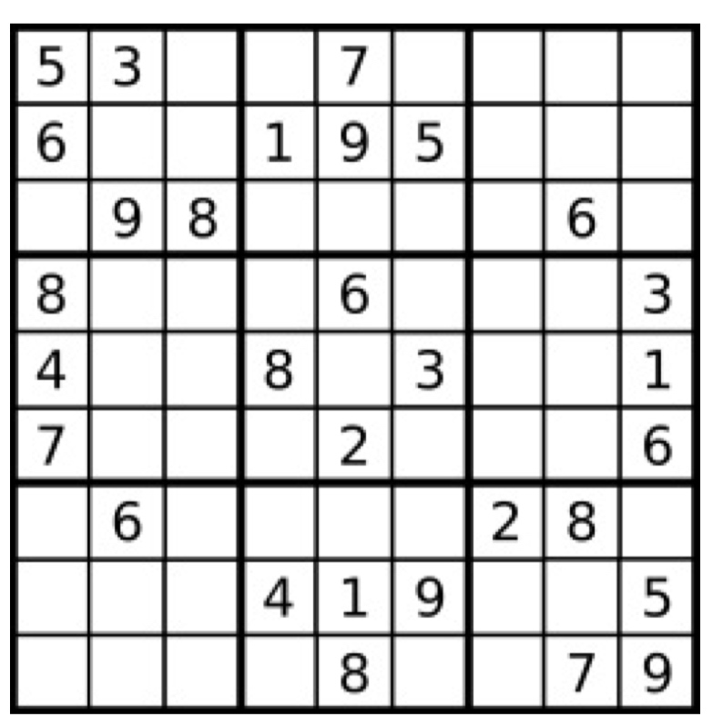

# leetcode - vector笔记

-------

## 一、next_permutation算法

### 1.1 问题描述

不重复的N(1<=N<=9)个数,给出个全排列，计算下一个比它大的全排序序列；如果是最大的给出起始最小的序列；
比如：[1,2,3] : 1,3,2 -> 2,1,3

### 1.2 算法

* *partitionNumber*: find the first number from right to left which has descending trend. If don't have ,it suggests current sequence is biggest one. 
* *changeNumber*: find number from right to left which is firstly bigger than  partitionNumber 
* swap: swap partitionNumber and changeNumber
* reverse: reverse the numbers from partitionNumber index to the end;

[最大序列-》最小序列，其实就差一个reverse的全交换]

## 二、找第Kth的全排列序列 

问题描述：

## 三、sudoku 数独判断

### 3.1问题描述：
Determine if a Sudoku is valid, according to: Sudoku Puzzles - The Rules http://sudoku.com.au/TheRules.aspx . The Sudoku board could be partially filled, where empty cells are filled with the character '.' 
也就是说，给了一个数独的board，判定这个borad中给出的数字，是否符合数独的规则？横竖行不能重复，子九宫格，数字也不能重复？数字是1~9之间。

### 3.2 学到的技巧

* 如何从头遍历访问子九宫格？
* 如何使用标识数组？使用值作为下标

##

