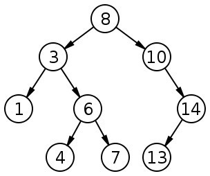
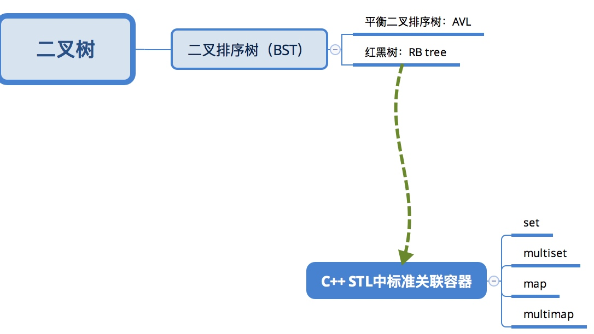

# 二叉排序树


## 一、二叉排序树(“二叉查找树”、“二叉搜索树”)

二叉排序树：或者是一棵空树，或者是具有下列性质的二叉树：

1. 若它的左子树不空，则左子树上所有结点的值均小于它的根结点的值；

2. 若它的右子树不空，则右子树上所有结点的值均大于它的根结点的值；

3. 它的左、右子树也分别为二叉排序树。



 
二叉排序树通常采用二叉链表作为存储结构。中序遍历二叉排序树可得到一个依据关键字的有序序列，一个无序序列可以通过构造一棵二叉排序树变成一个有序序列，构造树的过程即是对无序序列进行排序的过程。每次插入的新的结点都是二叉排序树上新的叶子结点，在进行插入操作时，不必移动其它结点，只需改动某个结点的指针，由空变为非空即可。搜索、插入、删除的时间复杂度等于树高，期望O(logn)，最坏O(n)（数列有序，树退化成线性表，如右斜树）。虽然二叉排序树的最坏效率是O(n)，但它支持动态查找，且有很多改进版的二叉排序树可以使树高为O(logn)，如AVL、红黑树等

## 二、查找算法

在二元排序树b中查找x的过程为：

 1.若b是空树，则搜索失败，否则：

 2.若x等于b的根节点的数据域之值，则查找成功；否则：

 3.若x小于b的根节点的数据域之值，则搜索左子树；否则：

 4.查找右子树。
 
 ```c++
 /* 二叉树的二叉链表结点结构定义 */
typedef  struct BiTNode    /* 结点结构 */
{
    int data;    /* 结点数据 */
    struct BiTNode *lchild, *rchild; /* 左右孩子指针 */
} BiTNode, *BiTree;


/* 递归查找二叉排序树T中是否存在key, */
/* 指针f指向T的双亲，其初始调用值为NULL */
/* 若查找成功，则指针p指向该数据元素结点，并返回TRUE */
/* 否则指针p指向查找路径上访问的最后一个结点并返回FALSE */
Status SearchBST(BiTree T, int key, BiTree f, BiTree *p) 
{  
    if (!T)    /*  查找不成功 */
    { 
        *p = f;  
        return FALSE; 
    }
    else if (key==T->data) /*  查找成功 */
    { 
        *p = T;  
        return TRUE; 
    } 
    else if (key<T->data) 
        return SearchBST(T->lchild, key, T, p);  /*  在左子树中继续查找 */
    else  
        return SearchBST(T->rchild, key, T, p);  /*  在右子树中继续查找 */
}


 ```

## 三、插入算法


``` c++

/*  当二叉排序树T中不存在关键字等于key的数据元素时， */
/*  插入key并返回TRUE，否则返回FALSE */
Status InsertBST(BiTree *T, int key) 
{  
    BiTree p,s;
    if (!SearchBST(*T, key, NULL, &p)) /* 查找不成功 */
    {
        s = (BiTree)malloc(sizeof(BiTNode));
        s->data = key;  
        s->lchild = s->rchild = NULL;  
        if (!p) 
            *T = s;            /*  插入s为新的根结点 */
        else if (key<p->data) 
            p->lchild = s;    /*  插入s为左孩子 */
        else 
            p->rchild = s;  /*  插入s为右孩子 */
        return TRUE;
    } 
    else 
        return FALSE;  /*  树中已有关键字相同的结点，不再插入 */
}

```

##四、 删除算法

在二叉排序树中删去一个结点，分三种情况讨论：


```
 1.若*p结点为叶子结点，即PL(左子树)和PR(右子树)均为空树。由于删去叶子结点不破坏整棵树的结构，则只需修改其双亲结点的指针即可。

 2.若*p结点只有左子树PL或右子树PR，此时只要令PL或PR直接成为其双亲结点 * f的左子树（当*p是左子树）或右子树（当*p是右子树）即可，作此修改也不破坏二叉排序树的特性。

 3.若*p结点的左子树和右子树均不空。在删去*p之后，为保持其它元素之间的相对位置不变，可按中序遍历保持有序进行调整。比较好的做法是，找到*p的直接前驱（或直接后继）*s，用*s来替换结点*p，然后再删除结点*s。

```


``` c++

/* 若二叉排序树T中存在关键字等于key的数据元素时，则删除该数据元素结点, */
/* 并返回TRUE；否则返回FALSE。 */
Status DeleteBST(BiTree *T,int key)
{ 
    if(!*T) /* 不存在关键字等于key的数据元素 */ 
        return FALSE;
    else
    {
        if (key==(*T)->data) /* 找到关键字等于key的数据元素 */ 
            return Delete(T);
        else if (key<(*T)->data)
            return DeleteBST(&(*T)->lchild,key);
        else
            return DeleteBST(&(*T)->rchild,key);
         
    }
}

/* 从二叉排序树中删除结点p，并重接它的左或右子树。 */
Status Delete(BiTree *p)
{
    BiTree q,s;
    if((*p)->rchild==NULL) /* 右子树空则只需重接它的左子树（待删结点是叶子也走此分支) */
    {
        q=*p; *p=(*p)->lchild; free(q);
    }
    else if((*p)->lchild==NULL) /* 只需重接它的右子树 */
    {
        q=*p; *p=(*p)->rchild; free(q);
    }
    else /* 左右子树均不空 */
    {
        q=*p; s=(*p)->lchild;
        while(s->rchild) /* 转左，然后向右到尽头（找待删结点的前驱） */
        {
            q=s;
            s=s->rchild;
        }
        (*p)->data=s->data; /*  s指向被删结点的直接前驱（将被删结点前驱的值取代被删结点的值） */
        if(q!=*p)
            q->rchild=s->lchild; /*  重接q的右子树 */ 
        else
            q->lchild=s->lchild; /*  重接q的左子树 */
        free(s);
    }
    return TRUE;
}

```

## 五、二叉排序树性能分析

每个结点的Ci为该结点的层次数。最好的情况是二叉排序树的形态和折半查找的判定树相同，其平均查找长度和logn成正比（O(log2(n))）。最坏情况下，当先后插入的关键字有序时，构成的二叉排序树为一棵斜树，树的深度为n，其平均查找长度为(n + 1) / 2。也就是时间复杂度为O(n)，等同于顺序查找。因此，如果希望对一个集合按二叉排序树查找，最好是把它构建成一棵平衡的二叉排序树（平衡二叉树）。


## 六、使用，实现？




## reference

[0] https://www.cnblogs.com/zhuyf87/archive/2012/11/09/2763113.html

[1] 《大话数据结构》

[2] wikipedia: 二叉查找树


