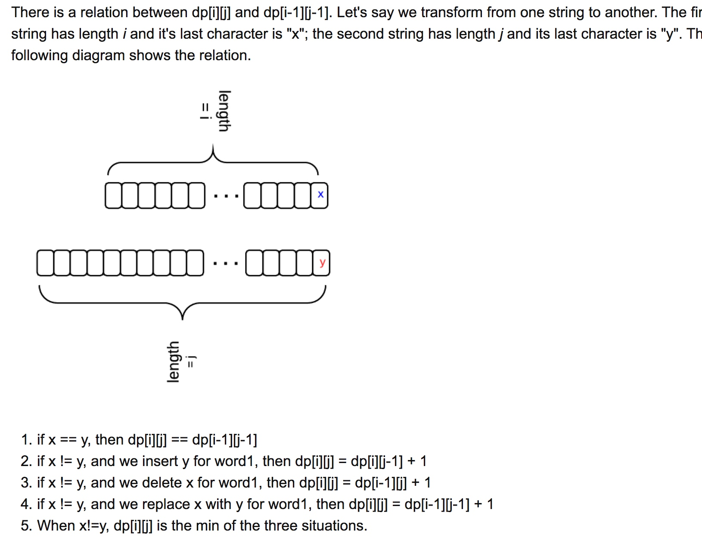

# leetcode - string 笔记

## Implement strStr 

对于KMP算法o(m+n)态度?

## String to Integer (atoi)

atoi

加上某个数据，可能存在溢出风险，溢出判断，怎么实现？

num *10 + x 保证他不溢出，使用除法和求余运算

num > INT_MAX/10; // 垦丁溢出
num == INT_MAX/10 && x > INT_MAX%10 //垦丁溢出

## Longest Palindromic Substring

最长回文子串：？

暴力：以每个元素，作为中间元素，从左右出发，寻找最长回文串；

DP:  

最长公共字串：

编辑距离：？

## Regular Expression Matching

1、从这里学到？递归函数的使用。
   抽象出递归模型？
   
   

2、理解： a*  这种模式匹配： 匹配0个a；1个a；大于2个a以上。

## 

 

