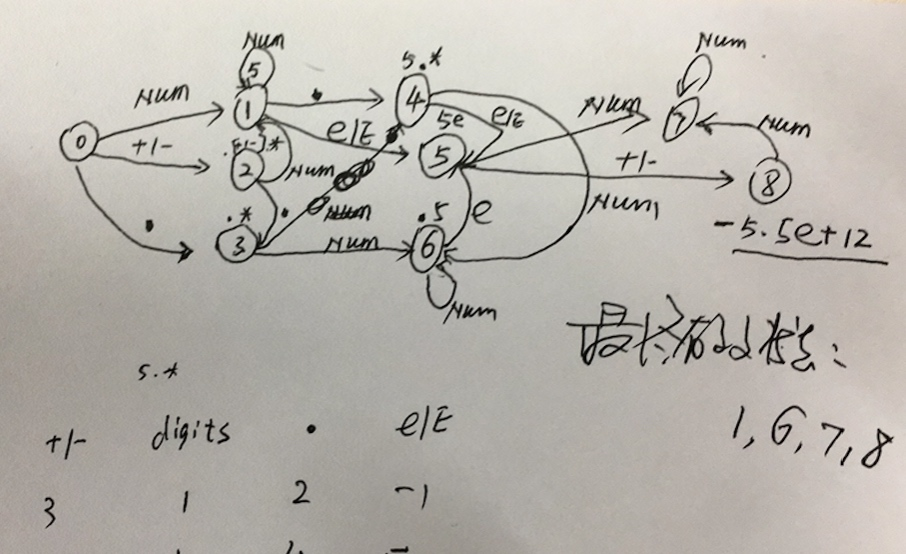

# leetcode - string 笔记

总结：
>> 对字符串的使用，工作中也是最经常的；算法方面的考察也要侧重
>> 字符串模式匹配：DP 有限自动机 各种方法，各种经典技巧
>> 

## Implement strStr  这个是最重要的一个题目。。

对于KMP算法o(m+n)态度?

可以写暴力算法，但bugfree； 对于KMP和其它线性算法，可以知道其实现思想

## String to Integer (atoi)

atoi

加上某个数据，可能存在溢出风险，溢出判断，怎么实现？

num *10 + x 保证他不溢出，使用除法和求余运算

num > INT_MAX/10; // 垦丁溢出
num == INT_MAX/10 && x > INT_MAX%10 //垦丁溢出

## Longest Palindromic Substring

最长回文子串：？

暴力：以每个元素，作为中间元素，从左右出发，寻找最长回文串；

DP:  

最长公共字串：

编辑距离：？

## Regular Expression Matching

1、从这里学到？递归函数的使用。
   抽象出递归模型？
   
   

2、理解： a*  这种模式匹配： 匹配0个a；1个a；大于2个a以上。

## Valid Number

判断一个字符串是否为有效的数字；

eg:  +12.3e-10 : 是一个digits

思路？
1、正则表达式：

   ` "[\\+-]?[0-9]*(\\.[0-9]*)?([eE][\\+-]?[0-9]+)?" `

2、有限自动机：使用有限自动机，进行字符串的模式匹配

* 有限自动机数学基础：

一个有限自动机(deterministic finite automaton, DFA) M 是一个 5-元组(Q, q0, A, Σ, δ)，其中：

Q 是状态的有限集合
q0 ∈ Q 是初始状态
A  是Q一个接受状态集合
Σ 是有限的输入字母表
δ 是一个从 Q × Σ 到 Q 的函数，称为 M 的转移函数

有限自动机开始于状态 q0，每次读入输入字符串的一个字符。如果有限自动机在状态 q 时读入了输入字符 a，则它从状态 q 变为状态 δ(q, a)(进行了一次转移)。每当其当前状态 q 属于 A 时，就说自动机 M 接受了迄今为止所读入的字符串。没有被接受的输入称为被拒绝的输入。

很多字符串匹配算法都要建立一个有限自动机，它通过对文本字符串 T 进行扫描的方法，找出模式 P的所有出现位置。用于字符串匹配的自动机都是非常有效的：它们只对每个文本字符检查一次，并且检查每个文本字符的时间为常数。因此，在建立好自动机后所需要的时间为 Θ(n)。

* 使用自动机原理进行分析

可能有效的字符：space，e，.，数字，+-  

状态转移图：？不考虑space

有效字符：NUM，+-，.，e/E

每输入一个字符，进行一次状态转移; 每层都输入有效字符，转移到下一个状态；这样的话，下一层是多叉树的形式，但可以对状态进行合并，使用已有的匹配状态合并； 最终是要收敛；找出所有的有效状态；

* 好吧，当年看离散数学时，学习自动机，不知道所云，终于见到干什么事情？怎么用代码实现了。
    
    https://github.com/ww5365/leetcode/blob/master/src/12_is_valid_digits.cpp

* 参考：
1、自动机&字符串模式匹配
https://www.cnblogs.com/zhanglanyun/archive/2012/02/16/2354686.html

 ## 

