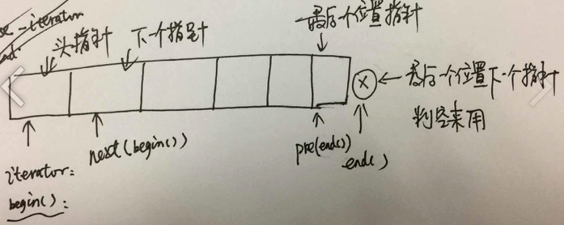

# c++ STL - iterator reverse_iterator


## next

```c++
template <class ForwardIterator>
  ForwardIterator next (ForwardIterator it,
       typename iterator_traits<ForwardIterator>::difference_type n = 1);
       //获取迭代器的下n个位置
```


## 图形描述




distance(begin(),end()); //计算元素的个数、步长


##reverse_iterator

从反方向定义了：首尾指针


