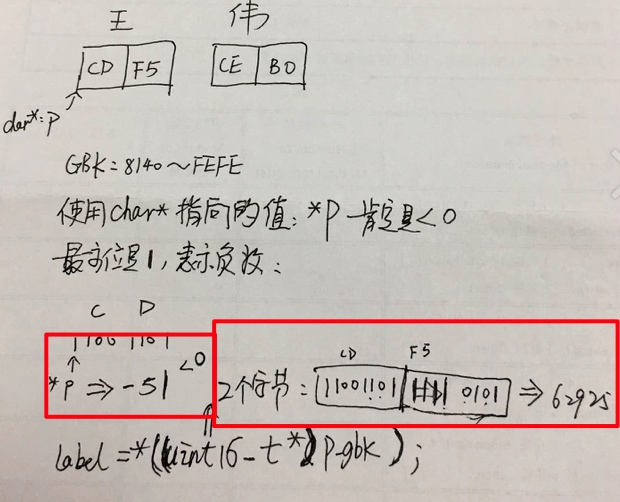

# 字符编码问题--gbk,utf8


## gbk编码汉字，第一个字节为什么小余0？

``` c++

string str_gbk = "王伟";//gbk汉字，是两个字节编码
char* p_gbk = const_cast<char*>(str_gbk.c_str());
    
uint16_t label = 0;
while(*p_gbk){
    if(*p_gbk<0){  //第一个字符，小于0，这是为何？
        label = *((uint16_t*)p_gbk);
        cout << *p_gbk <<" 22: " << label << endl;
        p_gbk ++;
    }else{
        label = *p_gbk;
        cout << *p_gbk <<" : " << label << endl;
        p_gbk++;
    }
}

```
回答上面的问题，先了解gbk编码和char，uint16_t这种数据类型

### gbk编码,char,uint16_t

gbk编码使用2个字节来标识汉字，码位范围：8140~FEFE

char：一个字节表示；默认情况，是有符号的，标识范围-128 ~ +127；
unsigned char：一个字节表示；是无符号，表示范围：0~256

uint16_t: 按照posix标准，一般整形对应的*_t类型为：
1字节     uint8_t
2字节     uint16_t  
4字节     uint32_t
8字节     uint64_t




