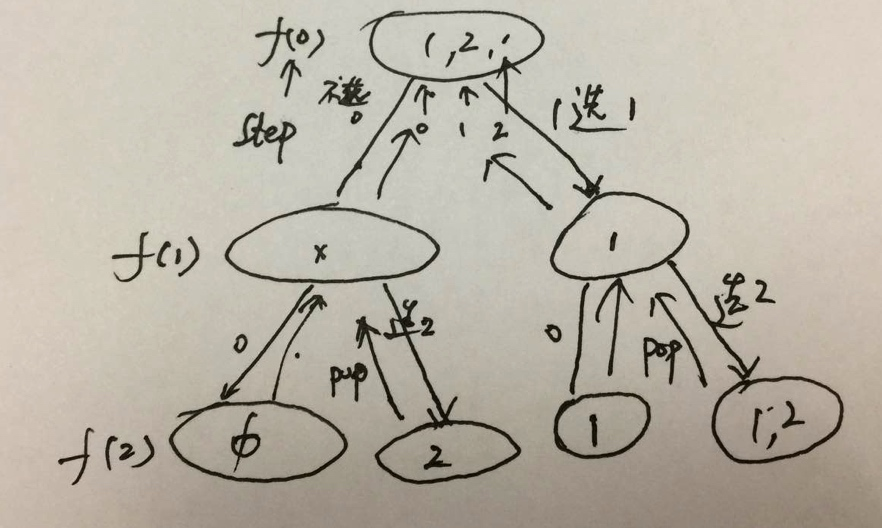
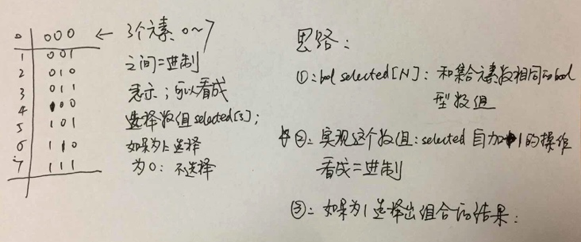
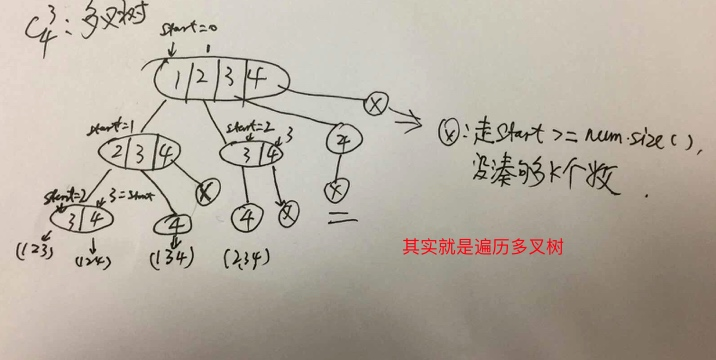
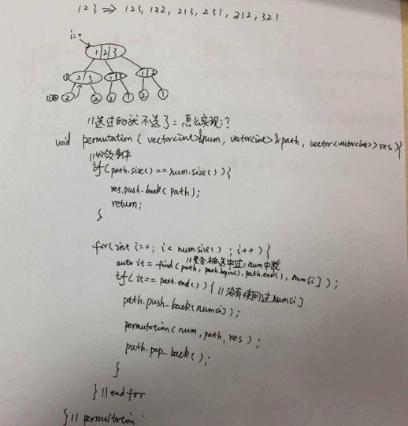
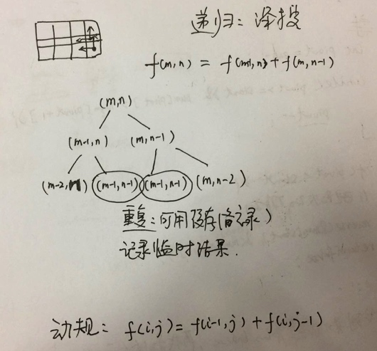

# leetcode - 暴力枚举&深搜&回溯

>深搜学习总结

* 深搜适用场景：递归的数据结构，链表，树，集合，可以考虑深搜；主要再解决问题时，会形成递归调用的多叉树；
* 深搜实现要点：
    * path 记录路径上遍历到的数据集合
    * step 是否往前走一步
    * 收敛条件：gap=0 （找集合中的子集=target）step = c.size(排列)
    * 如何加速搜索？ 剪枝  加缓存(有公共子问题，使用数组存下已经计算过的结果，比如：问题5 unique path)

    
* 代码模板：

```c++
/**
* dfs模板.
* @param[in] input 输入数据指针
* @param[out] path 当前路径，也是中间结果
* @param[out] result 存放最终结果
* @param[inout] cur or gap 标记当前位置或距离目标的距离
* @return 路径长度，如果是求路径本身，则不需要返回长度
*/

void dfs(type &input, type &path, type &result, int cur or gap) {
if (数据非法) return 0;
// 终止条件
if (cur == input.size()) { // 收敛条件
// if (gap == 0) {
将path放入result
   }
if (可以剪枝) return;
for(...) { // 执行所有可能的扩展动作
执行动作，修改path
dfs(input, step + 1 or gap--, result);
恢复path
   }
}

```


## 1、求集合中的所有组合（子集）

{1，2} -> {},{1},{2},{1,2}

###思路一：增量构造法，深搜，递归，选，不选

```c++

// Subsets
// 增量构造法，深搜，时间复杂度O(2^n)，空间复杂度O(n)

class Solution {
public:
vector<vector<int> > subsets(vector<int> &S) {
sort(S.begin(), S.end());
// 输出要求有序
vector<vector<int> > result;
vector<int> path;
subsets(S, path, 0, result);
return result;
}
private:
static void subsets(const vector<int> &S, vector<int> &path, int step,
vector<vector<int> > &result) {
if (step == S.size()) {
result.push_back(path);
return;
}
// 不选S[step]
subsets(S, path, step + 1, result);
// 选S[step]
path.push_back(S[step]);
subsets(S, path, step + 1, result);
path.pop_back();
}
};

```


对这种思路的关注点：

*  两次递归，体现选或不选；递归函数的调用展开，就是一颗递归调用树；





* 收敛的条件：step已经到数组的长度；
* "选"的情况下，需要将path中的数据pop出来。

* 初现"深搜"解决问题的代码模板。。

### 思路二  位向量法，递归；使用标志数组，进行选或不选的判断

使用selected数组，如果选择此元素，打上true；如果不选打上false； 在每次递归返回的时候，使用selected数组，形成最终的结果；

### 思路三  位向量法，扩展方法；迭代

参考下面的位向量的思路：




实际上转化成，求二进制数组的自动加1，代码如下：

```c++
/*
 * 实现bool型数组作为二进制数，自动加1
 * 正常返回true；溢出时，返回false；
 *
 * example：
 * 110 + 1 -> 111 返回true
 * 111 + 1 -> 1000 ,溢出，返回false
 */

bool Solution::add_one(vector<bool> &selected){
    bool flag = true; //进位标识
    size_t i = 0;
    for(i = selected.size() - 1; i >= 0 && flag; i--){
        flag = (selected[i] + 1)/2;
        selected[i] = (selected[i] + 1)%2;
        //cout << "e: " << selected[i] << endl;
    }
    if (flag && i == selected.size()){
        //溢出
        return false;
    }
    return true;
}

```


## 2、求集合中的某个特定的集合：C（N，K）

{1，2，3，4} -> c（4，2）： {1，2},{1，3},{1，4},{2,3}，{2，4}，{3，4}


### 2.1 思路一：深搜，递归

* 记录搜索路径上的值：path;如果没有使用
* 收敛的条件：path.size() == K
* 另一个条件：start>=num.size()时：起点位置大于数组长度，同时，path结果的长度还不到k。也就是没有凑够k个数；
* 理解时，尽量能映射到递归调用树：多叉树的遍历


```c++

//start是开始选择元素的起点下标
void dfs(vector<int> &num, vector<int> &path, int k, int start，vector<vector<int> > res){
     
     if(path.size() == k){
        res.push_back(path);
        return;
     }
     
     if(start >= num.size()){
        //path.pop_back();
        return;
     }
     
     for（int i = start；i < num.size(); i++）{
         
         path.push_back(num[i]);
         dfs(num,path,k,i+1,res);
         path.pop_back();
     }//for

}//dfs


```





## 3、permutation 全排列的实现

{1，2，3} -》123，132，213，231，312，321


### 3.1 思路1：使用next_permutation来实现

next_permutation:实现了什么功能？ 计算下一个比它大的全排列；比如，132 -> 213

算法：
* pivot点：从右至左，第一个降序的位置
* change点：从右至左，找第一个比pivot点大的位置；
* 将pivot点 <-> change点 互换
* 将pivot点右边的序列：reverse

实现可以参考：《leetcode - vector笔记》

差别在于：next_permutation 在最大的序列之后，返回false；其它返回true；


``` c++

void permutation(vector<int> &num, vector<vector<int> >&res){
     
     if (num.size() <= 0){
        return;
     }
     
     sort(num.begin(),num.end());
     
     do{
        res.push_back(num);
     }while(next_permutation(num))
          
     return;
     
}
```


### 3.2 思路2： 深搜，递归


* 递归调用树：现在脑海中形成多叉树
* 实现代码：





## 4、palindrome partition


## 5、unique paths

m*n的矩形格，从（0，0）开始走到（m-1,n-1）,只能走一步且向右或向下走，问：总共有多少中走法？


思路：




