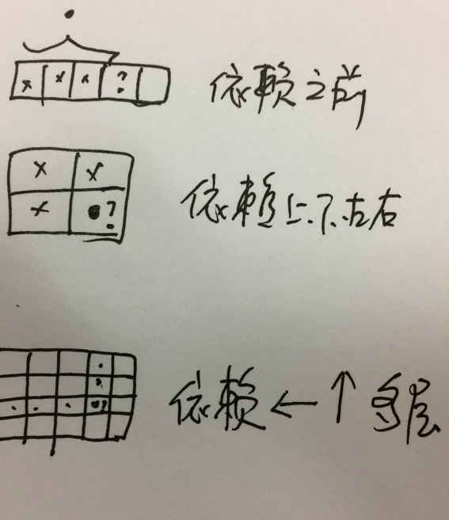
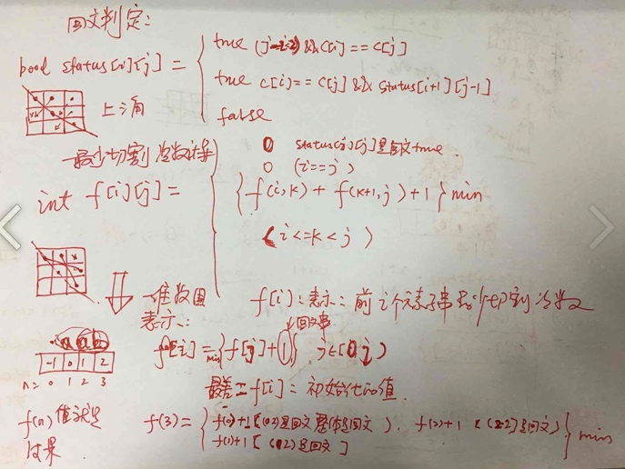
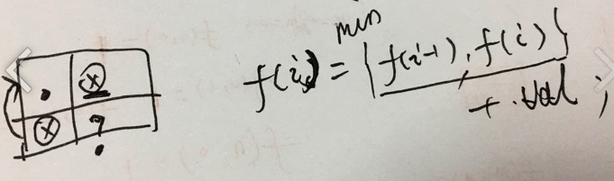
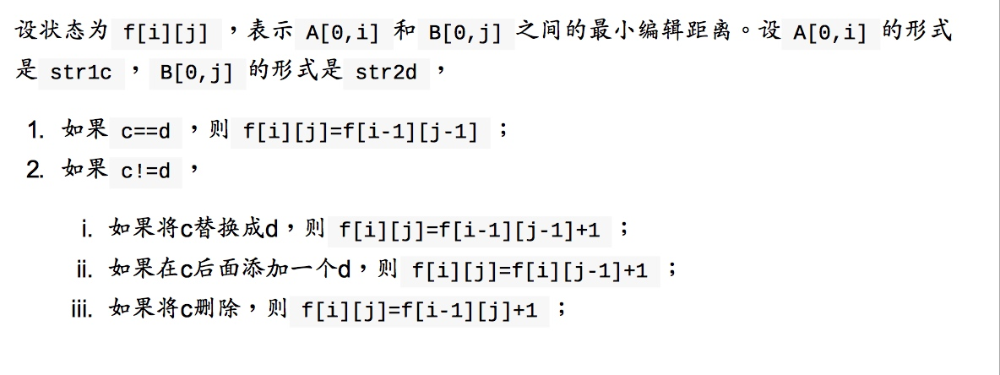

# leetcode -- 动态规划法

> DP总结：

* 使用中间临时数据的模式，有下面3种




* 一维数组：辅助： 最终的结果，可能是前面所有临时结果选取出来的min或max值；比如，回文串切割；

* 下面这个样子的依赖：临时结果：f（i,j）-> f(i-1,j) f(i,j-1) 可以归化到一维辅助数组；


## 参考别人的总结：

### DP是什么

动态规划是一种解决问题的思想。这种思想的本质是，一个规模比较大的问题（假如用2-3个参数可以表示），是通过规模比较小的若干问题的结果来得到的（通过取最大，取最小，或者加起来之类的运算）所以我们经常看到的动态规划的核心——状态转移方程都长成这样：


* f[i][j] = f[i - 1][j] + f[i][j - 1]

* f[i] = max{f[j] if j < i and …} + 1

* f[i][j] = f[0][j - 1] && judge(1,i) || f[1][j - 1] && judge(2,i) || …


### DP 常见类型

我们将动态规划的常见类型分为如下几种：（和自己画图总结有点像）

* 矩阵型

* 序列型

* 双序列型

* 划分型

* 区间型

* 背包型

* 状态压缩型

* 树型


其中，在技术面试中经常出现的是矩阵型，序列型和双序列型。划分型，区间型和背包型偶尔出现。状态压缩和树型基本不会出现（一般在算法竞赛中才会出现）。


每种类型都有着自己的题目特点和状态的表示方法。以矩阵型动态规划为例，一般题目会给你一个矩阵，告诉你有一个小人在上面走动，每次只能向右和向下走，然后问你比如有多少种方案从左上走到右下,比如：http://www.lintcode.com/problem/unique-paths/  
这种类型状态表示的特点一般是使用坐标作为状态，如f[i][j]表示走到(i,j)这个位置的时候，一共有多少种方案。状态的转移则是考虑是从哪儿走到(i,j)这个坐标的。
而序列型的动态规划，一般是告诉你一个序列；
双序列的动态规划一般是告诉你两个字符串或者两个序列。（编辑距离）


### 解决DP问题的步骤

1. 状态转移方程
2. 初始状态
3. 问题最终结束点


### DP问题比较好的参考

背包问题九讲:  https://www.kancloud.cn/kancloud/pack/70125


## 问题1：unique path

从m*n的矩形，只能向下或右走，从（0,0）点走到（m-1,n-1）点，总共有多少中不同的走法？


### 解决思路1：深搜，从上到下 from top to down

f（m，n）= f(m-1,n) + f(m,n-1) 可以使用备忘录，加速

### 解决思路2：动态规划

状态转移方程：？


## 问题2： 在数组中，寻找连续的子序列，使得子序列的和最大

For example, given the array [−2,1,−3,4,−1,2,1,−5,4] , the contiguous subarray [4,−1,2,1] has the largest sum = 6 


状态转移方程：？

f（i）= max{f(i-1)+num[i], num[i]}   //和小于0时候，是无用的

实现tips：

* 因为只和f(i-1)有关，使用o(1)的空间
* 能否也记录一下子序列的start和end的索引位置 ？


## 问题3： 给出一个无序数组，找出这个无序数组中，最长的递增序列的长度；

比如，{10，2，8，4，11，5，9} 最长递增序列：{2，4，5，9} 长度为4；


### 3.1 思路一：DP

状态方程：f[j] 表示位于数组下标j时，最长递增序列的长度；
* f[j] = max {f[j], f[i]+1(0<=i<j&&num[i]<num[j])}:换成人话：当前结果，和前面所有的中间结果都有关系；
* 选出f[]数组中值最大的那个，就是最大长度；

时间复杂度：o(n^2)


### 3.2 思路2：o(n*logn)的算法


？？

维护一个单调递增序列，遍历数组，二分查找每一个数在单调序列中的位置，然后替换之


## 问题4： palindrome partition II

Given a string s, partition s such that every substring of the partition is a palindrome. Return the minimum cuts needed for a palindrome partitioning of s. For example, given s = "aab" , Return 1 since the palindrome partitioning ["aa","b"] could be produced using 1 cut.


**这是一个重点题型，一个问题，有两个dp计算**

### 4.1 问题分析

状态方程：

1、判断字符串是否为回文？dp
   
   f[i,j]:表示字符子串(i,j)是否为回文的标志，true false
   f[i,j]: c[i] == c[j] && f[i+1,j-1]  说明c(i,j)也是回文串
           j-i<2&&c[i]==c[j] 初始状态 是true
   
   上三角，从上到下找；
   
2、计算最少切割次数

f[i,j]:表示从位置i~j之间的最少切割次数

f[i,j]= min{f[i,k]+f[k+1,j]+1} (i<=k<j)

使用二维数组记录临时结果；怎么转成使用一维数组实现？**滚动数组**

f(i) :  表示前i个元素形成的子串，最少切割次数；
f[0]= -1;         
状态方式：
f(i) = min{f[j]+1} (0<=j<i)  
初始：f(i)={-1，0，1，2，。。。} 比字符串长度大1； 
      
理解：
1. 如果从[j,i]的子串是回文，说明右边的子串只用1刀就切开了。f[j]是左边的最少切割次数。所以就得到的f(0,i)的可能的最少切割次数。 从所有的f[j]中选取最小的值，就是f[i];
2. 每个f[i]也是循环多次，得到min结果





###4.2 代码参考

```c++
class Solution {
public:
    /**
     * @param s a string
     * @return an integer
     */
    int minCut(string s) {
        int n = s.length();
        int f[n + 1];
        bool isPalin[n][n];

        for (int i = 0; i < n; i++) {
            isPalin[i][i] = true;
            if (i + 1 < n) {
                isPalin[i][i + 1] = (s[i] == s[i + 1]);
            }
        }
        
        for (int i = n - 1; i >= 0; i--) {
            for (int j = i + 2; j < n; j++) {
                isPalin[i][j] = isPalin[i + 1][j - 1] && (s[i] == s[j]);
            }
        }
        
        f[0] = -1;
        for (int i = 1; i <= n; i++) {
            f[i] = i - 1;
            for (int j = 0; j < i; j++) {
                if (isPalin[j][i - 1]) {
                    f[i] = min(f[i], f[j] + 1);
                }
            }
        }
        
        return f[n];
    }
};

```

### 4.3 问题扩展
如何求一个最长的回文子串？abcdedcf =》cdedc

思路：dp  一次dp算法就足够了

* 利用上面判断回文的状态方程，能计算出f[i,j] 字符串[i,j]是否为回文；
* 是回文的情况下，记录最长子串(len=j-i)的下标[i,j]及最大长度；


## 问题 5 求从（0，0）到（m-1,n-1）最短最短路径和；

Given a m × n grid filled with non-negative numbers, find a path from top left to bottom right which minimizes the sum of all numbers along its path. 
Note: You can only move either down or right at any point in time。

### 问题5.1 分析

类似unique path，状态方程

f（i,j）：标识从（00）~（i,j）这条路径path上，最小的路径和；

f（i,j）= min{f(i-1,j),f(i,j-1)} + arr[i][j];

初始化： f[0][j] += arr[0][j]  f[i][0] += arr[i][0]


使用一维数组，动态滚动：？这中情况下，可以使用





## 问题 6  Edit Distance




## 问题7 01背包问题

一个背包容量是V；每装第i个元宝，消耗c[i]的容量，但获取的价值为w[i];求获取哪些元宝放进背包，使价值和最大；


### 7.1 思路

状态方程：？
f(i,v):拿前i个元宝过程中，在容量是v的情况下，获得的最大利益；

f(i,v) = max{f(i-1,v) f(i,v-c(i)) }


