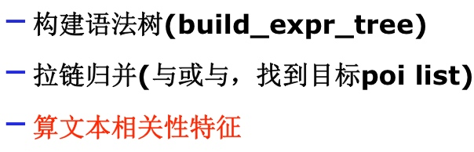
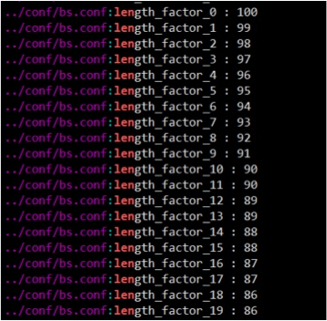
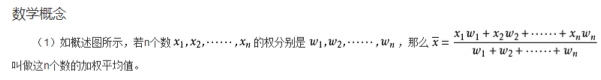
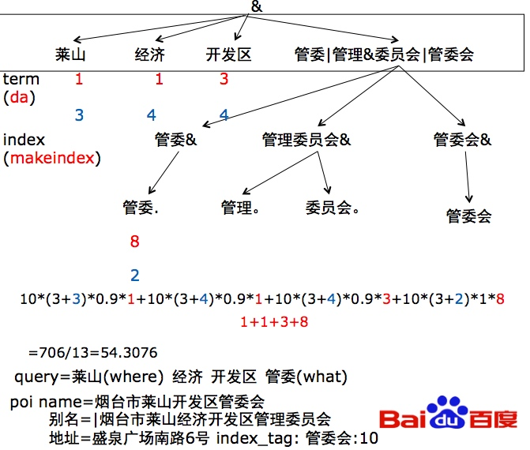
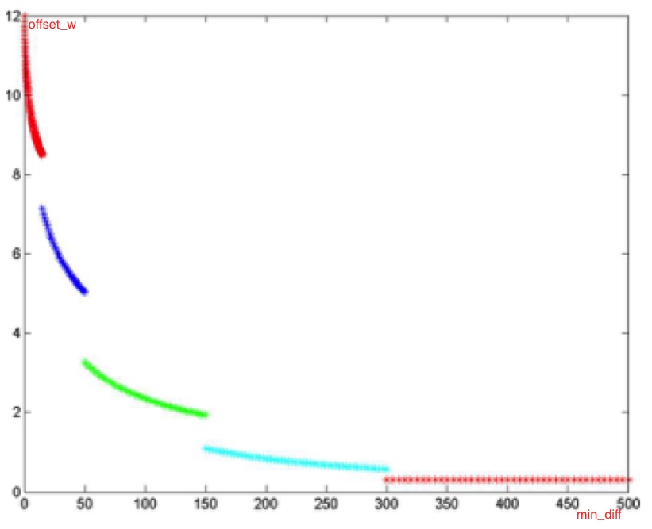
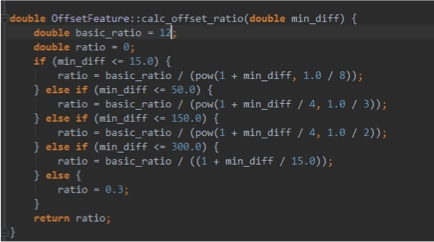

# 九 相关性计算

## 跬步学习

2018.3.19
用了一个上午看了，张瑞昌的bs的基础文本相关性计算；模糊，信息含量还比较大。对txt_weight计算由case一步步的解析，还是很清晰。由它引发了，sug-bs是否具有基础文本相关性计算的思考？发现代码没有；看了bs代码，发现检索还是有的；下午查了些资料；发现了2009年的《新地图文本相关性详细设计》的文档，也具有较高参考价值；先了解下基本术语？要解决的问题？
看完后，再review下张瑞昌的串讲。

2018.3.20

多路归并算法：2009年的《新地图文本相关性详细设计》引出这个技术点。为什么？数据要先多term召回，进行数据归并，之后计算归并后数据的文本相关性；

深入理解这个技术点,又阅读：http://wiki.baidu.com/pages/viewpage.action?pageId=327613709  


##基本术语
* term:
* 切词粒度：
* offset:描述的含义？term之间的紧密度关系，位置关系
* 多路归并算法：本质求多个集合的交集；


## 信息检索导论中给相关性计算的引导？

tf-idf = tf * log(N/df): 意义：词频大，切出现再少数文档中，说明区分度大，权重就高；

一片文章，可以把term标识成tf-idf的多维度单位向量：v=（x1,x2,x3,...）
可以把query标识成：q=<q1,q2,q3,....> 单位向量；

利用向量间夹角来描述相似度；越相似，夹角越小，值越大；

二维向量夹角计算：cosA = v1.v2/|v1||v2| = （x1*y1 + x2*y2） 单位向量

多维向量夹角计算类似？cosA = v*q/|v||q| = (x1*q1 + x2*q2 + ...)/sqrt(x1*x1 + x2*x2 + ...)*sqrt(q1*q1+q2*q2+...)  


## 多等等




## 文本相关性计算公式


```
文本相关性(txt_weight) = 
* 基础文本相关性(basic_w) query与poi资源在文本上加权值
* 偏移差异(offset_w) query与poi资源在term紧密程度  0.025~1
* 标题匹配程度(title_w)  匹配|命中 * 全|别名|what (as全部)  1.2~1.5
* where位置因子(where_hit_factor) 调权 0.9(hit)|1
* 公交地铁站调权(linestop_f) 0.95|2


```


### basic_w ?

```
basic_w = 
sigma(m_basic_p * (m_basic_c + index_weight) * length_factor * term_weight) / sigma(term_weight)
```

m_basic_p:基础系数？ 10

m_basic_c:? 

index_weight: 建立索引时给的基础权重？makeindex阶段给出
              =max(name,catalog,addr,tag,multi_titles)

length_factor: 长度因子，配置再bs.conf; 0.86~1之间；



term_weight: DA解析query，给出各个term的权重；


理论依据：n个数的加权平均值



意义：
建库索引里poi资源被用来召回term的一种加(query中term的)权平均值；如果term出现在poiname资源里面，一般平均权重是较高的；

例子：

m_basic_p = 10;
m_basic_c = 3;
index_weight = (3,4,4,2);
length_factor = 0.9
term_weight = (1,1,3,8);

基础文本相关性：
`basic_w = {10*(3+3)*0.9*1 + 10*(3+4)*0.9*1 + 10*(3+4)*0.9*3 + 10*(3+2)*0.9*8 }/(1+1+3+8)`




### offset_w

意义：？query中相邻的term是否再poi中也相邻; 文本位置匹配度；







##参考


* 【bs串讲：不仅仅是文本相关性，关键是这个检索架构，非常具备参考性】http://wiki.baidu.com/pages/viewpage.action?pageId=287025524

*  【bs基础文本相关性计算串讲_20171214_张瑞昌.pptx】在自己的技术文档下面有下载；大陆地图检索rd；
*  【拉链归并算法探讨】http://wiki.baidu.com/pages/viewpage.action?pageId=327613709  


