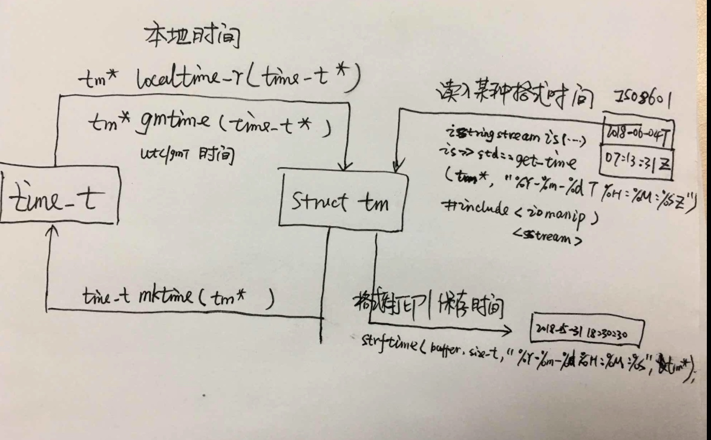

# c++ - 时间处理

头文件：time.h/ctime

## 一、 time 函数

原型：`time_t time (time_t* timer);` 
说明：
    返回从1970.1.1到现在的时间戳差；
参数：
    time_t: long int
    timer： NULL 情况下，返回当前时间到1970的时间戳；
    
## 二、获取当前系统的日期时间

原型：`struct tm *localtime(const time_t * timep)`
     `struct tm *localtime_r(const time_t *timep, struct tm *result);`
     
功能： 返回当前的系统的日期，时间等信息；locatime_r 是**多线程安全**的；


参数说明：

``` c++
//struct_tm 结构体
int tm_sec;       /* 秒 – 取值区间为[0,59] */
int tm_min;       /* 分 - 取值区间为[0,59] */
int tm_hour;      /* 时 - 取值区间为[0,23] */
int tm_mday;     /* 一个月中的日期 - 取值区间为[1,31] */
int tm_mon;       /* 月份（从一月开始，0代表一月） - 取值区间为[0,11] */
int tm_year;        /* 年份，其值等于实际年份减去1900 */
int tm_wday;      /* 星期 – 取值区间为[0,6]，其中0代表星期天，1代表星期一，以此类推 */
int tm_yday;       /* 从每年的1月1日开始的天数 – 取值区间为[0,365]，其中0代表1月1日，1代表1月2日，以此类推 */
int tm_isdst;      /* 夏令时标识符，实行夏令时的时候，tm_isdst为正。不实行夏令时的进候，tm_isdst为0；不了解情况时，tm_isdst()为负。*/

```


代码实例：

```c++


```
     

##  time_t、tm 相互转换





## 精确到秒，毫秒 时间处理

```c++

  //头文件：include <sys/time.h>

  //时间戳
    struct  timeval{
        long  tv_sec;  //秒
        long  tv_usec; //微妙
    };

    //时区
    struct  timezone{
        int tz_minuteswest;  //和greenwich 时间差了多少分钟
        int tz_dsttime; //type of DST correction
    };
  
    //获取当前系统的时间戳(从1970开始)和时区
    gettimeofday(&tv,&tz);
    
  //头文件:include <unistd.h>
  
  void usleep(int micro_seconds); //挂起微妙级别  
    
```
    
    


